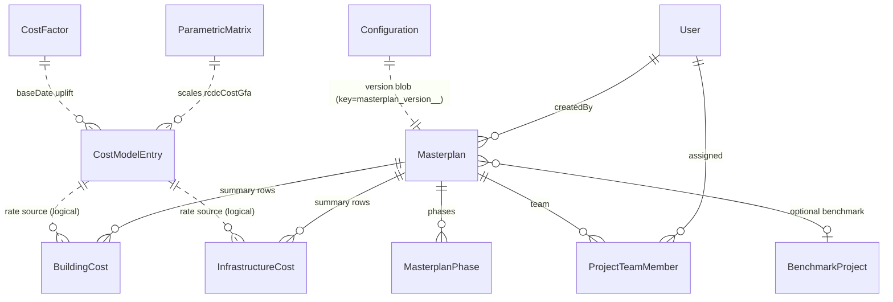
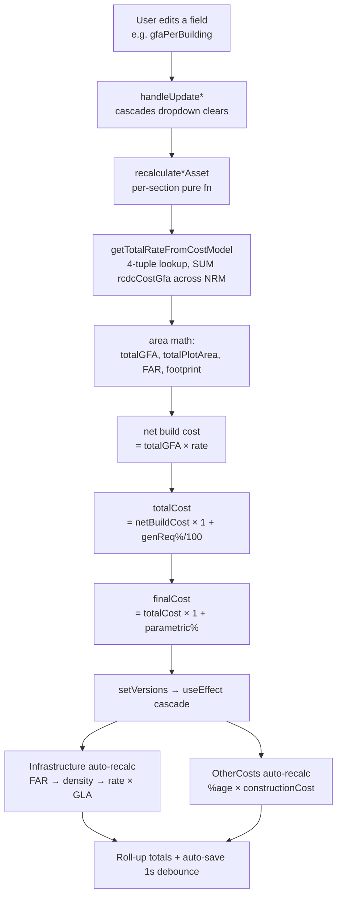
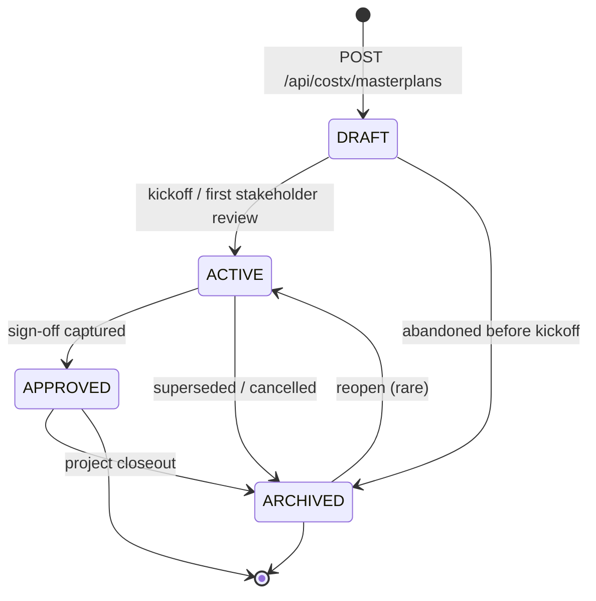

# CostX

CostX is IOX's parametric masterplan modelling module — a quantity-surveying workbench that turns plot geometry, asset mix, and a SAR-per-m² rate library into a fully reconciled construction cost estimate. It is used by development managers, cost consultants, and project owners during the feasibility-to-pre-tender phase, when the design is still notional and decisions need to be priced in seconds rather than weeks. The "parametric" idea is simple: you describe *what* you want to build (residential mid-rise, podium parking, primary infrastructure, public-realm parks) and *how much* of it (plot area, GFA, number of buildings, levels), and the system walks every entry through the rate library to produce a defensible total cost — recalculating live as you tweak any input.

## Overview

CostX is the IOX-shell port of the standalone `roshn` masterplan estimator. Every helper function (rate lookups, infrastructure auto-calc, S-curve generation, recalculation cascades, debounced auto-save) is preserved verbatim per the [faithful-port rule](../../web/AGENTS.md). What changed is the chrome: zinc tokens, the IOX `Header`, and the unified `/costx/*` route prefix.

A CostX project is anchored by a single `Masterplan` row in Postgres. Around it hang six editable sections — Building Assets, Car Parking, Additional Assets, Infrastructure, Public Realm, and Other Costs — plus a roll-up of one or more `MasterplanPhase` rows for time-phasing. The numeric brain lives in two places: `web/utils/calculations/*` (per-section synchronous math) and `web/lib/calculations/masterplanSummary.ts` (aggregate metrics + S-curve generation for the read-only summary page). The rate library is exposed through `web/lib/queries/configuration.ts` (`getCostModelEntries`, `getParametricMatrix`, `getCostFactors`) and is shared across every masterplan in the tenant.

> [!IMPORTANT]
> Live editor state is **not** stored in the relational `Masterplan`/`BuildingCost`/`InfrastructureCost` columns. Those columns hold the *summary snapshot* (the create-time values plus whatever a future writeback path persists). The full per-section working set is JSON-blobbed into the `Configuration` table under the key `masterplan_version_<masterplanId>_<versionId>`, written every second by `autoSaveMasterplanVersion`. See [The masterplan lifecycle](#the-masterplan-lifecycle).

## Data model

The CostX module spans eleven Prisma models. The relational core is `Masterplan` → child cost tables, phases, and team members. The rate library (`CostModelEntry`, `ParametricMatrix`, `CostFactor`) and the editor-state stash (`Configuration`) sit alongside as tenant-wide reference data.



### `Masterplan`

Root of every CostX project. Created via `POST /api/costx/masterplans`; mutated via the editor's debounced auto-save.

| Field | Type | Notes |
|---|---|---|
| `id` | `String @id @default(uuid())` | Used in every `/costx/[masterplanId]` URL |
| `name` | `String` | Free-text |
| `description` | `String?` | |
| `grossLandArea` | `Decimal(12,2)` | GLA in m² — anchors infrastructure cost |
| `calculatedPlotArea` | `Decimal(12,2)` | Sum of building plot areas (snapshot) |
| `balanceExternalArea` | `Decimal(12,2)` | `grossLandArea − plot − publicRealm` |
| `totalUnits` | `Int` | Free-entry, used in benchmarking |
| `parkingSpaces` | `Int` | Free-entry |
| `contingency` | `Decimal(15,2)` | Frozen SAR value — *not* a percentage |
| `totalCost` | `Decimal(15,2)` | Snapshot of last computed grand total |
| `costPerGfa` | `Decimal(12,2)` | Snapshot |
| `assetClass`, `assetTypeL1`, `assetFormL2?` | `String` | Top-level taxonomy at creation |
| `status` | `MasterplanStatus` | `DRAFT / ACTIVE / ARCHIVED / APPROVED` |
| `version` | `Int @default(1)` | Schema-level version (not the JSON `MasterplanVersion`) |
| `createdById` | `String` | FK → `User` |
| `numberOfPhases` | `Int @default(1)` | Drives editor's phase dropdown count |
| `benchmarkProjectId` | `String?` | Optional FK to `BenchmarkProject` |
| `country`, `developer` | `String?` | Filterable metadata |
| `isPublic` | `Boolean` | Reserved for cross-tenant share |
| `createdAt`, `updatedAt` | `DateTime` | |

> [!NOTE]
> Indexes exist on `createdById`, `status`, `assetClass`, `country`, and `benchmarkProjectId`. The masterplan list page filters by accessible-id-set produced by `getAccessibleMasterplanIds`.

### `MasterplanPhase`

Each phase declares its start date (in roshn's `1Q27` quarter format) and total months. Editor cascades these into per-asset `baseDate` defaults.

| Field | Type | Notes |
|---|---|---|
| `id` | `String @id` | |
| `masterplanId` | `String` | FK, `onDelete: Cascade` |
| `phaseNumber` | `Int` | Unique per `masterplanId` |
| `phaseName` | `String` | e.g. `"Phase 1"` |
| `startDate` | `String` | Quarter code like `1Q27` (parsed by `parseQuarterDate`) |
| `totalMonths` | `Int` | Drives S-curve generation |

### `BuildingCost`

NRM-keyed cost-summary row. One per `(masterplanId, nrmLvl1)`.

| Field | Type | Notes |
|---|---|---|
| `masterplanId` | `String` | FK, `Cascade` |
| `nrmLvl1` | `String` | e.g. `"Superstructure"` |
| `costGfa` | `Decimal(12,2)` | SAR/m² GFA |
| `costPlotArea` | `Decimal(12,2)` | SAR/m² plot area |
| `totalCost` | `Decimal(15,2)` | Absolute SAR |

### `InfrastructureCost`

Per-category infra summary row. No `nrmLvl1`; uses free-text `category`.

| Field | Type | Notes |
|---|---|---|
| `masterplanId` | `String` | FK, `Cascade` |
| `category` | `String` | e.g. `"Primary"`, `"Secondary"` |
| `description` | `String?` | |
| `cost` | `Decimal(15,2)` | |

### `CostModelEntry` — the rate library

The single source of truth for SAR-per-m² rates. Joined to building/parking/additional/public-realm assets at lookup time by the 4-tuple `(assetClass, assetTypeL1, assetFormL2, pricePoint)` and then collapsed by NRM level.

| Field | Type | Notes |
|---|---|---|
| `assetClass` | `String` | e.g. `"Residential"` |
| `assetTypeL1` | `String` | e.g. `"Multi Family"` |
| `assetFormL2` | `String?` | e.g. `"Mid Rise"` |
| `pricePoint` | `String?` | e.g. `"Premium"` |
| `nrmLvl1` / `nrmLvl2` / `nrmLvl3` | `String / String? / String?` | NRM (New Rules of Measurement) cost-breakdown taxonomy |
| `unitOfMeasurement` | `String?` | Usually `m2` |
| `sarPerUoM` | `Decimal(12,2)?` | Raw unit rate |
| `rcdcCostGfa` | `Decimal(12,2)` | **The primary rate column** — Roshn Cost Data Centre rate per m² GFA |
| `benchmarkedCostGfa` | `Decimal?` | Benchmarked alternative |
| `costBua`, `costGia`, `costGfa` | `Decimal?` | Alternate area bases |
| `extraPath` | `String` | Routing-table breadcrumb |

`@@unique([assetClass, assetTypeL1, assetFormL2, pricePoint, nrmLvl1])` — one row per combination per NRM bucket.

### `ParametricMatrix`

Per-NRM scaling factors (e.g. "Premium price point uplifts Superstructure rates by 1.15").

| Field | Type | Notes |
|---|---|---|
| `nrmLvl1` | `String` | Bucket the factor applies to |
| `parameter` | `String` | e.g. `"pricePoint"`, `"glazing"` |
| `option` | `String` | e.g. `"Premium"`, `"High"` |
| `factor` | `Decimal(5,4)` | Multiplier (1.0000 = neutral) |

`@@unique([nrmLvl1, parameter, option])`. Read via `getParametricMatrix({ parameter?, option? })`.

### `CostFactor`

Base-date inflation curve.

| Field | Type | Notes |
|---|---|---|
| `baseDate` | `String @unique` | Quarter code, e.g. `1Q27` |
| `costUplift` | `Decimal(5,4)` | Multiplier vs. the reference date |

### `ProjectTeamMember`

Per-masterplan ACL row.

| Field | Type | Notes |
|---|---|---|
| `masterplanId` | `String` | `Cascade` |
| `userId` | `String` | `Cascade` |
| `role` | `TeamRole` | `MANAGER` or `VIEWER` |
| `assignedAt`, `assignedBy` | `DateTime / String?` | |

`@@unique([masterplanId, userId])` — one membership row per user per masterplan.

### `Configuration`

Generic key-value JSON store. CostX uses it for three things:
- **Editor state**: `masterplan_version_<masterplanId>_<versionId>` → full `MasterplanVersion` blob (the live working set).
- **Per-tenant knobs**: `parking_area_per_space`, `density_range_factor`, `infrastructure_split`, `scurve_settings`, etc.
- **Cost-model defaults**: warning thresholds for `otherCosts` validation.

### Enums

```prisma
enum TeamRole {
  MANAGER
  VIEWER
}

enum MasterplanStatus {
  DRAFT
  ACTIVE
  ARCHIVED
  APPROVED
}
```

## Calculation engine

The CostX cost pipeline is **deterministic, synchronous, and recomputed on every keystroke**. There is no async cost API — every recalculation is pure JS over the in-memory `MasterplanVersion` plus the (already-loaded) `CostModelEntry[]`.



### Plot area × SAR/m² → construction cost (per asset)

From `web/utils/calculations/buildingAssets.ts`:

```typescript
totalPlotArea = plotAreaPerBuilding × numberOfBuildings
totalGFA      = gfaPerBuilding × numberOfBuildings
far           = totalGFA / totalPlotArea     // 3 dp, guarded against div-by-0
footprint     = round(totalGFA / levels)
externalArea  = max(0, totalPlotArea − footprint)

netBuildCost  = round(totalGFA × sarPerM2GFA)
totalCost     = round(netBuildCost × (1 + generalRequirements / 100))
finalCost     = round(totalCost × (1 + glazingFactor))
              // glazingFactor: None=0, Low=0.02, Medium=0.05, High=0.10
```

The `sarPerM2GFA` is the **sum** of every `CostModelEntry.rcdcCostGfa` row that matches the asset's `(assetClass, assetTypeL1, assetFormL2, pricePoint)` 4-tuple — see `getTotalRateFromCostModel` in `MasterplanDetailClient.tsx`. Because one (assetClass, assetTypeL1, assetFormL2, pricePoint) maps to many NRM rows, the sum reassembles a full per-m² rate from its NRM breakdown.

### How phases roll up

A masterplan has 1–N `MasterplanPhase` rows. The editor:
1. Cascades `phase.startDate` into each asset's `baseDate` on selection (`handleUpdate*`).
2. The summary page groups costs by `asset.phase` via `calculateCostByPhase()` in `lib/calculations/masterplanSummary.ts`.
3. Each phase's `(startDate, totalMonths, totalCost)` is fed to `generateSCurveDataWithPhases()` which produces a logistic-curve cumulative-spend timeline (one S-curve per phase, summed monthly).

### How the parametric matrix overrides defaults

The `ParametricMatrix` table stores per-NRM scaling factors keyed by `(parameter, option)`. The intent is that when a user picks `pricePoint = "Premium"`, every matching matrix row scales the corresponding `rcdcCostGfa` rate. Today the editor implements a subset of this in-line (the glazing factor hash above; parking facade factors `Light=0.02 / Medium=0.05 / Heavy=0.10`); the broader matrix is exposed via `getParametricMatrix()` for future authoring UI.

### Infrastructure — fully automated

From `utils/calculations/infrastructure.ts`. **No user input** beyond GLA (set at masterplan creation) and `generalRequirements%`. The editor recomputes via a `useEffect` whenever building/public-realm totals change:

```typescript
calculatedFAR  = totalGFA / totalPlotArea
density        = FAR < 0.465 ? "Low" : FAR < 1.5 ? "Medium" : "High"   // configurable via density_range_factor
sarPerM2GLA    = rate-from-cost-model[density]
netInfraCost   = round(grossLandArea × sarPerM2GLA)
primaryCost    = round(netInfraCost × 0.30)    // configurable via infrastructure_split
secondaryCost  = round(netInfraCost × 0.70)
totalInfraCost = round(netInfraCost × (1 + genReq/100))
```

### Other costs

Soft costs, authority fees, and contingency are **percentages of total construction cost** — no overlap, each computed independently. Default thresholds (validated, not enforced): contingency 5%, authority 3%, soft 8%. Warnings fire above contingency 15% / authority 10% / soft 15% / combined 30%.

### Final grand total

```typescript
constructionCost = sum(buildingTotals) + sum(carParkingTotals) + sum(additionalTotals)
                 + infrastructure.totalInfrastructureCost
                 + sum(publicRealmTotals)

totalCost = constructionCost + contingencyAmount + authorityFeesAmount + softCostsAmount
```

## The masterplan lifecycle

A `Masterplan` flows through four `MasterplanStatus` states. `DRAFT` is the creation state; `ACTIVE` flags work-in-progress that's been formally kicked off; `APPROVED` is a sign-off marker; `ARCHIVED` retires the row from the default list without deleting it.



> [!NOTE]
> The lifecycle is currently advisory — there is no server-side state machine enforcing transitions, and `MasterplanDetailClient` does not expose status edits. Status is set to `DRAFT` on creation and mutated through future admin UI / direct DB updates. The dashboard counts via `getMasterplanStats` only treat `ACTIVE` and `DRAFT` as first-class.

The orthogonal lifecycle is the **per-version editor state**: each visit to `/costx/[id]` boots from the `Configuration` row keyed `masterplan_version_<masterplanId>_v1`. If absent, the editor seeds an empty `MasterplanVersion` and starts auto-saving (1 s debounce → `autoSaveMasterplanVersion`). Users can add (`handleAddVersion`), copy (`handleCopyVersion`), or delete (`handleDeleteVersion`) named versions — each gets its own `Configuration` row.

## Routes + UI surfaces

| URL | File | Renders |
|---|---|---|
| `/costx` | `app/costx/page.tsx` | Server component. Loads all accessible masterplans + users + benchmark projects + permissions. Wraps `MasterplanListClient`. |
| `/costx/[masterplanId]` | `app/costx/[masterplanId]/page.tsx` | Server component. Loads masterplan + costModelEntries + configurations + saved version. Wraps `MasterplanDetailClient` (the editor). |
| `/costx/[masterplanId]/summary` | `app/costx/[masterplanId]/summary/page.tsx` | Server component. Read-only dashboard. Redirects to editor if no saved version exists (so auto-save can seed v1). |
| `POST /api/costx/masterplans` | `app/api/costx/masterplans/route.ts` | Create-only endpoint. Required: `name`, `grossLandArea`, `assetClass`, `assetTypeL1`. Returns `{ id }`, status 201. |
| `/configuration` | `app/configuration/page.tsx` | Tenant-wide settings — exposes `Configuration`-table keys (infrastructure split, density thresholds, parking config, S-curve settings). |
| `/cost-model-rate-analysis` | `app/cost-model-rate-analysis/page.tsx` | Read-only `CostModelEntry` browser. |

`MasterplanListClient` (`components/costx/MasterplanListClient.tsx`) renders the `MasterplanTable`, `CreateMasterplanModal`, and `Pagination`. The "create" modal calls `POST /api/costx/masterplans` then `router.push("/costx/<newId>")`.

`MasterplanDetailClient` (1,506 LOC) orchestrates the six section components in `components/sections/`: `BuildingAssets`, `CarParking`, `AdditionalAsset`, `Infrastructure`, `PublicRealm`, `OtherCosts`. It owns version state, auto-save, and every recalculation cascade.

## Summary page deep-dive

The summary page is a non-editable analytics view of one `MasterplanVersion`. It boots from the same auto-saved `Configuration` blob and runs everything through `lib/calculations/masterplanSummary.ts`.

Top-of-page sections (in order):

1. **High-Level Metrics** — 15 KPI cards via `KPIStatGrid`: Total GLA, FAR, # Phases, Plot Area, GFA, Approved Budget, BUA For Parking, Base Date, Construction Cost (Hard), Total BUA, Built Assets Cost, Total Construction Cost, Plot Area (Buildings), Infra & PR Cost, Variance.
2. **Key Performance Indicators (radial)** — 4 gauges: Budget Utilisation, Hard Cost Ratio, Built Assets, FAR Achievement.
3. **Capex Breakdown Summary** — hierarchical tree by asset class → asset → cost component, in `CapexBreakdownSummary.tsx`.
4. **Cost Trend (S-curve)** — `CostTrendChart` (Recharts area-line). Powered by `generateSCurveDataWithPhases(phaseCosts, scurveSettings)` when a phase timeline exists, else falls back to `generateSCurveData(phases, totalCost, baseDate, 36)`. Logistic curve: `value = totalCost / (1 + exp(-steepness × (t/months − midpoint)))` with defaults `steepness=10, midpoint=0.5`.
5. **Area Analysis & FAR** — actual-vs-target FAR, residential/commercial GFA split, FAR-by-asset-class/type charts.
6. **GFA Distribution** — 4 charts by Asset Class, Asset Type, Typology, Price Point.
7. **Cost Distribution** — 3 charts: by Asset Class, by Phase, by Asset Type.
8. **Cost Model Analysis** — NRM-bucket aggregation. `aggregateCostsByNRM` walks each building asset, finds matching `CostModelEntry` rows, and sums `gfa × rcdcCostGfa` per `nrmLvl1`. Falls back to a hardcoded percentage distribution if no cost-model match (Superstructure 15%, Substructure 8%, etc.).
9. **Executive Summary** — markdown editor stored back on the version blob.

> [!NOTE]
> `getExecutiveSummary()` currently returns `null` (TODO: dedicated column). The displayed summary is the cached version-blob value, not a relational read.

## Cost models + rate library

`CostModelEntry` is the **only** source of SAR-per-m² rates. It is tenant-wide (no `masterplanId`), loaded once per page via `getCostModelEntries()` (`unstable_cache`, 5-min revalidate, tag `cost-model`), and passed into the editor as a prop.

The lookup contract for an asset is:

```sql
-- conceptually:
SELECT SUM(rcdcCostGfa) AS rate
FROM cost_model_entries
WHERE assetClass = $1
  AND assetTypeL1 = $2
  AND assetFormL2 = $3
  AND pricePoint  = $4;
```

Implementation lives client-side in `getTotalRateFromCostModel` (`MasterplanDetailClient.tsx:217`), which trims whitespace and case-sensitively matches every NRM row, summing `rcdcCostGfa`. This means **changing an asset's price point recomputes the rate by re-summing the matching NRM rows** — there is no per-rate cache.

Infrastructure rates come from the same table via `getInfrastructureRatesFromCostModel(costModelEntries)` (in `utils/dropdownOptions.ts`), which returns `{ Low, Medium, High }` rate values to feed `buildFARDensityRanges()`.

The asset taxonomy (drop-down cascades) is also derived from `CostModelEntry` via `getAssetHierarchy()` — a distinct on `(assetClass, assetTypeL1, assetFormL2, pricePoint)` shaped into a nested object.

Bulk upload: `/configuration` page accepts a `COST_MODEL_CSV` upload (`FileCategory` enum). The cache is keyed by tag `cost-model`, so any seed/upload should call `revalidateTag("cost-model")`.

## Team and access

ACL is two layers thick.

**Tenant-level role** (`UserRole`): `ADMIN`, `DEVELOPMENT_MANAGER`, `VIEWER`. Admins see everything; DMs can create masterplans on benchmark projects where they're a `MANAGER`; viewers are read-only.

**Per-masterplan role** (`TeamRole` on `ProjectTeamMember`): `MANAGER` or `VIEWER`. Drives the `getAccessibleMasterplanIds` filter — non-admin users see masterplans they created **or** were added to as team members.

Key helpers in `lib/permissions.ts`:
- `getAccessibleMasterplanIds(userId): Promise<string[] | null>` — null = full access, array = filter set.
- `canAccessMasterplan(userId, masterplanId): Promise<boolean>` — admin OR owner OR team member.
- `canCreateMasterplanForProject(userId, projectId)` — admin OR `DEVELOPMENT_MANAGER` who is `MANAGER` on the benchmark project.
- `getUserPermissions(userId): UserPermissions` — composite `{ isAdmin, canCreateMasterplan, ... }` consumed by the list-page header.

> [!WARNING]
> IOX currently runs with a mock ADMIN session (Arjun Mehta) per `lib/session.ts`. All call sites resolve to "full access" today. The permission machinery is in place for when real role-based auth ships — do not remove it.

## Configuration knobs

All knobs live in the `Configuration` table as JSON blobs. They are read by `getAllConfigurations()` / `getConfiguration(key)` and passed into `MasterplanDetailClient` as a `Record<string, unknown>`.

| Key | Shape | Used by | Default |
|---|---|---|---|
| `parking_area_per_space` | `{ onGrade, basement, podium, separateStructure: number }` | `recalculateCarParking` | `{ onGrade: 35, basement: 45, podium: 35, separateStructure: 40 }` |
| `density_range_factor` | `{ lowToUse, midToUse: number }` | `buildFARDensityRanges` | `{ lowToUse: 0.465, midToUse: 1.5 }` |
| `infrastructure_split` | `{ primary, secondary: number }` (percentages) | `calculateInfrastructure` | `{ primary: 30, secondary: 70 }` |
| `scurve_settings` | `{ steepness, midpoint: number, defaultPhaseDuration?, minPhaseDuration?, maxPhaseDuration? }` | `generateSCurveData*` | `{ steepness: 10, midpoint: 0.5 }`, duration 36 mo |
| `other_costs_thresholds` | `Partial<WarningThresholds>` | `validateOtherCostsInput` | See `DEFAULT_WARNING_THRESHOLDS` in `otherCosts.ts` |
| `masterplan_version_<id>_<v>` | `MasterplanVersion` blob | editor + summary | (none — auto-seeded) |

Hidden assumptions baked into code (not in `Configuration`):
- Auto-save debounce: **1000 ms** (hardcoded in `MasterplanDetailClient` `useEffect` at line 685).
- Cost-model cache revalidate: 5 min (`CACHE_MEDIUM = 300` in `lib/queries/configuration.ts`).
- Masterplan list cache: 1 min (`CACHE_SHORT = 60` in `lib/queries/masterplans.ts`).
- Glazing factors: hardcoded `{ Low: 0.02, Medium: 0.05, High: 0.10 }` — not yet sourced from `ParametricMatrix`.
- Parking facade factors: hardcoded `{ Light: 0.02, Medium: 0.05, Heavy: 0.10 }`.
- Base date format: quarter codes `^[1-4]Q\d{2}$` (e.g. `1Q27` = Q1 2027). `parseQuarterDate` tolerates `new Date()`-parseable fallbacks.
- General-requirements default: **10%** (seeded on every new asset row).
- Asset-hierarchy cache: 1 hour (`CACHE_LONG`).

> [!IMPORTANT]
> There is no `web/.env`-driven cost-model toggle. Cost-model behaviour is 100% data-driven — to change rates, change `CostModelEntry` rows and call `revalidateTag("cost-model")`.

## Common edits

### "I want to add a new phase type"

Phases are free-text `phaseName` strings on `MasterplanPhase`. To add a new phase to an existing masterplan:

1. Either add via UI (a future `CreateMasterplanModal` extension — today's modal sets `numberOfPhases` at creation) or insert directly:
   ```sql
   INSERT INTO masterplan_phases (id, masterplanId, phaseNumber, phaseName, startDate, totalMonths, createdAt, updatedAt)
   VALUES (gen_random_uuid(), '<masterplanId>', 3, 'Phase 3 - East Quarter', '2Q29', 24, now(), now());
   ```
2. Increment `Masterplan.numberOfPhases`.
3. The editor's per-asset `phase` dropdown is populated from `masterplan.phases`, so the new phase will appear next refresh.
4. The summary's S-curve will pick up the new phase automatically via `generateSCurveDataWithPhases`.

If you want a new *type* of phase (e.g. an "Enabling Works" pseudo-phase that doesn't count toward construction cost), add it as a regular phase but filter it out in `calculateCostByPhase` (`lib/calculations/masterplanSummary.ts:171`).

### "I want to change the default contingency %"

The editor seeds new versions with `contingencyPercentage: 0` (see `createEmptyVersion` in `MasterplanDetailClient.tsx`). To change the seed:

1. Edit `createEmptyVersion()` and set `otherCosts.contingencyPercentage` to your default.
2. Also update `DEFAULT_OTHER_COSTS_PERCENTAGES.contingency` in `utils/calculations/otherCosts.ts` (currently `5`) for the documented industry default.
3. If you want a tenant-configurable default, add an `other_costs_defaults` `Configuration` key and read it in `MasterplanDetailClient` to override `createEmptyVersion`.
4. The contingency *warning threshold* (currently 15%) is in `DEFAULT_WARNING_THRESHOLDS.contingencyMax` — override per tenant via the `other_costs_thresholds` key.

### "I want to change the infrastructure split"

Update `Configuration` row `infrastructure_split` to `{ "primary": 40, "secondary": 60 }`. The editor's `useEffect` cascade picks up the new split next render (no cache to bust — `getAllConfigurations` is per-request).

### "I want to add a new NRM category to the cost-model display"

Edit `NRM_CATEGORIES` in `lib/chartColors.ts` (the canonical render order) and add a default-distribution percentage in `aggregateCostsByNRM` (`lib/calculations/masterplanSummary.ts:265`) for the fallback case. Insert at least one `CostModelEntry` row carrying the new `nrmLvl1` value, then `revalidateTag("cost-model")`.

### "I want to add a new asset class"

Insert `CostModelEntry` rows covering the full `(assetClass, assetTypeL1, assetFormL2, pricePoint, nrmLvl1)` matrix for the new class. The dropdown cascades (`getBuildingAssetsOptions` in `utils/dropdownOptions.ts`) read distinct values from the entries you provide, so no code changes are needed — but you must populate every NRM row for every combination you expect users to pick, or the rate sum will be incomplete.

## Gotchas

> [!WARNING]
> **Editor state is in `Configuration`, not the relational summary tables.** `BuildingCost` / `InfrastructureCost` rows are only the *create-time snapshot* (zeroed by `POST /api/costx/masterplans`) — they are not written back by auto-save. The live working set lives in the `masterplan_version_<id>_<v>` JSON blob. Any analytics that hits `BuildingCost` will see stale or zero data for any post-creation work.

> [!WARNING]
> **Decimal → number conversion is mandatory at the server/client boundary.** Every server component calls `convertDecimalToNumber(...)` from `@/utils/decimal` before passing data to a `"use client"` component. Skipping it crashes the client with "Object of type Decimal cannot be serialized".

> [!WARNING]
> **The summary page redirects to the editor if no saved version exists.** This is by design — the editor's auto-save creates `v1` on first edit. If you hit `/costx/<id>/summary` before *any* edit, you'll bounce to `/costx/<id>` and need to make at least one change for the version blob to materialise.

> [!WARNING]
> **Quarter-date arithmetic is fragile.** `parseQuarterDate` only matches `^[1-4]Q\d{2}$`. Anything else falls back to `new Date(str)` which silently produces invalid dates. Always validate phase `startDate` strings before persisting.

> [!NOTE]
> **The `Masterplan.contingency` column is a frozen SAR amount, not a percentage.** The live percentage lives in `MasterplanVersion.otherCosts.contingencyPercentage`. Don't confuse them.

> [!NOTE]
> Rate lookups are **case-sensitive after trim**. If a `BuildingAsset.assetClass` is `"residential"` but `CostModelEntry.assetClass` is `"Residential"`, no rows match and the rate is 0. The seed pipeline must enforce capitalisation.

> [!NOTE]
> `Math.round` is applied at every cost step (`netBuildCost`, `totalCost`, `finalCost`, every infra/other-cost amount). Reported sums can drift by ±1 SAR per row from a pure-decimal calculation. This is intentional — quantities are always whole SAR in the UI.

> [!NOTE]
> Empty rows: each section auto-inserts an "empty" row if none exists (see `isEmpty*` predicates in `MasterplanDetailClient`). Don't be surprised if `version.buildingAssets.length` is 1 immediately after creation.

> [!NOTE]
> S-curve generation assumes phases can overlap. `generateSCurveDataWithPhases` finds `min(startDate)` and `max(startDate + totalMonths)` across all phases and emits one row per month over the union — `phase2SCurve` can ramp up before `phase1SCurve` finishes.

## File map

```
web/
├── app/
│   ├── costx/
│   │   ├── page.tsx                            # /costx — list
│   │   └── [masterplanId]/
│   │       ├── page.tsx                        # /costx/[id] — editor wrapper
│   │       └── summary/
│   │           └── page.tsx                    # /costx/[id]/summary — read-only dashboard
│   ├── api/costx/masterplans/route.ts          # POST — create masterplan
│   ├── configuration/page.tsx                  # tenant settings + cost-model upload
│   └── cost-model-rate-analysis/page.tsx       # rate browser
│
├── actions/
│   └── masterplan.ts                           # autoSave / loadMasterplanVersion (server actions)
│
├── components/
│   ├── costx/
│   │   ├── ConfirmDialog.tsx
│   │   ├── CostxCard.tsx
│   │   ├── CreateMasterplanModal.tsx           # phase scheduler + project picker
│   │   ├── MasterplanListClient.tsx
│   │   ├── MasterplanTable.tsx
│   │   └── Pagination.tsx
│   ├── masterplan/
│   │   ├── MasterplanDetailClient.tsx          # 1,506-LOC editor orchestrator
│   │   ├── MasterplanSummaryClient.tsx         # summary dashboard
│   │   └── summary/
│   │       ├── HighLevelMetrics.tsx
│   │       ├── CapexBreakdownSummary.tsx
│   │       ├── CostAnalysisCharts.tsx
│   │       ├── CostModelAnalysis.tsx
│   │       ├── DevelopmentEfficiencyCharts.tsx
│   │       ├── ExecutiveSummary.tsx
│   │       └── GFADistributionCharts.tsx
│   ├── sections/                               # the six editor sections
│   │   ├── BuildingAssets.tsx
│   │   ├── CarParking.tsx
│   │   ├── AdditionalAsset.tsx
│   │   ├── Infrastructure.tsx
│   │   ├── PublicRealm.tsx
│   │   └── OtherCosts.tsx
│   ├── charts/                                 # generic chart primitives
│   │   ├── AreaLineChart.tsx                   # exports CostTrendChart
│   │   ├── GaugeChart.tsx
│   │   ├── HorizontalBarChart.tsx
│   │   ├── KPIStatCard.tsx
│   │   ├── MicroChart.tsx
│   │   ├── MiniPieChart.tsx
│   │   ├── MultiLineChart.tsx
│   │   └── RadialChart.tsx
│   ├── cost-model/CostModelAnalysisClient.tsx
│   └── SummaryCards.tsx                        # editor top-strip totals
│
├── lib/
│   ├── calculations/
│   │   └── masterplanSummary.ts                # aggregate metrics + S-curve
│   ├── queries/
│   │   ├── masterplans.ts                      # CRUD + dashboard stats
│   │   ├── configuration.ts                    # cost model + parametric matrix + factors
│   │   ├── benchmarking.ts                     # BenchmarkProject reads
│   │   └── users.ts
│   ├── permissions.ts                          # ACL helpers
│   ├── chartColors.ts                          # NRM_CATEGORIES + CHART_COLORS
│   └── content/summaryPageContent.ts           # tooltip / explainer copy
│
├── utils/
│   ├── calculations/
│   │   ├── buildingAssets.ts                   # plot × rate → cost
│   │   ├── carParking.ts
│   │   ├── additionalAssets.ts
│   │   ├── infrastructure.ts                   # FAR → density → rate × GLA
│   │   ├── publicRealm.ts
│   │   ├── otherCosts.ts                       # contingency / authority / soft
│   │   └── index.ts
│   ├── dropdownOptions.ts                      # cascade providers, quarter generator
│   ├── decimal.ts                              # convertDecimalToNumber
│   └── formatters.ts
│
├── types/
│   ├── masterplan.ts                           # MasterplanVersion + section types
│   └── costModel.ts                            # CostModelEntry client type
│
└── prisma/
    └── schema.prisma                           # all 11 models above
```
