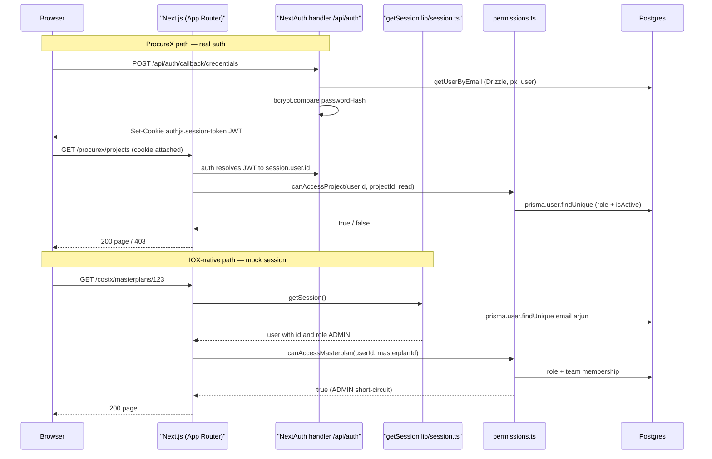

# IOX Core

The core layer is the platform-wide foundation that every IOX module — CostX, BOQs, ProcureX, Benchmarking, Configuration — sits on top of. It owns identity, session resolution, role-based access, environment configuration, and the database connections that wire those pieces together. Anything that needs to know "who is the current user" or "may they do this" flows through this layer.

## Overview

Core is split across two physical roots in the repository because IOX is mid-migration between two ORMs and two authentication systems:

| Concern | Path | Role |
|---|---|---|
| Mock session (IOX-native modules) | `web/lib/session.ts` | Returns the seeded Arjun Mehta user. Used by CostX, BOQs, summary screens — anything ported from roshn. |
| Permission helpers | `web/lib/permissions.ts` | Role + membership checks (`canAccessMasterplan`, `canAccessProject`, `getUserPermissions`). Reads from Prisma `users`. |
| Prisma client singleton | `web/lib/prisma.ts` | Prisma 7 client with the `@prisma/adapter-pg` driver adapter. |
| NextAuth wiring | `web/modules/core/auth.ts` | Real Auth.js v5 (NextAuth) with Drizzle adapter + Credentials provider. Used by ProcureX. |
| Edge-safe auth config | `web/modules/core/auth.config.ts` | NextAuthConfig importable from middleware. No Node-only deps. |
| Drizzle DB client | `web/modules/core/db.ts` | `drizzle-orm/node-postgres` Pool wired to `DATABASE_URL`. |
| Env validation | `web/modules/core/env.ts` | Zod schema, parsed once at boot. |
| NextAuth identity tables | `web/modules/identity/schema.ts` | `px_user`, `px_account`, `px_session`, `px_verification_token`. |
| Identity queries | `web/modules/identity/queries.ts` | `getUserById`, `getUserByEmail`, `listDevSeedUsers`. |
| Root NextAuth route | `web/app/api/auth/[...nextauth]/route.ts` | Re-exports `handlers.GET`/`POST` from `modules/core/auth`. |

> [!IMPORTANT]
> IOX runs **two parallel user tables today**: Prisma's `users` (with the `UserRole` enum, the source of truth for RBAC) and Drizzle's `px_user` (NextAuth identities for ProcureX sign-in). Both rows for the same person are reconciled by email convention. See [ADR-0004](../architecture/decisions/0004-mock-session-shim.md) for the resolution path (Phase 9).

## Identity model: Prisma User + Drizzle px_user

### Prisma `User` (table `users`)

The authoritative platform identity. Holds the role, lifecycle flags, and every cross-module relation (masterplans, BOQ runs, activity logs).

```prisma
model User {
  id    String   @id @default(uuid())
  email String   @unique
  name  String?
  role  UserRole @default(VIEWER)

  // Credentials — present but not wired (non-breaking future migration)
  passwordHash        String?
  mustChangePassword  Boolean   @default(false)
  failedLoginAttempts Int       @default(0)
  lockedUntil         DateTime?

  // 2FA — present but not wired
  twoFactorEnabled Boolean  @default(false)
  twoFactorSecret  String?
  backupCodes      String[]

  // Access control
  allowedCountries  String[]
  allowedDevelopers String[]
  isActive          Boolean   @default(true)
  lastLoginAt       DateTime?

  // Relations — Masterplan[], BenchmarkProject[], ActivityLog[], BoqRun[], …
  @@index([email]) @@index([role]) @@index([isActive])
  @@map("users")
}
```

The password / 2FA / login-lockout fields are present but **not wired** — they exist so the future migration to real per-user credentials is a non-breaking column addition.

### Drizzle `px_user` (NextAuth)

The Auth.js standard tables, extended with two app-specific columns. Defined in `web/modules/identity/schema.ts`:

```typescript
export const users = pgTable("px_user", {
  id: text("id").primaryKey().$defaultFn(() => crypto.randomUUID()),
  name: text("name"),
  email: text("email").unique().notNull(),
  emailVerified: timestamp("email_verified", { mode: "date" }),
  image: text("image"),
  passwordHash: text("password_hash"),              // Credentials provider
  isDevSeed: boolean("is_dev_seed").default(false).notNull(),
  devRoleLabel: text("dev_role_label"),             // free-text, dev quick-fill only
  createdAt: timestamp("created_at", { mode: "date" }).defaultNow().notNull(),
  updatedAt: timestamp("updated_at", { mode: "date" }).defaultNow().notNull(),
})
```

Alongside `px_user` are the standard Auth.js sibling tables `px_account`, `px_session`, and `px_verification_token` — each `text("user_id")` references `px_user.id` with `onDelete: "cascade"`.

> [!NOTE]
> The `px_` prefix is historical — these tables were introduced when ProcureX was a standalone app. They are deliberately **not** renamed during the IOX consolidation so the Auth.js migration history stays clean. Phase 9 collapses them into the Prisma `users` table via a custom NextAuth adapter.

### ProcureX role labels vs IOX role enum

`px_user.dev_role_label` is free-text — it powers the dev quick-fill sign-in panel ("sign in as QS", "sign in as Project Owner") but it is **not** the enforced role. The enforced role is Prisma's `UserRole` enum on the matching `users` row:

```prisma
enum UserRole {
  ADMIN
  DEVELOPMENT_MANAGER
  VIEWER
}

enum TeamRole {
  MANAGER
  VIEWER
}
```

`UserRole` is the platform role; `TeamRole` is per-project (set on `BenchmarkProjectTeamMember` and `ProjectTeamMember`).

## The mock session shim

`web/lib/session.ts` is the seam that lets ported roshn code run inside IOX without being rewritten to talk to NextAuth. Every place the original called `await auth()` and read `session.user.id` now calls `await getSession()` and reads the same shape from this file.

```typescript
export interface IoxSession {
  user: { id: string; email: string; name: string;
          role: "ADMIN" | "DEVELOPMENT_MANAGER" | "VIEWER" };
}

export async function getSession(): Promise<IoxSession> {
  if (cached) return cached;
  const u = await prisma.user.findUnique({
    where: { email: "arjun.mehta@iox.local" },
    select: { id: true, email: true, name: true, role: true },
  });
  if (!u) throw new Error("Mock IOX user not found — run `npm run db:seed` in web/");
  cached = { user: { id: u.id, email: u.email, name: u.name ?? "Arjun Mehta", role: u.role } };
  return cached;
}
```

### Why it exists

IOX absorbed two codebases on different timelines: roshn (CostX, BOQs, summary) was already feature-complete; ProcureX joined later and needed real authentication for its multi-tenant flows. Rather than re-plumb ported code to NextAuth on day one, the shim lets it keep working while ProcureX gets real `auth()`. Both sides resolve to the same person (Arjun Mehta) by email convention.

### Properties

- **Server-only** — first line is `import "server-only"`; calling from a client component fails at build time.
- **Process-cached** — memoised on a module-level variable; one DB hit per cold process.
- **Throws on missing seed** — deliberate. Returning `null` would let permission helpers fall back to "deny" and hide the real failure.

### How to remove it (Phase 9)

[ADR-0004](../architecture/decisions/0004-mock-session-shim.md) defines the swap: replace the body with a `await auth()` call, fall back to Arjun in non-production, return `null` in production. In the same migration, a custom Drizzle adapter points NextAuth at the Prisma `users` row instead of `px_user`, collapsing the two tables. Until that lands, the shim is the only contract.

> [!CAUTION]
> Because the shim always returns Arjun (ADMIN), every `canAccess*` helper short-circuits to "true" in IOX-native modules. A direct HTTP hit on `/costx` from an unauthenticated client gets a 200 response. That is acceptable on the demo VM (single-IP allowlist) but **not for public production** — see the [access control matrix](../security/access-control-matrix.md) test evidence row marked with a warning.

## NextAuth at root mount

The NextAuth route handler lives at `/api/auth/[...nextauth]`, not under `/procurex/api/auth/[...nextauth]`. The decision and rationale are in [ADR-0002](../architecture/decisions/0002-nextauth-at-root.md).

```typescript
// web/app/api/auth/[...nextauth]/route.ts
import { handlers } from "@/modules/core/auth"
export const { GET, POST } = handlers
```

The handlers are constructed in `web/modules/core/auth.ts`:

```typescript
export const { handlers, auth, signIn, signOut } = NextAuth({
  ...authConfig,
  adapter: DrizzleAdapter(db, { usersTable: users, accountsTable: accounts,
                                sessionsTable: sessions, verificationTokensTable: verificationTokens }),
  providers: [
    Credentials({
      credentials: { email: { type: "email" }, password: { type: "password" } },
      async authorize(creds) {
        const email = String(creds?.email ?? "").trim().toLowerCase()
        const password = String(creds?.password ?? "")
        if (!email || !password) return null
        const user = await getUserByEmail(email)
        if (!user?.passwordHash) return null
        if (!(await bcrypt.compare(password, user.passwordHash))) return null
        return { id: user.id, email: user.email, name: user.name ?? undefined }
      },
    }),
  ],
  events: {
    async signIn({ user }) {
      if (user?.id) {
        try { await ensureWorkspaceForUser(user.id) }
        catch (err) { console.error("[auth] workspace bootstrap failed", err) }
      }
    },
  },
})

export async function requireUserId(): Promise<string> {
  const session = await auth()
  const userId = session?.user?.id
  if (!userId) throw new Error("UNAUTHENTICATED")
  return userId
}
```

### Split into edge-safe + Node-only halves

`auth.config.ts` is the edge-safe slice. It declares `pages.signIn`, `session.strategy: "jwt"`, and the `authorized`/`jwt`/`session` callbacks without importing the Drizzle adapter or `bcryptjs` (both pull in Node-only APIs that fail to bundle on the Edge runtime). `auth.ts` extends that config with the adapter and providers — anything Node-only stays there.

```typescript
export const authConfig = {
  pages: { signIn: "/procurex/sign-in" },
  session: { strategy: "jwt" },
  providers: [],
  callbacks: {
    authorized: ({ auth }) => Boolean(auth?.user),
    async jwt({ token, user }) { if (user?.id) token.sub = user.id; return token },
    async session({ session, token }) {
      if (token?.sub && session.user) session.user.id = token.sub
      return session
    },
  },
} satisfies NextAuthConfig
```

> [!NOTE]
> The sign-in **page** lives at `/procurex/sign-in` (configured via `pages.signIn`); the underlying NextAuth **handler** is at root `/api/auth/[...nextauth]`. This separation is the literal mechanic that makes super-admin work — one cookie, one session, every module honours it.

## Role-based access

### The `UserRole` enum

Three platform-level roles, enforced via Prisma:

| Role | Intent |
|---|---|
| `ADMIN` | Module-level admin. Create masterplans, manage users, see all data. Short-circuits to allow on every helper. |
| `DEVELOPMENT_MANAGER` | Can create masterplans and manage projects where they are a `TeamRole.MANAGER`. |
| `VIEWER` | Read-only access to assigned masterplans. |

`SUPER_ADMIN` is not a separate enum value — it is the combination of `users.role = "ADMIN"` plus the seed marker. Today only Arjun Mehta holds it.

### The helpers in `web/lib/permissions.ts`

All helpers take a `userId: string` (from `getSession().user.id`) and resolve the role server-side. They split into three families:

**Read-side filters** — return `null` for full access (admin) or an array of IDs the user may see:

```typescript
export async function getAccessibleProjectIds(userId: string): Promise<string[] | null>
export async function getAccessibleMasterplanIds(userId: string): Promise<string[] | null>
```

`null` is the magic "no filter — show everything" signal that the list-query helpers in `lib/queries/*` understand.

**Action-side authorisation** — boolean gates for write actions:

```typescript
export async function canAccessMasterplan(userId: string, masterplanId: string): Promise<boolean>
export async function canCreateMasterplanForProject(userId: string, projectId: string): Promise<boolean>
export async function canAccessProject(userId: string, projectId: string, action: "read" | "update" | "delete"): Promise<boolean>
```

**Aggregate user view** — single object that the UI renders against:

```typescript
export interface UserPermissions {
  role: "ADMIN" | "DEVELOPMENT_MANAGER" | "VIEWER" | null;
  canCreateProject: boolean;
  canCreateMasterplan: boolean;
  canManageUsers: boolean;
  isAdmin: boolean;
  isDevelopmentManager?: boolean;
  isViewer?: boolean;
}

export async function getUserPermissions(userId: string): Promise<UserPermissions>
```

When `user.isActive === false`, every flag returns `false` and `role` is `null` — that is the lockout path.

> [!WARNING]
> `canAccessProject()` today returns `true` for any active user regardless of `projectId` or `action`. The comment in the file explicitly flags it as "mock ADMIN — full access for now". When real RBAC ships, the `_projectId` and `_action` parameters need to be honoured.

The full action-by-role matrix lives in [docs/security/access-control-matrix.md](../security/access-control-matrix.md).

## Session lifecycle

The diagram below shows how a request flows from the browser through the platform to a permission decision. Two paths coexist: the NextAuth path used by ProcureX (real cookie, real `auth()` call) and the mock path used by IOX-native modules (in-process cache, seeded user).



Notes: the Prisma DB lookup in `getSession()` happens **once per process** thanks to the module-level cache. The NextAuth path uses Drizzle (`px_user`); permission helpers always use Prisma (`users`); reconciliation is by email.

> [!WARNING]
> There is no `web/middleware.ts` in the repository today. The `authConfig.callbacks.authorized` callback is wired but currently unused. Route protection relies on server components calling `getSession()` or `auth()` themselves — a missing call is a missing gate.

## Environment surface

Defined and validated in `web/modules/core/env.ts` via a Zod schema. `env` is parsed once at module load; an invalid environment throws before any request is served.

| Variable | Type | Required | Default | Purpose |
|---|---|---|---|---|
| `NODE_ENV` | `"development" \| "production" \| "test"` | no | `"development"` | Standard Node mode flag. Controls Prisma logging and the dev fallback path in the planned Phase 9 session swap. |
| `DATABASE_URL` | URL string | yes | — | Postgres connection used by both Prisma (`lib/prisma.ts`) and Drizzle (`modules/core/db.ts`). Neon-protocol URLs auto-enable TLS. |
| `DATABASE_URL_UNPOOLED` | URL string | yes | — | Direct (non-pooled) Postgres connection. Used by migration tooling that cannot run through PgBouncer. |
| `AUTH_SECRET` | string, min 16 chars | yes | — | Auth.js JWT signing secret. Platform-wide because the cookie is platform-wide ([ADR-0002](../architecture/decisions/0002-nextauth-at-root.md)). |
| `ANTHROPIC_API_KEY` | string, min 10 chars | yes | — | Direct Anthropic SDK key for the document-extraction agent (adaptive thinking, prompt caching, 128k output beta). |
| `AI_DEFAULT_MODEL` | string | no | `"claude-sonnet-4-6"` | Default model for top-level extraction calls. |
| `AI_CHUNKED_MODEL` | string | no | `"claude-haiku-4-5"` | Model used by the chunked extractor; Haiku because the chunked path makes hundreds of structured-JSON calls and is dominated by per-call cost. |
| `AI_DEFAULT_EFFORT` | `"low" \| "medium" \| "high" \| "xhigh" \| "max"` | no | `"medium"` | Default reasoning-effort level for agent calls. |
| `AI_MAX_ITERATIONS` | positive int | no | `500` | Agent loop ceiling. |
| `AI_MAX_TOKENS` | positive int | no | `32000` | Per-call max output token cap. |
| `AI_CHUNKED_MAX_UNITS` | non-negative int | no | `0` | Dev-only cap on extracted top-level units (`0` = unlimited). When a cap kicks in the run is marked `cache_eligible: false`. |
| `AI_CLASSIFY_DISABLED` | boolean (string `"true"` coerced) | no | `false` | When true, the bulk-upload classifier skips the Haiku call and falls back to the deterministic fingerprint detector. |
| `BLOB_READ_WRITE_TOKEN` | string | no | — | Vercel Blob token for file storage. |

> [!NOTE]
> `env` is exported as a fully-typed object: `import { env } from "@/modules/core/env"`. Treat `process.env.X` reads outside this file as legacy — they bypass validation.

## Common patterns

### Resolve the current user in a server component

```typescript
import { getSession } from "@/lib/session";
import { getUserPermissions } from "@/lib/permissions";

export default async function Page() {
  const { user } = await getSession();
  const perms = await getUserPermissions(user.id);

  return <Dashboard userId={user.id} canCreateMasterplan={perms.canCreateMasterplan} />;
}
```

### Require an authenticated user in a server action (ProcureX side)

```typescript
"use server";
import { requireUserId } from "@/modules/core/auth";

export async function createProject(formData: FormData) {
  const userId = await requireUserId(); // throws "UNAUTHENTICATED" if no session
  // …
}
```

### Resolve the live DB user from the mock session

```typescript
import { getCurrentUserServer } from "@/lib/auth";

const me = await getCurrentUserServer();
if (!me || !me.isActive) return null;
```

`getCurrentUserServer()` is the bridge for ported actions that expect a full user record (name, role, `isActive`) rather than the lean session shape.

### Gate a masterplan read

```typescript
import { canAccessMasterplan } from "@/lib/permissions";

const ok = await canAccessMasterplan(user.id, masterplanId);
if (!ok) notFound();
```

### Filter a list query by accessible IDs

```typescript
import { getAccessibleMasterplanIds } from "@/lib/permissions";

const accessibleIds = await getAccessibleMasterplanIds(user.id);
const rows = await prisma.masterplan.findMany({
  where: accessibleIds === null ? {} : { id: { in: accessibleIds } },
});
```

The `null` return means "no filter — full access" and must be branched on explicitly. Treating `null` as an empty array would silently hide everything from admins.

### Log an action

```typescript
import { logActivity } from "@/lib/auth";

await logActivity(user.id, "UPDATE", "Masterplan", masterplanId, before, after, request);
```

## Gotchas

> [!CAUTION]
> **Two user tables.** A row in `px_user` does **not** automatically exist in `users`, and vice versa. The mock session always reads from `users`; NextAuth always reads from `px_user`. Cross-table reconciliation is by email — if the emails diverge, the same human becomes two distinct identities and activity logs split.

> [!WARNING]
> **Role enum casing matters.** Prisma's `UserRole` is `"ADMIN" | "DEVELOPMENT_MANAGER" | "VIEWER"` (uppercase, underscores). The `px_user.dev_role_label` column is free-text — strings like `"qs"`, `"project_owner"`, `"Project Owner"` appear there and are **not** comparable to `UserRole`. Always compare against `UserRole` for authorisation.

> [!CAUTION]
> **Mock vs real.** `getSession()` from `@/lib/session` is the mock; `auth()` from `@/modules/core/auth` is real NextAuth. They return different shapes (the mock has a guaranteed `role`; NextAuth's `session.user` does not include `role` unless you extend it). Do not import both into the same file without naming them apart.

> [!WARNING]
> **Cookie name.** Auth.js v5 cookie defaults to `authjs.session-token` (dev) and `__Secure-authjs.session-token` (production over HTTPS). Older docs and roshn references to `next-auth.session-token` are stale.

> [!IMPORTANT]
> **Missing seed = hard failure.** `getSession()` throws if the seeded `arjun.mehta@iox.local` row is missing. That is a feature, not a bug — silently returning `null` would let every permission helper return "deny" and surface as 403s with no diagnostic. Run `npm run db:seed` in `web/` if you see the error.

> [!CAUTION]
> **`canAccessProject` is a stub.** It returns `true` for any active user. Do not infer that ProcureX project authorisation is enforced — it is not, today. The shape of the helper is the contract; the body needs to be filled in before production.

> [!NOTE]
> **No middleware.** There is no `web/middleware.ts`. Unauthenticated GETs on IOX-native routes (`/costx`, `/boqs`) return 200 because the mock session never throws. The demo VM relies on single-IP network access; do not extrapolate to public deployment.

> [!WARNING]
> **`prisma.user.findUnique` is called in every permission helper.** That is fine inside a request because the connection pool is warm, but a tight loop calling `canAccessMasterplan` N times will issue N user lookups. Batch by resolving the role once and reusing it.

> [!NOTE]
> **`env` parses at module load.** A missing required env var crashes the process at boot, before any route handler runs. That is intentional — fail loud on misconfiguration rather than fail silently mid-request.

## Where to find it in code

| File | Purpose |
|---|---|
| `web/lib/session.ts` | Mock IOX session (`getSession`) — Arjun Mehta, process-cached. |
| `web/lib/auth.ts` | `getCurrentUserServer()` + `logActivity()` for ported actions. |
| `web/lib/permissions.ts` | All `canAccess*`, `getAccessible*`, `getUserPermissions` helpers. |
| `web/lib/prisma.ts` | Prisma 7 client singleton with `@prisma/adapter-pg`. |
| `web/modules/core/auth.ts` | NextAuth setup, Drizzle adapter, Credentials provider, `requireUserId()`. |
| `web/modules/core/auth.config.ts` | Edge-safe NextAuthConfig — `pages`, `session.strategy`, callbacks. |
| `web/modules/core/db.ts` | Drizzle client over `pg.Pool` — `DATABASE_URL`, auto-TLS for Neon. |
| `web/modules/core/env.ts` | Zod-validated env schema, parsed once at boot. |
| `web/modules/core/index.ts` | Public re-exports (`db`, `env`). |
| `web/modules/identity/schema.ts` | Drizzle tables `px_user`, `px_account`, `px_session`, `px_verification_token`. |
| `web/modules/identity/queries.ts` | `getUserById`, `getUserByEmail`, `listDevSeedUsers`. |
| `web/modules/identity/index.ts` | Public re-exports. |
| `web/app/api/auth/[...nextauth]/route.ts` | Root-mounted NextAuth handler (`GET`, `POST`). |
| `web/prisma/schema.prisma` (lines 32–78) | Prisma `User` model. |
| `web/prisma/schema.prisma` (lines 117–127) | `SystemSettings` (Azure AD config, currently disabled). |
| `web/prisma/schema.prisma` (lines 414–423) | `UserRole` and `TeamRole` enums. |
| `web/prisma/seed.ts` (line 211) | Arjun Mehta seed (`arjun.mehta@iox.local`). |
| [`docs/architecture/decisions/0002-nextauth-at-root.md`](../architecture/decisions/0002-nextauth-at-root.md) | Why the NextAuth handler mounts at root. |
| [`docs/architecture/decisions/0004-mock-session-shim.md`](../architecture/decisions/0004-mock-session-shim.md) | Why the mock shim exists and the Phase 9 removal path. |
| [`docs/security/access-control-matrix.md`](../security/access-control-matrix.md) | Full role × module × action matrix, with test evidence. |
