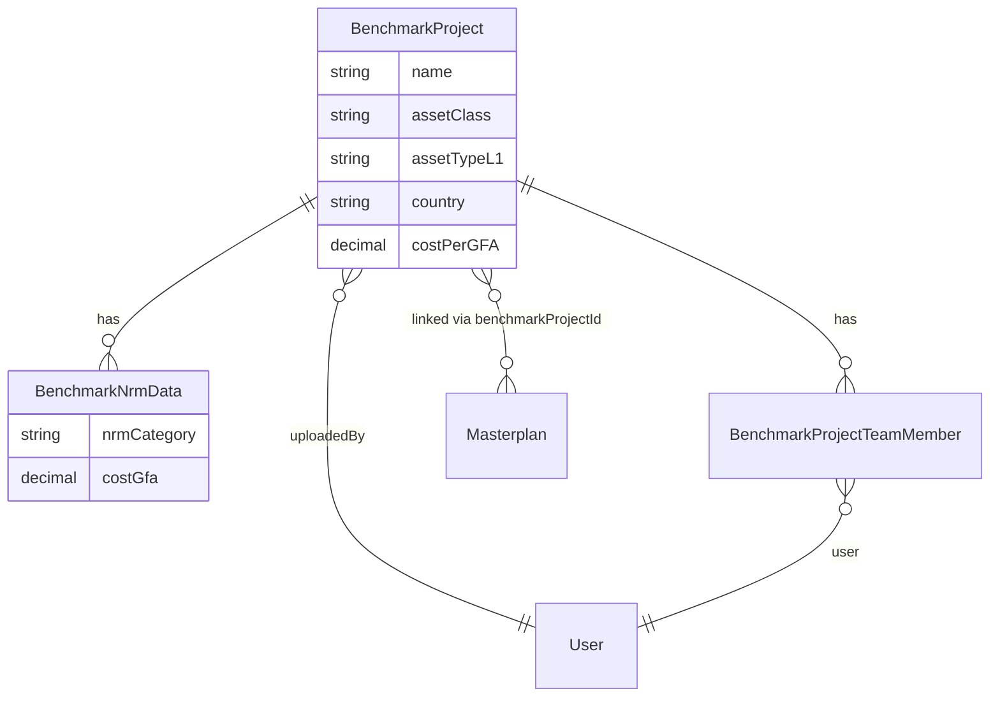
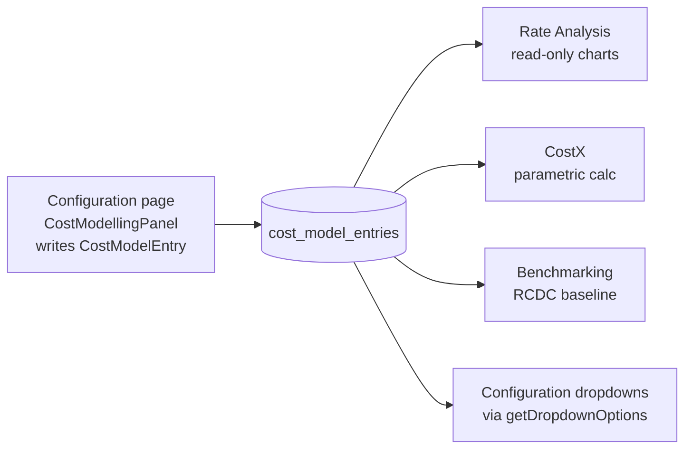
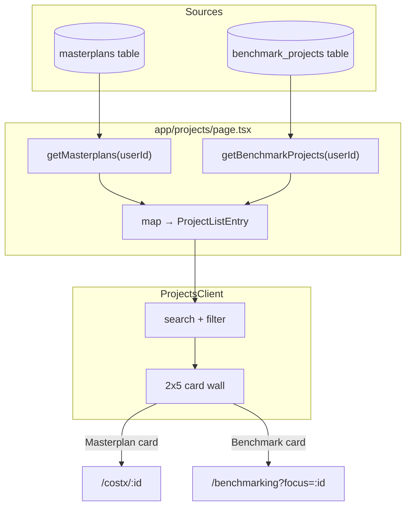

# IOX Secondary Modules

This document covers four IOX modules that share one trait: they are smaller in surface area than CostX and BOQs but are still first-class entries in the IOX shell — each has its own top-level route, its own Prisma-backed data, and its own server-action surface. They are the connective tissue of the platform. Benchmarking feeds CostX with comparable peer projects. Rate Analysis is the read-only analytical view over the same cost model that CostX consumes parametrically. Projects is the cross-module landing surface that lets a user jump from "I want to open a project" to the right downstream module. Configuration is where admins shape every dropdown, hierarchy and tuning knob that every other module reads.

Together these four routes form the meta-layer that the heavier modules (CostX masterplans, BOQs pricing runs, ProcureX procurement projects) depend on. Touching any of them has blast radius across the platform — so this doc is deliberately concrete about what each one writes, what it reads, and where the surprises hide.

## Why these are grouped here

The first-class IOX modules — CostX (`/costx`, `/masterplans`, `/cost-modelling`), BOQs (`/boqs`), ProcureX (`/procurex`) and CommercialX (planned) — each have their own dedicated module docs. They are heavy: thousands of lines of UI, deep state machines, file pipelines, multi-step wizards.

The four routes covered here (`/benchmarking`, `/cost-model-rate-analysis`, `/projects`, `/configuration`) are smaller in their own dimensions but are not "secondary" in importance. They are grouped together because:

- **Each is a single top-level route under `web/app/<route>/page.tsx`.** No nested layouts, no per-segment loaders.
- **Each is a single server-rendered shell** (`export const dynamic = "force-dynamic"`) that fetches its data in `page.tsx` and hands it to one large client component (`ConfigurationClient`, `BenchmarkingClient`, `ProjectsClient`, `CostModelAnalysisClient`).
- **They have no module-private Prisma models of their own** — Benchmarking owns `BenchmarkProject` and friends, and Configuration owns the `Configuration` JSON store, but neither model exists for that route alone. Other modules read from them too.
- **They sit on the shared identity system** described in MEMORY (super admin spans every module — there is no per-module auth silo).

> [!NOTE]
> If you are extending one of these routes, you are almost certainly also changing data shapes that CostX, BOQs or ProcureX read from. Cross-check with the dedicated module docs before merging.

---

## Benchmarking

### Intent

`/benchmarking` is the comparable-projects workspace. Users upload a multi-project Excel export from a quantity-surveyor tool, the system parses one column per project into `BenchmarkProject` rows with a per-NRM-category cost-per-GFA breakdown, and the page renders all uploaded projects on one multi-line chart against an RCDC baseline computed live from the CostX cost model. Officers can then filter by asset class, asset type, asset massing, country, city, developer and project to narrow comparisons.

The product premise is "show me how my new masterplan compares to every project we have on file, by NRM category, at the cost-per-GFA grain." Everything on the page serves that comparison.

### Data model

Three Prisma models drive Benchmarking. Their schema is verbatim from `web/prisma/schema.prisma` lines 326–385.

**`BenchmarkProject`** — one row per uploaded project.

| Field | Type | Notes |
|---|---|---|
| `id` | `String @id @default(uuid())` | Stable URL key |
| `name` | `String` | Display name; also the filter key |
| `assetClass` | `String?` | E.g. "Residential" |
| `assetTypeL1` | `String?` | E.g. "Low Rise" |
| `assetFormL2` | `String?` | Massing |
| `location`, `country`, `city`, `developer` | `String?` | Free-text filter dimensions |
| `currency` | `String? @default("SAR")` | |
| `latitude`, `longitude` | `Decimal? @db.Decimal(10, 7)` | For map view |
| `polygon` | `Json?` | Site outline |
| `grossLandArea`, `totalCost`, `totalGFA`, `costPerGFA` | `Decimal?` | Totals (Excel importer fills `totalCost`/`totalGFA = 1`, `costPerGFA` = sum, because Excel values are already per-GFA) |
| `uploadedById` | `String` (FK → `User`) | Always set |
| `source` | `String?` | The uploaded filename |
| `nrmData` | `BenchmarkNrmData[]` | One row per NRM L1 category |
| `teamMembers` | `BenchmarkProjectTeamMember[]` | Access list |
| `masterplans` | `Masterplan[]` | Reverse side of `Masterplan.benchmarkProjectId` |

**`BenchmarkProjectTeamMember`** — RBAC join.

| Field | Type | Notes |
|---|---|---|
| `projectId` | FK → `BenchmarkProject` | Cascade delete |
| `userId` | FK → `User` | Cascade delete |
| `role` | `TeamRole @default(VIEWER)` | Same enum used by `ProjectTeamMember` (Masterplan side) |
| `assignedBy` | `String?` | Audit |
| `@@unique([projectId, userId])` | | One row per (project, user) |

**`BenchmarkNrmData`** — the cost breakdown.

| Field | Type | Notes |
|---|---|---|
| `projectId` | FK → `BenchmarkProject` | Cascade delete |
| `nrmCategory` | `String` | Free-text — must match cost-model `nrmLvl1` after `normalizeNrmCategory` strips the `"N - "` prefix |
| `costGfa` | `Decimal @db.Decimal(18, 2)` | **Already per-GFA**, not absolute. The chart plots this directly. |
| `@@unique([projectId, nrmCategory])` | | One row per category per project |



### Routes

| Route | Verb | Purpose |
|---|---|---|
| `/benchmarking` | GET | The page. Hands off to `BenchmarkingClient`. |
| `/api/benchmark-projects` | GET | JSON of all projects (used by `DropdownOptionsPanel` in Configuration) |
| `/api/benchmark-filter-options` | GET | Saved custom filter options from `Configuration[key="benchmark_filter_options"]` |
| `createBenchmarkProject` (action) | POST | Admin-only; creates an empty project |
| `uploadBenchmarkNRMData` (action) | POST | Replaces `BenchmarkNrmData` rows for a project |
| `updateBenchmarkProject` (action) | POST | Admins manage team members; updaters edit metadata |
| `deleteBenchmarkProject` (action) | POST | Admin-only; cascades to NRM data and team members |
| `importBenchmarkExcel` (action) | POST | The bulk import — see "Key flows" below |
| `getRCDCBaselineAction` (action) | POST | Re-computes the RCDC baseline given live filter selections |

### Key flows

**Initial render** (`web/app/benchmarking/page.tsx`):

1. `getSession()` to identify the user.
2. `getBenchmarkProjects(user.id)` — Prisma find with `teamMembers`, `nrmData`, `uploadedBy`, `_count.masterplans` included. Filtered by `getAccessibleProjectIds(userId)` so non-admins only see projects they own or are on the team for.
3. `getRCDCBaseline({})` — pulls every `CostModelEntry`, groups by normalised `nrmLvl1`, averages `rcdcCostGfa` per category.
4. `getCostModelEntries()` — feeds `getDropdownOptions(...)` for asset class / type / massing dropdowns.
5. Read `Configuration[key="benchmark_filter_options"]` to apply any admin-saved overrides for which filter values appear.
6. Build the sorted `nrmCategories` list as the **union** of categories actually present in uploaded NRM data and in the RCDC baseline, then sort by the hardcoded `nrmOrder` preference list with anything unknown falling to the end alphabetically.
7. Filter `benchmarkProjects` to only those whose `name` is in the configured project options (when configured), so deleted-from-config projects vanish from chart + everywhere else.
8. `convertDecimalToNumber(...)` to flatten Prisma `Decimal` to JS number before serialising to the client.

**Excel import** (`actions/benchmarking.ts → importBenchmarkExcel`):

```typescript
// Expected sheet:
// Row 1+: header row — first cell contains "Row Labels", subsequent cells are project names
// Rows 2+: first cell is an NRM category, subsequent cells are cost-per-GFA values per project
const headerRow = rawData[headerRowIndex];
const projectNames = headerRow.slice(1).filter(n => n && !n.includes("Grand Total"));

// Each cell value flows into BenchmarkNrmData.costGfa for that project
// Project asset type is regex-extracted from the name itself:
const nameMatch = projectName.match(/(Low Rise|Mid Rise|High Rise|Multi Family)/i);
```

The importer hardcodes country to "Saudi Arabia", currency to "SAR", and assumes asset class is "Residential". Per-NRM values are summed to derive `totalCost`, `totalGFA` is set to 1, and `costPerGFA` is the sum — so downstream math treats the imported values as already-normalised cost-per-GFA.

**Live RCDC re-baseline** (`useEffect` in `BenchmarkingClient`): whenever the user changes `assetClass`, `assetType` or `assetMassing` filters, the client calls `getRCDCBaselineAction({...})` which re-runs the same NRM-level-1 average against the filtered subset of `CostModelEntry` rows. The result replaces `dynamicRcdcBaseline` and the chart re-renders.

### NRM data and what it represents

`BenchmarkNrmData.costGfa` is **cost in SAR per square metre of GFA, for that NRM Level 1 category, for that project**. It is *not* a total. The chart plots one line per project across the NRM-category axis, with each Y value being that single Decimal.

The RCDC baseline is a synthetic project labelled `"RCDC Baseline"` (or `"RCDC Cost Model"` when re-baselined live). Its `nrmBreakdown` is `Math.round(sum / count)` across all `CostModelEntry` rows that pass the live filter, grouped by `normalizeNrmCategory(entry.nrmLvl1)`.

### Gotchas

> [!WARNING]
> **The "N - " prefix mismatch was a real bug.** `CostModelEntry.nrmLvl1` stores prefixed names like `"1 - Substructure"`. `BenchmarkNrmData.nrmCategory` stores bare names like `"Substructure"`. Both pages strip the prefix via `normalizeNrmCategory()` in `lib/queries/benchmarking.ts`. Do not invent a third comparison path — use that helper.

> [!WARNING]
> **The hardcoded `nrmOrder` list drifts.** Two synonym pairs are explicitly listed (`"Internal Walls & Doors"` / `"Internal Walls and Doors"`, `"Mechanical Services"` / `"Mechanical"`) because seeded data uses one variant and imported Excel data uses the other. If you add a new canonical name, add both variants until the seed is fixed.

> [!NOTE]
> **`totalGFA = 1` is intentional in the Excel path.** The Excel importer already receives per-GFA values, so the `costPerGFA = totalCost / totalGFA` invariant is preserved by setting `totalGFA = 1`. Don't "correct" this without auditing every chart that divides by `totalGFA`.

> [!WARNING]
> Empty arrays are truthy in JavaScript. The page code uses `savedFilters?.assetClass?.length > 0` not `savedFilters?.assetClass` — preserve that pattern when adding new filter dimensions or the saved-empty-list will get silently ignored.

---

## Rate Analysis

### Intent

`/cost-model-rate-analysis` is a read-only analytical view over the same `CostModelEntry` table that powers CostX's parametric calculator and Configuration's editor. It presents three drill-down levels of stacked horizontal bar charts: asset class × NRM, asset type (within a class) × NRM, and asset form (within a class + type) × NRM. The Y axis is the NRM Level 1 category; the X axis is summed `sarPerUoM` cost.

It is the read-side of the cost model. It owns no data, writes nothing, and re-derives every chart from the same `getCostModelEntries()` query Configuration uses.

### Where the rates come from

Every value on the page is derived from `CostModelEntry.sarPerUoM` (cost per unit of measurement). The schema (lines 154–181):

```prisma
model CostModelEntry {
  id                 String   @id @default(uuid())
  assetClass         String
  assetTypeL1        String
  assetFormL2        String?
  pricePoint         String?
  nrmLvl1            String
  nrmLvl2            String?
  nrmLvl3            String?
  unitOfMeasurement  String?
  sarPerUoM          Decimal? @db.Decimal(12, 2)
  rcdcCostGfa        Decimal  @db.Decimal(12, 2)
  benchmarkedCostGfa Decimal? @db.Decimal(12, 2)
  // ...
  @@unique([assetClass, assetTypeL1, assetFormL2, pricePoint, nrmLvl1])
}
```

The unique tuple is the natural key: an asset (class, type, form, price-point) has at most one row per NRM Level 1 category. Rate Analysis sums `sarPerUoM` across that table without de-duplication, because the cardinality is already controlled by the unique constraint.

### How they connect to CostX cost models



The same row drives four downstream consumers. Rate Analysis is the analytical lens; CostX is the calculation engine; Benchmarking averages it into the RCDC baseline; and Configuration's `DropdownOptionsPanel` derives asset-class / asset-type option lists from it via `getDropdownOptions(...)` in `web/utils/dropdownOptions.ts`.

### Routes

| Route | Verb | Purpose |
|---|---|---|
| `/cost-model-rate-analysis` | GET | The page. Hands off to `CostModelAnalysisClient`. |
| (no writes) | — | Read-only module. To change data, go to `/configuration → Cost Modelling`. |

### Key flows

`web/app/cost-model-rate-analysis/page.tsx` does all the aggregation in the Server Component. The shape is:

1. `Promise.all([getCostModelEntries(), getCostModelStats()])` — both are `unstable_cache`'d (5 min revalidate, tag `cost-model`).
2. Compute `summaryStats`: number of asset classes, number of asset types, min/max/avg `sarPerUoM` across all rows.
3. **Asset class × NRM**: `assetClassData[assetClass][nrmLvl1] = sum(sarPerUoM)`. Reshape to `[{ category: nrmLvl1, [assetClassName]: value, ... }]` for the recharts grouped-bar format.
4. **Asset type × NRM by class**: same shape, one chart per asset class. Each `{ category, values: [{name, value, color}] }` row carries the per-type breakdown for one NRM category.
5. **Asset form × NRM by class + type**: third drill-down level, only emitted when forms exist for that (class, type) pair.
6. Hand the three pre-shaped arrays to `CostModelAnalysisClient`, which is purely a `useState`-driven chart switcher (selected asset class, selected asset type, stack-mode toggle).

The colour assignment uses a small rotating palette (`#424242`, brand primary, teal, mint, blue, grey) plus a couple of named overrides in `assetClassColors` and `assetTypeColors`.

### Gotchas

> [!WARNING]
> **Cache invalidation.** `getCostModelEntries` is wrapped in `unstable_cache` with tag `"cost-model"`. If you mutate cost-model data outside the `/actions/costModel.ts` and `/actions/configuration.ts` paths (both of which `revalidatePath("/configuration")`), Rate Analysis will show stale numbers for up to 5 minutes. Add `revalidateTag("cost-model")` to any new mutation path.

> [!NOTE]
> The page uses `sarPerUoM` directly, **not** `rcdcCostGfa` or `costGfa`. Those three fields are subtly different (per UoM vs per GFA) and exist for different consumers — Benchmarking averages `rcdcCostGfa`, Rate Analysis sums `sarPerUoM`. Don't conflate them.

> [!WARNING]
> Rate Analysis assumes a single row per `(assetClass, assetTypeL1, assetFormL2, pricePoint, nrmLvl1)` tuple — the unique constraint enforces this. If the constraint is ever relaxed, the sums become double-counts.

---

## Projects (cross-module surface)

### Intent

`/projects` is the cross-module project landing surface. It is the "I want to open a project" entry point. Today it unions two source-of-truth tables — `Masterplan` (CostX) and `BenchmarkProject` (Benchmarking) — into a single typed list, renders them as a 2×5 card wall styled to match the home page, and routes each card to the right downstream module.

It does not own data. Every row is a pointer to a record owned by another module, and the `href` on each card is the module-specific deep link.

### What it aggregates

Currently two project kinds:

| Kind | Source table | `href` target | Owner module |
|---|---|---|---|
| `Masterplan` | `prisma.masterplan` via `getMasterplans(user.id)` | `/costx/{id}` | CostX |
| `Benchmark` | `prisma.benchmarkProject` via `getBenchmarkProjects(user.id)` | `/benchmarking?focus={id}` | Benchmarking |

BOQ runs (`BoqRun`) and ProcureX projects are **not** currently unioned in — those modules have their own landing pages (`/boqs`, `/procurex`). When they are folded in, the existing union pattern extends straightforwardly.



### Routes

| Route | Verb | Purpose |
|---|---|---|
| `/projects` | GET | The unified card wall |
| (no writes) | — | Pure surface — all writes happen in the owner module |

### How it does the union

The transform is a literal concatenation of two mapped arrays into a single `ProjectListEntry[]` type:

```typescript
export interface ProjectListEntry {
  id: string;
  kind: "Masterplan" | "Benchmark";
  name: string;
  assetClass: string | null;
  developer: string | null;
  country: string | null;
  city: string | null;
  totalCost: number | null;
  gla: number | null;          // grossLandArea (Masterplan) or grossLandArea (Benchmark)
  status: string | null;        // Masterplan.status, null for Benchmark
  updatedAt: Date;
  href: string;                 // module-specific deep link
}

const projects: ProjectListEntry[] = [
  ...masterplans.map((mp) => ({ kind: "Masterplan", ..., href: `/costx/${mp.id}` })),
  ...benchmarks.map((b)  => ({ kind: "Benchmark",  ..., href: `/benchmarking?focus=${b.id}` })),
];
```

Both source queries already filter by user access (`getAccessibleMasterplanIds`, `getAccessibleProjectIds`), so the union inherits the same access control without re-checking.

Client-side, `ProjectsClient` provides:

- A text search across `name`, `developer`, `city`, `country`.
- A Segment toggle for `All / Masterplan / Benchmark` with live counts.
- An asset-class select derived from `[...new Set(projects.map(p => p.assetClass))]`.
- A capped 10-card grid (`filtered.slice(0, 10)`) with an overflow hint below.

### Gotchas

> [!WARNING]
> **The grid is capped at 10 cards.** This is a deliberate design constraint that mirrors the home-page card wall shape (5 cols × 2 rows). If you raise the cap, the grid layout breaks. The overflow notice below the grid is the documented escape hatch — refine the filters to narrow further.

> [!NOTE]
> The two source queries are run in parallel via `Promise.all`. If a third source is added (e.g. `getProcureXProjects`), keep the parallelism — the page is `force-dynamic` and any serialisation will be felt on every render.

> [!WARNING]
> **`updatedAt` is not currently used in the UI.** Both sources include it on the entry, but `ProjectsClient` does not sort by it. If you add sort-by-recency, sort the unioned array, not the individual sources — otherwise interleaving breaks.

> [!NOTE]
> Asset class on `BenchmarkProject` is nullable (`assetClass?`) but on `Masterplan` is required. The `ProjectListEntry.assetClass` field is therefore `string | null`. The filter dropdown coalesces null/missing to "All".

---

## Configuration

### Intent

`/configuration` is the admin surface for every tunable knob in IOX that is not project-specific. It edits the cost model (asset hierarchy + per-NRM rates), the parametric matrix (multiplicative adjustments per parameter × option × NRM), cost factors over time, density / infrastructure / parking defaults, S-curve settings, dropdown options used across the app, and platform-wide system defaults.

The page is one route, one client component (`ConfigurationClient`), and nine tabs.

### Data model

Configuration interacts with four Prisma models. Three of them are typed schemas with foreign keys; one is a generic JSON store.

**`Configuration`** — the generic key/value JSON store (lines 315–324):

```prisma
model Configuration {
  id        String   @id @default(uuid())
  key       String   @unique
  value     Json
  createdAt DateTime @default(now())
  updatedAt DateTime @updatedAt

  @@index([key])
}
```

Known keys in active use:

| Key | Writer | Reader |
|---|---|---|
| `benchmark_filter_options` | `DropdownOptionsPanel.save()` | `/benchmarking/page.tsx` (line 65), `/api/benchmark-filter-options` |
| `cost_factor_settings` | `ConfigurationClient.handleSave()` | `CostFactorPanel` |
| `scurve_settings` | `ConfigurationClient.handleSave()` | `SCurveSettingsPanel` |
| `system_defaults` | `ConfigurationClient.handleSave()` | `SystemDefaultsPanel` |
| `infrastructure_split` | `InfrastructureSplitPanel` | `ConfigurationClient` |
| `masterplan_version_{masterplanId}_{versionId}` | `autoSaveMasterplanVersion()` | `loadMasterplanVersion()` (CostX) |

Because `value: Json`, each key is free-shape. **There is no schema enforcement** — readers must defensively shape the value. New keys can be introduced without a migration; readers must be added in lockstep.

**`CostModelEntry`** — see Rate Analysis section above. Edited via the Cost Modelling tab.

**`ParametricMatrix`** (lines 289–302):

```prisma
model ParametricMatrix {
  id        String   @id @default(uuid())
  nrmLvl1   String
  parameter String
  option    String
  factor    Decimal  @db.Decimal(5, 4)
  @@unique([nrmLvl1, parameter, option])
}
```

A per-(NRM, parameter, option) multiplicative factor used by CostX's parametric calculator. `factor = 1.0000` means no adjustment.

**`CostFactor`** (lines 304–313):

```prisma
model CostFactor {
  id         String   @id @default(uuid())
  baseDate   String   @unique
  costUplift Decimal  @db.Decimal(5, 4)
}
```

Time-indexed cost uplift factor. `baseDate` is the unique key (string, not Date — historical choice from the source-app port).

**`SystemSettings`** (lines 117–127) — a singleton row keyed `id = "settings"` for Azure AD wiring. Distinct from `Configuration`. Owned by the platform / auth layer, not by `/configuration`. The dashboard at `/platform` edits it; this page does not. Listed here only because the names collide with `system_defaults` and engineers regularly confuse the two.

> [!WARNING]
> `SystemSettings` (Azure AD wiring, singleton, schemaed) and `Configuration[key="system_defaults"]` (general defaults, JSON, edited by this page) are different rows in different tables. The names sound the same. They aren't.

### What the page lets admins change

The nine tabs are declared in `web/types/costModel.ts`:

| Tab id | Label | Component | What it writes |
|---|---|---|---|
| `cost-modelling` | Cost Modelling | `CostModellingPanel` + `AssetHierarchyTree` | `CostModelEntry` rows (CRUD via `addCostModelEntry`, `editCostModelEntry`, `deleteCostModelEntry`) |
| `parametric-matrix` | Parametric Matrix | `ParametricMatrixPanel` + `ParametricTree` | `ParametricMatrix` (full replace via `updateParametricMatrix` — `deleteMany` then `createMany`) |
| `cost-factor` | Cost Factor | `CostFactorPanel` | `Configuration[cost_factor_settings]` + `CostFactor` rows (via `updateCostFactors`) |
| `density-range-factor` | Density Range Factor | `DensityRangeFactorPanel` | (panel-internal; client-side only at present) |
| `infrastructure-split` | Infrastructure Split | `InfrastructureSplitPanel` | `Configuration[infrastructure_split]` |
| `parking-space` | Parking Space | `ParkingSpacePanel` | (panel-internal) |
| `scurve-settings` | S-Curve | `SCurveSettingsPanel` | `Configuration[scurve_settings]` |
| `dropdown-options` | Benchmarks Filter | `DropdownOptionsPanel` | `Configuration[benchmark_filter_options]` |
| `system-defaults` | System Defaults | `SystemDefaultsPanel` | `Configuration[system_defaults]` |

Plus a "Flow View" link to `/asset-hierarchy` (a sibling route, not a tab).

The header bar exposes one **Save** button whose label and dispatch depend on `activeTab`. The dispatch lives in `ConfigurationClient.handleSave()`:

```typescript
if (activeTab === "dropdown-options") return dropdownOptionsRef.current.save();
if (activeTab === "cost-factor")      return updateConfiguration("cost_factor_settings", costFactorSettings);
if (activeTab === "scurve-settings")  return updateConfiguration("scurve_settings",      scurveSettings);
if (activeTab === "system-defaults")  return updateConfiguration("system_defaults",      systemDefaultsSettings);
// other tabs: toast-only (panels save inline)
```

### Persistence

All writes flow through `actions/configuration.ts` server actions:

- `updateCostModel(entries)` — per-row update-or-create, used by the Cost Modelling tab.
- `updateParametricMatrix(entries)` — full table replace (`deleteMany` then `createMany`).
- `updateCostFactors(factors)` — full table replace.
- `updateConfiguration(key, value)` — upsert into `Configuration`. Generic for any `Configuration[key]` write.
- `exportCostModelCSV()` / `importCostModelCSV(csvData, mode)` — bulk path. Import has `"replace"` (truncate + bulk insert in 500-row batches with `skipDuplicates`) and `"merge"` (per-row upsert by unique tuple) modes.
- `clearCostModel()` — `deleteMany` everything. Logged. Should be admin-only at the route level.

Every action calls `logActivity(userId, verb, entityType, entityId, oldValue, newValue)` and `revalidatePath("/configuration")`. Some actions also revalidate `/benchmarking` (when the change ripples).

### Gotchas

> [!WARNING]
> **`updateParametricMatrix` and `updateCostFactors` are full-table replaces.** They `deleteMany({})` first. If two admins save concurrently, last-writer-wins clobbers the other's edits. There is no optimistic concurrency control. Coordinate edits or add row-level upsert if this becomes a real problem.

> [!WARNING]
> **`clearCostModel` exists and is not behind an admin gate in the action itself** (the gate is the route, which only super-admins reach). Be very careful if exposing this through any new surface — it deletes every `CostModelEntry` row platform-wide and the cascade does not restore.

> [!NOTE]
> **`logActivity` falls back to "demo user" when no current user is available.** Several actions in `configuration.ts` use `prisma.user.findFirst()` as the actor — that's a historical pattern from the demo data. Newer actions (`actions/benchmarking.ts`) use `getCurrentUserServer()` properly. When porting actions, swap to `getCurrentUserServer()`.

> [!WARNING]
> **`Configuration.value` is `Json` with no schema.** A schema mistake on the writer side silently corrupts the reader. The conventional defence is: type the value at the writer (e.g. `SCurveSettings`, `SystemDefaultsSettings`), and re-type at the reader with a runtime guard. Don't rely on Prisma to catch shape drift.

> [!NOTE]
> **The "demo user" fallback creates an audit-trail attribution gap.** Activity logs for these actions show the seeded demo user even when an admin actually triggered the edit. Treat configuration audit logs as informational until this is fixed across the action surface.

> [!NOTE]
> Auto-saved CostX masterplan versions land in this table too, under keys like `masterplan_version_{id}_{versionId}`. The Configuration page does not surface or manage them — they are owned by CostX. Don't list-delete keys here without filtering those out.

---

## File map

```
web/
├── app/
│   ├── benchmarking/page.tsx                        ← Benchmarking page shell
│   ├── cost-model-rate-analysis/page.tsx            ← Rate Analysis page shell
│   ├── projects/page.tsx                            ← Cross-module Projects landing
│   ├── configuration/page.tsx                       ← Configuration page shell
│   └── api/
│       ├── benchmark-projects/                      ← Read endpoint used by Configuration
│       ├── benchmark-filter-options/                ← Reads Configuration[benchmark_filter_options]
│       └── cost-model-entries/                      ← Read endpoint used by DropdownOptionsPanel
│
├── components/
│   ├── benchmarking/
│   │   ├── BenchmarkingClient.tsx                   ← Filters, chart, modal trigger
│   │   └── UploadProjectModal.tsx                   ← Excel + manual upload dialog
│   ├── cost-model/
│   │   └── CostModelAnalysisClient.tsx              ← Three-level drill-down charts
│   ├── projects/
│   │   ├── ProjectsClient.tsx                       ← Search + filter + 2×5 grid
│   │   └── ProjectCard.tsx                          ← Single card cell
│   └── configuration/
│       ├── ConfigurationClient.tsx                  ← Tab router + Save dispatcher
│       ├── ConfigTabs.tsx                           ← Tab bar
│       ├── AssetHierarchyTree.tsx                   ← Left-panel tree for Cost Modelling
│       ├── CostModellingPanel.tsx                   ← Right-panel CRUD table
│       ├── CostModelImportExport.tsx                ← CSV import/export controls
│       ├── ParametricTree.tsx                       ← Left-panel tree for Parametric Matrix
│       ├── ParametricMatrixPanel.tsx                ← Right-panel factor table
│       ├── CostFactorPanel.tsx                      ← Cost factor editor
│       ├── DensityRangeFactorPanel.tsx              ← Density defaults
│       ├── InfrastructureSplitPanel.tsx             ← Infra split JSON editor
│       ├── ParkingSpacePanel.tsx                    ← Parking defaults
│       ├── SCurveSettingsPanel.tsx                  ← S-curve settings
│       ├── DropdownOptionsPanel.tsx                 ← Benchmarks Filter editor
│       └── SystemDefaultsPanel.tsx                  ← Platform-wide defaults
│
├── lib/queries/
│   ├── benchmarking.ts                              ← getBenchmarkProjects, getRCDCBaseline, etc.
│   ├── configuration.ts                             ← getCostModelEntries (cached), getAllConfigurations
│   ├── masterplans.ts                               ← getMasterplans (used by /projects)
│   └── users.ts                                     ← team-member selection
│
├── actions/
│   ├── benchmarking.ts                              ← create/update/delete + importBenchmarkExcel + getRCDCBaselineAction
│   ├── configuration.ts                             ← updateCostModel / updateParametricMatrix / updateCostFactors / updateConfiguration / CSV import-export / clearCostModel
│   ├── costModel.ts                                 ← addCostModelEntry / editCostModelEntry / deleteCostModelEntry
│   └── masterplan.ts                                ← autoSave/load masterplan version JSON (via Configuration keys)
│
├── prisma/schema.prisma
│   ├── SystemSettings                                line 117 — Azure AD singleton (not edited here)
│   ├── CostModelEntry                                line 154 — rate table
│   ├── Masterplan                                    line 183 — CostX model (joined by /projects)
│   ├── ParametricMatrix                              line 289
│   ├── CostFactor                                    line 304
│   ├── Configuration                                 line 315 — generic JSON store
│   ├── BenchmarkProject                              line 326
│   ├── BenchmarkProjectTeamMember                    line 359
│   └── BenchmarkNrmData                              line 375
│
└── types/costModel.ts                                ← ConfigTab union + CONFIG_TABS array
```

---

## Where to extend

### Adding a new Benchmarking filter dimension

1. Add the column to `BenchmarkProject` in `prisma/schema.prisma` and migrate.
2. Extract a `<dim>FromDb` set in `app/benchmarking/page.tsx` (mirror `developersFromDb`).
3. Add a `<dim>Options` line that prefers `savedFilters?.<dim>` over the DB list, with the `length > 0` truthy check.
4. Pass `<dim>Options` into `<BenchmarkingClient>` and thread it through the `Filters` interface and the dropdown set.
5. Add the dimension to `DropdownOptionsPanel` so admins can override the list.
6. Update `importBenchmarkExcel` if the new dimension should be parsed from the upload.

### Adding a new NRM category to the chart

You don't. The chart's category axis is the union of categories present in uploaded data and the RCDC baseline. The fix is upstream: add the category to a `BenchmarkNrmData` row (via import or update) and/or to a `CostModelEntry.nrmLvl1`. The chart will pick it up on next render. If ordering matters, add it to the `nrmOrder` array in `app/benchmarking/page.tsx`.

### Adding a new chart drill-down to Rate Analysis

The data prep follows a single pattern: build `Record<groupKey, Record<nrmCategory, number>>` by reducing `entries`, then reshape into recharts' `{ category, [seriesKey]: value }` array. To add e.g. "asset class × asset type × asset form × NRM" as a fourth level:

1. Add the new aggregation block in `app/cost-model-rate-analysis/page.tsx` after the form-level block. Don't push it into the client — server-side aggregation keeps the wire payload small.
2. Add a new prop to `CostModelAnalysisClient` and a corresponding `useState` for the new selection.
3. Add a select control and a chart panel.
4. **Do not** add a write path here — this module is read-only by design. Routing edits through `/configuration` keeps `revalidatePath` / cache invalidation honest.

### Adding a new project kind to `/projects`

1. Add a query that returns the records the user has access to (mirror `getMasterplans(user.id)` / `getBenchmarkProjects(user.id)` access pattern).
2. Add `.map(...)` in `app/projects/page.tsx` that produces `ProjectListEntry` rows with the new `kind` literal and the correct module deep link.
3. Extend the `ProjectKind` union in `components/projects/ProjectsClient.tsx`.
4. Add an entry to the `Segment` toggle (count + label + id).
5. Add a card-background pool in `ProjectsClient` (mirror `masterplanBackgrounds` / `benchmarkBackgrounds`).
6. The 10-card grid cap still applies — if your new kind regularly pushes past 10, expose pagination or a "view all" route in the owner module.

### Adding a new Configuration tab

1. Extend the `ConfigTab` union in `types/costModel.ts` and add the entry to `CONFIG_TABS`.
2. Build a panel component under `components/configuration/`.
3. Wire it into `ConfigurationClient`:
   - Add a render branch in the tab-content `if` ladder.
   - Add a save branch in `handleSave()` and `getSaveButtonText()` — or if the panel saves inline, just add the toast message in the fallthrough switch.
4. Decide persistence:
   - **Typed Prisma model** if the data has a clear relational shape and is read by other modules. Add the model, migrate, add a typed action.
   - **`Configuration[key=...]` JSON** if the value is genuinely freeform settings owned by one writer. Pick a stable key (snake_case), use `updateConfiguration(key, value)` to write, and type the value at both writer and reader.
5. Add `revalidatePath` / `revalidateTag` calls for every downstream consumer of the data.
6. Document the new key in the "Known keys in active use" table above.

### Adding a new Excel importer to Benchmarking

The pattern in `importBenchmarkExcel`:

1. `getCurrentUserServer()` + `getUserPermissions(currentUser.id).canCreateProject` gate.
2. Read `FormData → file → arrayBuffer → XLSX.read(...)`.
3. Find the header row (the importer scans the first 10 rows for the literal `"row labels"`).
4. Map columns to projects, rows to NRM categories.
5. Match category names against `validNrmCategories` (case-insensitive). Unmatched rows are dropped silently — log them if you want visibility.
6. Build a `Map<projectName, Map<nrmCategory, number>>` in memory before writing — avoids partial commits on parse errors.
7. Per project: `prisma.benchmarkProject.create` then `prisma.benchmarkNrmData.createMany`. Both wrapped in `await` (no transaction today — consider `prisma.$transaction` if partial-failure recovery matters).
8. `logActivity` + `revalidatePath("/benchmarking")`.

If the new importer drives different downstream modules, add their `revalidatePath` too — Benchmarking imports today don't revalidate `/projects` but should.
