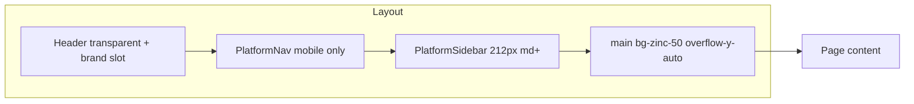
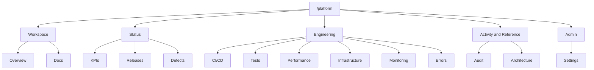
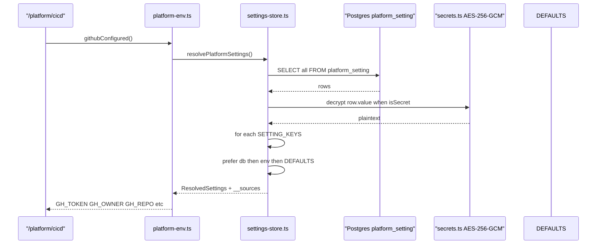
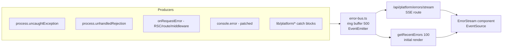

# Platform Dashboard

The IOX Platform Dashboard at `/platform` is the internal control plane for the
delivery team — the in-app home for every KPI, document, defect, build, deploy,
metric, audit event, ADR, and integration credential that backs the IOX
program. It replaces the "open files in the editor" workflow with a single,
authenticated, sidebar-navigated dashboard that ships in the same Next.js app
as the customer-facing modules.

> [!NOTE]
> This handbook documents the dashboard shipped in
> [`docs/operations/release-notes/2026-05-31-platform-dashboard.md`](../operations/release-notes/2026-05-31-platform-dashboard.md)
> (release `v0.2.0`). Read those release notes first for the change log; this
> document is the durable reference for how the surface is wired together.

## Why it exists

The Schedule 1 Appendix A sign-off framework asks 24 sub-component questions
about how IOX is built, tested, operated, governed, and released. Answering
each one requires evidence — a markdown file, a CI run, a workflow scorecard, a
defect log entry, an Azure resource list, an ADR. Before the dashboard, every
piece of that evidence lived in a separate surface: GitHub, Azure portal,
markdown files in the repo, local terminal output. Officers, partners, and the
delivery team itself had to context-switch across half a dozen tools to confirm
even one KPI.

The dashboard collapses that surface area. Every Schedule 1 evidence artefact
that can be rendered in-app is rendered in-app. Every external dependency
(GitHub Actions, Azure Resource Manager, Azure Monitor, Log Analytics) is
fetched live with read-only credentials and surfaced inside the same chrome.
Settings that govern those integrations are editable from the same UI by a
`SUPER_ADMIN`, encrypted at rest, and take effect on the very next request — no
redeploy required.

The dashboard is built to be the canonical answer to "show me the proof that
IOX is operating well today."

## Auth + role gating

Every page and route handler under `/platform/*` calls
`requirePlatformAccess()` from `web/lib/platform/auth.ts`. The helper:

1. Reads the active session via `getSession()` (NextAuth via the IOX session
   shim — ADR-0004).
2. Returns the user wrapped in a `PlatformRole` (`SUPER_ADMIN` or
   `PLATFORM_ADMIN`).
3. Redirects to `/procurex/sign-in?callbackUrl=/platform` when there is no
   session.
4. Redirects to `/platform/access-denied` when the role is not in the allowed
   list.

Today every mock session resolves to Arjun (`SUPER_ADMIN`); when the real users
table lands the role will be read from `user.role` and the helper signature
stays identical.

> [!IMPORTANT]
> `requirePlatformAccess()` is the **only** access check on `/platform/*`. Do
> not add ad-hoc `if (user.role !== "SUPER_ADMIN")` branches in pages — call
> the helper, let it redirect, and trust the result. The SSE route handler at
> `app/api/platform/errors/stream/route.ts` uses `getPlatformUser()` directly
> and returns `403 Forbidden` instead of redirecting, because EventSource
> clients don't follow redirects.

## Layout

`web/app/platform/layout.tsx` composes three pieces of chrome around every
child route:

- **Header** — the shared `<Header variant="transparent" />` with a custom
  `brand` slot that renders `IOX / Platform / Internal control plane` in the
  top-left. `variant="transparent"` removes the white background so the header
  blends into the zinc-50 dashboard surface.
- **Sidebar** — `PlatformSidebar` (desktop ≥ `md`). A 212-px-wide column with
  5 grouped sections, active-state pill, and a "Live · UAE North · iox-vm-01 ·
  D2s_v3" status footer.
- **Mobile nav** — `PlatformNav` (below `md`). A horizontally-scrollable tab
  bar with all 14 destinations, sticky under the header.

The five sidebar sections are:

| Section | Tabs |
|---|---|
| Workspace | Overview · Docs |
| Status | KPIs · Releases · Defects |
| Engineering | CI/CD · Tests · Performance · Infrastructure · Monitoring · Errors |
| Activity & Reference | Audit · Architecture |
| Admin | Settings |



## The 14 tabs

Every tab is a server component (`export const dynamic = "force-dynamic"`)
gated by `requirePlatformAccess()`, with data fetched in parallel via
`Promise.all`. Tabs that talk to third-party services degrade to a
`<CredentialsRequired>` setup card when their credentials are missing.

| # | Tab | URL | Phase | Lib |
|---|---|---|---|---|
| 1 | Overview | `/platform` | 1 | `kpis.ts`, `defects.ts`, `releases.ts`, `docs.ts` |
| 2 | Docs | `/platform/docs` | 1 | `docs.ts` |
| 3 | KPIs | `/platform/kpis` | 2 | `kpis.ts`, `sign-off-matrix.ts`, `backlog.ts` |
| 4 | Releases | `/platform/releases` | 2 | `releases.ts`, `github.ts` |
| 5 | Defects | `/platform/defects` | 2 | `defects.ts` |
| 6 | CI/CD | `/platform/cicd` | 3 | `github.ts` |
| 7 | Tests | `/platform/tests` | 4 | `junit.ts` |
| 8 | Performance | `/platform/performance` | 4 | `k6.ts` |
| 9 | Infrastructure | `/platform/infrastructure` | 3 | `infrastructure.ts`, `azure.ts` |
| 10 | Monitoring | `/platform/monitoring` | 3 | `log-analytics.ts` |
| 11 | Errors | `/platform/errors` | 3 | `error-bus.ts` |
| 12 | Audit | `/platform/audit` | 4 | `audit.ts` |
| 13 | Architecture | `/platform/architecture` | 5 | `adrs.ts` |
| 14 | Settings | `/platform/settings` | 3 | `settings-store.ts`, `settings-actions.ts` |



### Overview

`app/platform/page.tsx`. The dashboard home. Renders a welcome line ("Welcome
back, Arjun"), 8 `<StatusTile>` cards (KPIs met, Documentation count, Open
critical defects, Latest release, Last CI run, Azure infrastructure,
Monitoring, Outstanding), a per-component sign-off grid keyed by Schedule 1
Appendix A component ref (1–5), and a "Recently updated docs" list of the
last 5 files by `mtime`.

- **Integrations:** none direct — reads only from in-repo files via `docs.ts`,
  `kpis.ts`, `defects.ts`, `releases.ts`.
- **Env vars:** none required.
- **Empty state:** all tiles render even when data is empty; KPI tally shows
  `0 / 0` and the docs list collapses.

### Docs

`app/platform/docs/page.tsx` (index) and `app/platform/docs/[...slug]/page.tsx`
(viewer). Recursively walks `docs/` (one level above `web/`) via
`getDocsTree()` and renders a 3-column layout — left rail `DocsTree`, center
`MarkdownView`, right rail `Toc` with scroll-spy. The viewer adds a sticky
breadcrumb + title + meta band ("4 min read · Updated 2026-05-31 · Edit on
GitHub"). The index lists every section as a card with file counts and shows
"Recently updated" newest-first.

- **Integrations:** filesystem only.
- **Env vars:** none.
- **Empty state:** the docs tree must be non-empty for sections to appear; in
  practice `docs/` is always populated.

### KPIs

`app/platform/kpis/page.tsx` (board) and `app/platform/kpis/[kpi]/page.tsx`
(detail). Parses `docs/quality/sign-off-matrix.md` (live from
`sign-off-matrix.ts`) and `BACKLOG.md` (via `backlog.ts`) and unions them per
KPI ID (e.g. `C1-SC1`). Renders a 24-card `<KpiBoard>` filterable by status,
groupable by Component / Status / Phase. The detail page shows the KPI hero,
"What we have" / "What's missing" blocks pulled from BACKLOG, and an evidence
list where every `docs/*.md` path resolves to an in-app link via
`/platform/docs/...`.

- **Integrations:** none direct.
- **Env vars:** none.
- **Empty state:** the matrix parser will return `[]` if the markdown is
  malformed; the board shows zero cards.

### Releases

`app/platform/releases/page.tsx`. Two stacked sections. The top section ("Live
deploys since latest release") filters successful GitHub Actions runs of any
workflow whose name contains "deploy" since the last hand-written release date
— this surfaces every real production deploy even when nobody has written
notes. The bottom section is the curated timeline from
`docs/operations/release-notes/YYYY-MM-DD-slug.md`.

- **Integrations:** GitHub Actions (optional — degrades to curated timeline
  only).
- **Env vars:** `GH_TOKEN`, `GH_OWNER`, `GH_REPO`.
- **Empty state:** if `releases[]` is empty, shows a "No releases recorded
  yet" card with a hint that `docs/operations/release-notes/` files create
  rows. The live-deploys block hides entirely.

### Defects

`app/platform/defects/page.tsx`. Parses `docs/quality/defect-log.md` into
typed `Defect[]` (`defect-types.ts`) and shows 4 KPI stats (Open Critical, Open
total, Closed lifetime, Lifetime total) followed by a `<DefectTable>` with
severity tone (rose / orange / amber / zinc). Sign-off floor is `0 Open
Critical`.

- **Integrations:** filesystem only.
- **Env vars:** none.
- **Empty state:** stats read 0 / 0 / 0 / 0; the table renders empty.

### CI/CD

`app/platform/cicd/page.tsx` (overview) and
`app/platform/cicd/runs/[runId]/page.tsx` (per-run detail). The richest tab.
Pulls in parallel: 25 recent runs, CI stats (success rate, avg duration,
failures, in-progress), workflow scorecards (each workflow with last-20
sparkline), 15 commits on `main`, deploy freshness (HEAD vs deployed SHA), 10
open PRs. The run-detail page shows a `JobAccordion`, GitHub annotations
inline, and an artifacts download list.

- **Integrations:** GitHub Actions (required).
- **Env vars:** `GH_TOKEN` (fine-grained PAT — `actions:read` +
  `metadata:read` + `pull_requests:read` + `contents:read`), `GH_OWNER`,
  `GH_REPO`.
- **Empty state:** `<CredentialsRequired>` setup card if `githubConfigured()`
  is false.

### Tests

`app/platform/tests/page.tsx`. Reads the latest JUnit XML from
`web/tests/.last-junit.xml` (configurable per-run) and shows pass rate,
failures, skipped, duration, plus a 30-run trend chart from
`web/tests/.junit-history/`. Suites render as collapsible accordions; failed
suites auto-expand.

- **Integrations:** filesystem only.
- **Env vars:** none.
- **Empty state:** shows the "No JUnit report yet" card with the
  `npx vitest run --reporter=junit --outputFile=…` command to populate it.

### Performance

`app/platform/performance/page.tsx`. Reads the latest k6 summary JSON from
`web/tests/.last-load-test.json` (and a 30-run history) and renders 6 KPI
tiles (requests, iterations, avg, p95, p99, errors), a thresholds list,
p95-latency and error-rate trend charts, plus a per-route breakdown table
sorted by p95 descending.

- **Integrations:** filesystem only.
- **Env vars:** none.
- **Empty state:** shows the "No load-test run yet" card with the
  `BASE_URL=… k6 run web/scripts/load-test.js` command.

### Infrastructure

`app/platform/infrastructure/page.tsx`. Lists every resource in the
`AZURE_RESOURCE_GROUP` via `infrastructure.ts` (Azure Resource Manager
SDK), with topline stats (resource count, distinct types, location,
cost-attribution tag count), a detailed VM card (size, memory, power, IPs,
disks, OS, computer name, admin user, created), and a full
`<ResourceTable>`.

- **Integrations:** Azure Resource Manager (required).
- **Env vars:** `AZURE_TENANT_ID`, `AZURE_CLIENT_ID`, `AZURE_CLIENT_SECRET`,
  `AZURE_SUBSCRIPTION_ID`, `AZURE_RESOURCE_GROUP` (defaults to `iox-rg`).
- **Empty state:** `<CredentialsRequired>` with the `az ad sp create-for-rbac
  --role Reader …` setup command.

### Monitoring

`app/platform/monitoring/page.tsx`. Live CPU, memory, and Syslog-error charts
for `iox-vm-01` via `log-analytics.ts` (Kusto over `InsightsMetrics` +
`Syslog`). Three windows selectable via `?w=1h|24h|7d`. The bottom section is
the last 15 `err`+ syslog entries via `<SyslogList>`.

- **Integrations:** Azure Monitor + Log Analytics (required).
- **Env vars:** all Azure vars plus `AZURE_LOG_ANALYTICS_WORKSPACE_ID`
  (workspace GUID — not the full resource path).
- **Empty state:** `<CredentialsRequired>` indicating whether Azure SP or just
  the workspace ID is missing.

### Errors

`app/platform/errors/page.tsx`. Renders the initial 100-entry buffer
synchronously, then the `<ErrorStream>` client component opens an
`EventSource` against `/api/platform/errors/stream` for live push. Kind
filters (uncaught / unhandled / route / render / log / integration),
pause/resume, expandable stack traces. Auto-reconnects on dropout. Buffer
holds the last 500; resets on process restart.

- **Integrations:** in-process error bus (no external deps).
- **Env vars:** none.
- **Empty state:** the stream simply shows zero entries; the SSE connection
  stays open waiting.

### Audit

`app/platform/audit/page.tsx`. Live UNION of Prisma `activity_logs` (IOX
modules — CostX, BOQs, Configuration, etc.) and Drizzle `px_audit_log`
(ProcureX), normalised into a common `AuditEvent` shape, capped at 200 newest-
first. Stats show top actions, top actors, module split.

- **Integrations:** Postgres (both Prisma and Drizzle clients).
- **Env vars:** `DATABASE_URL`, `DATABASE_URL_UNPOOLED`.
- **Empty state:** stats read 0; table renders empty.

### Architecture

`app/platform/architecture/page.tsx`. Parses every file under
`docs/architecture/decisions/` (convention: `NNNN-kebab-slug.md`) via
`adrs.ts`. Shows status chips (Accepted / Proposed / Superseded / Deprecated /
Unknown) with counts, then a list with the ADR number badge, title, status,
summary, modified date, and a link to the rendered doc.

- **Integrations:** filesystem only.
- **Env vars:** none.
- **Empty state:** "No ADRs published yet" card with the
  `docs/architecture/decisions/` filing convention.

### Settings

`app/platform/settings/page.tsx`. The credential UI. Renders a
`<SettingsForm>` over every key in `SETTING_KEYS` (see Settings keys table
below), with secret keys masked (`•••• …` + last 4) and an eye-toggle for
plaintext reveal during editing. Server actions in `settings-actions.ts`
handle `saveSettings`, `testGithubConnection`, `testAzureConnection`,
`testLogAnalyticsConnection`. Saves trigger `revalidatePath` on the four
affected tabs so the next render picks up the new credentials.

- **Integrations:** Postgres (the `platform_setting` table).
- **Env vars:** `SETTINGS_ENCRYPTION_KEY` (or `AUTH_SECRET` fallback).
- **Empty state:** form always renders with whatever defaults / env values are
  present.

## Credential resolution chain

Every integration that needs credentials calls `getPlatformEnv()` from
`platform-env.ts`, which delegates to `resolvePlatformSettings()` in
`settings-store.ts`. The precedence is fixed:

1. **Database row** — if the `platform_setting` table has a non-empty row for
   the key, that value wins. Secrets are decrypted at this layer.
2. **`process.env`** — if no DB row, fall back to the environment variable of
   the same name.
3. **Built-in default** — only for non-secret identifiers (tenant ID,
   subscription ID, resource group, owner, repo, workspace ID) where the
   sensible "this is IOX" value is checked in to `DEFAULTS`.

Every resolved value carries a `__sources` map (`"db" | "env" | "default"`) for
diagnostic display.



A separate synchronous snapshot `platformEnvSync` reads from `process.env`
only — never blocks, never hits the DB — and is used for display-only purposes
(linking to the Azure portal, the GitHub repo, etc.) where stale values are
fine.

## Secret encryption

`web/lib/platform/secrets.ts` implements AES-256-GCM for the two secret keys
(`GH_TOKEN`, `AZURE_CLIENT_SECRET`).

- **Algorithm:** AES-256-GCM with a random 12-byte IV per ciphertext and the
  16-byte GCM auth tag appended.
- **Format:** `v1:<iv_b64>:<tag_b64>:<ciphertext_b64>` — versioned so the
  scheme can be rotated.
- **Key derivation:** `scryptSync(seed, "iox-platform-settings-v1", 32)`
  where `seed = SETTINGS_ENCRYPTION_KEY ?? AUTH_SECRET`. The key is derived
  once per process and cached.
- **Minimum seed length:** 16 chars. Shorter throws at startup.
- **Decrypt failures:** the resolver catches per-row decrypt errors and skips
  the row (allowing key rotation without crashing the page).
- **Display masking:** `maskSecret(s)` returns `•••• ` + last 4 chars; never
  the full plaintext.

> [!CAUTION]
> The threat model is "casual DB dump." An attacker with code execution on
> the VM can read the env var and decrypt freely. For real KMS protection,
> swap the `key()` function for a Key Vault `getKey()` call.

## Markdown rendering system

`MarkdownView` (`web/components/platform/MarkdownView.tsx`) is a server
component built on `react-markdown` + `remark-gfm` that renders every `.md`
file in `/platform/docs` with:

- **GitHub-flavoured markdown** — tables, task lists, strikethrough.
- **GFM alerts** — `> [!NOTE]`, `> [!TIP]`, `> [!IMPORTANT]`, `> [!WARNING]`,
  `> [!CAUTION]`, `> [!SUCCESS]` — detected via `detectAlertKind()` and
  rendered as coloured `<Callout>` cards. The `[!KIND]` marker is stripped
  from the first paragraph.
- **Mermaid blocks** — fenced ` ```mermaid ` code blocks are routed to the
  `<Mermaid>` client component, which dynamically imports `mermaid`,
  initialises with the neutral theme + IOX zinc palette, and renders to inline
  SVG. Errors surface as a rose-tone callout with the raw chart text for
  debugging.
- **Code blocks** — every other fenced block goes through `<CodeBlock>`: a
  dark `zinc-950` card with a language pill header (`TypeScript`, `bash`,
  `Kusto`, etc.) and a copy button that captures the raw source (not the
  highlighted HTML).
- **Anchored headings** — `h2` and `h3` get slug IDs and a hover-revealed
  link icon. `h1` is hidden because the page header already renders the
  title.
- **Tables** wrap in a horizontally-scrolling container.

`extractToc(content)` scans the markdown for h2/h3 lines (skipping fenced
blocks) and emits `TocEntry[]`. The right-rail `<Toc>` client component
scroll-spies the viewport: the last heading whose top is above 120 px from
the viewport top wins the active highlight.

`readingTimeMinutes(content)` divides word count by 220 wpm (technical
writing) for the "4 min read" badge.

## Live error stream

The Errors tab is fed by an in-process EventEmitter bus that never leaves the
Node.js process.



Key files:

- **`web/instrumentation.ts`** — Next.js auto-loads this once per server
  process. `register()` calls `installRuntimeHandlers()` (only when
  `NEXT_RUNTIME === "nodejs"`) which wires `uncaughtException`,
  `unhandledRejection`, and monkey-patches `console.error` so all server-side
  error logs flow into the bus while still printing to stderr.
  `onRequestError(err, request, context)` is Next's hook for streaming RSC /
  Server Action / route-handler / middleware errors that `try/catch` can't
  reach, and pushes a `render` or `route` kind into the bus.
- **`web/lib/platform/error-bus.ts`** — The bus itself. Stashed on
  `globalThis.__ioxErrorBus` so a single instance survives Next's HMR /
  module re-evaluation. `recordPlatformError()` produces a typed
  `RuntimeError` (id, ts, kind, message, stack, source, path, meta), pushes
  it to a 500-entry ring buffer, and fans it out via `EventEmitter`.
  `subscribeToErrors(listener)` returns an unsubscribe function.
- **`web/app/api/platform/errors/stream/route.ts`** — The SSE endpoint
  (Node.js runtime, `force-dynamic`). On open, sends `event: hello\ndata:
  {"buffered":N}\n\n`, replays the last 100 entries, then subscribes and
  forwards every new entry as `event: error\ndata: <RuntimeError JSON>\n\n`.
  Pings every 25 s for keep-alive. Auth-checked via `getPlatformUser()` —
  returns 403 (not redirect) so `EventSource` clients see the failure.
  `X-Accel-Buffering: no` disables nginx buffering on prod.

> [!WARNING]
> Because the bus is per-process and pm2 runs one Node instance per app, the
> live stream is single-VM. Errors raised on other servers behind a load
> balancer would not appear here. Today IOX runs on a single VM
> (`iox-vm-01`), so this is fine; if/when we go multi-VM, swap the
> EventEmitter for Redis pub/sub.

## Extending the dashboard

Adding a new tab — say `/platform/security` for security headers and CSP
status — is a five-step move:

1. **Pick a phase and slot it into the sidebar.** Edit
   `web/components/platform/PlatformSidebar.tsx` and add a new `NavItem` in
   the right `NavSection`. Mirror the change in
   `web/components/platform/PlatformNav.tsx` `PLATFORM_TABS` so the mobile
   nav and phase pill stay in sync.

2. **Create the lib module.** Drop `web/lib/platform/security.ts` with
   `import "server-only"` at the top. Export typed data-fetching functions.
   If the module needs credentials, read them from `await getPlatformEnv()`
   each call (not at module top level — the values can change without a
   restart).

3. **Split client-safe types into a separate file.** Any type or pure helper
   that a client component needs goes into `web/lib/platform/security-
   types.ts` (no `"server-only"`, no Prisma imports, no `fs`/`crypto`).

4. **Build the page.** Create `web/app/platform/security/page.tsx`:

   ```tsx
   export const dynamic = "force-dynamic";

   import { requirePlatformAccess } from "@/lib/platform/auth";
   import { getSecurityStatus } from "@/lib/platform/security";

   export default async function SecurityPage() {
     await requirePlatformAccess();
     const status = await getSecurityStatus();
     // … render
   }
   ```

5. **If it needs new credentials**, add the keys to `SETTING_KEYS` in
   `web/lib/platform/settings-store.ts`, mark them as secret in `SECRET_KEYS`
   if applicable, add `DEFAULTS` entries (only for non-secret identifiers),
   add `process.env` reads to `platformEnvSync` if you want display-only
   defaults, and add a `<CredentialsRequired>` branch to the page for the
   "not configured yet" case.

> [!TIP]
> Always add the new credential keys to `SETTING_KEYS` before referencing
> them anywhere — `setSetting()` rejects unknown keys and saves would
> silently no-op otherwise.

## Server-only vs client-safe split

Next.js's `"server-only"` import is enforced at build time: any client
component that transitively imports it fails the build. Several types and
helpers (status tones, badge labels, severity classes) are needed in both
worlds. The convention is to put them in a sibling `*-types.ts` module that
has **no server-only import and no imports of files that do**:

| Server-only module | Client-safe sibling | What lives in the sibling |
|---|---|---|
| `kpis.ts` | `kpi-types.ts` | `Kpi`, `KpiTally`, `statusTone`, `statusLabel`, `STATUS_BUCKET_ORDER` |
| `defects.ts` | `defect-types.ts` | `Defect`, `DefectSeverity`, `severityTone` |
| `sign-off-matrix.ts` | `matrix-types.ts` | `MatrixStatus`, `MatrixRow` |

The split exists because components like `<StatusPill>`, `<KpiCard>`, and
`<DefectTable>` must be client components for interactivity, but they need
the same tone/label helpers the server uses to render the static markup. If
those helpers were defined in the server-only modules, importing them in a
client component would crash the build.

> [!IMPORTANT]
> When you add a new dashboard module, audit your re-exports: a barrel that
> re-exports something from a server-only file will poison every consumer.
> Re-export from the `*-types.ts` sibling instead.

## Deploy + ops

The dashboard ships with the rest of the app on `git push origin main`, which
fires `.github/workflows/deploy.yml`. Two dashboard-specific steps were added:

1. **Apply manual Prisma migrations.** The
   `web/prisma/migrations/manual/` folder contains hand-written idempotent
   SQL files (e.g. `001_platform_setting.sql`). A deploy step iterates that
   folder and applies each file, tracked by a small `_manual_migrations`
   table so each only runs once per environment. **This folder exists
   because IOX shares one Postgres between Prisma and Drizzle** (ADR-0001):
   running `prisma migrate dev` would drop every `px_*` table that Drizzle
   owns.

2. **Regenerate Prisma client on VM.** After `npm ci` on the VM, the deploy
   pipeline runs `npx prisma generate` — but only when `schema.prisma`'s
   sha256 fingerprint has changed since the last deploy. This fixes the
   silent `"Cannot read properties of undefined (reading 'findMany')"` crash
   that happens when the deployed client is stale relative to the schema.

3. **Sync platform env.** A `sync-platform-env` step on the VM materialises
   any new env keys (e.g. `SETTINGS_ENCRYPTION_KEY`) into the running pm2
   process's environment so the next request picks them up.

The `001_platform_setting.sql` migration creates the table that backs the
Settings UI:

```sql
CREATE TABLE IF NOT EXISTS "platform_setting" (
  "key"       TEXT PRIMARY KEY,
  "value"     TEXT NOT NULL,
  "isSecret"  BOOLEAN NOT NULL DEFAULT false,
  "updatedBy" TEXT,
  "updatedAt" TIMESTAMP(3) NOT NULL DEFAULT CURRENT_TIMESTAMP,
  "createdAt" TIMESTAMP(3) NOT NULL DEFAULT CURRENT_TIMESTAMP
);
```

The required env keys per integration:

| Env var | Required for | Notes |
|---|---|---|
| `GH_TOKEN` | CI/CD, Releases (live deploys) | Fine-grained PAT, read-only |
| `GH_OWNER` | CI/CD, Releases | defaults to `tajalagawani` |
| `GH_REPO` | CI/CD, Releases | defaults to `BOQs-master` |
| `AZURE_TENANT_ID` | Infrastructure, Monitoring | defaults to the IOX tenant |
| `AZURE_CLIENT_ID` | Infrastructure, Monitoring | SP client id |
| `AZURE_CLIENT_SECRET` | Infrastructure, Monitoring | SP secret |
| `AZURE_SUBSCRIPTION_ID` | Infrastructure, Monitoring | defaults to IOX sub |
| `AZURE_RESOURCE_GROUP` | Infrastructure, Monitoring | defaults to `iox-rg` |
| `AZURE_LOG_ANALYTICS_WORKSPACE_ID` | Monitoring | workspace GUID |
| `SETTINGS_ENCRYPTION_KEY` | Settings (encrypt/decrypt secrets) | falls back to `AUTH_SECRET` |
| `DATABASE_URL`, `DATABASE_URL_UNPOOLED` | Audit, Settings | Postgres |

Settings keys catalogue (matches `SETTING_KEYS` in `settings-store.ts`):

| Key | Secret? | Default |
|---|---|---|
| `GH_TOKEN` | yes | `""` |
| `GH_OWNER` | no | `tajalagawani` |
| `GH_REPO` | no | `BOQs-master` |
| `AZURE_TENANT_ID` | no | `5c1c05b1-7b56-45e5-b38e-c9aea88f4588` |
| `AZURE_CLIENT_ID` | no | `""` |
| `AZURE_CLIENT_SECRET` | yes | `""` |
| `AZURE_SUBSCRIPTION_ID` | no | `5d5e49c7-1fe0-4d54-827b-57844c2dd0aa` |
| `AZURE_RESOURCE_GROUP` | no | `iox-rg` |
| `AZURE_LOG_ANALYTICS_WORKSPACE_ID` | no | `4e6790de-67ab-457c-9a8c-aa06e23e0777` |

## File map

```
web/
├── app/
│   ├── platform/
│   │   ├── layout.tsx                       # Header + sidebar + mobile nav
│   │   ├── page.tsx                         # Overview
│   │   ├── access-denied/                   # role-denied page
│   │   ├── docs/
│   │   │   ├── page.tsx                     # index (sections + recently updated)
│   │   │   └── [...slug]/page.tsx           # viewer (left tree + body + TOC)
│   │   ├── kpis/
│   │   │   ├── page.tsx                     # 24-card board
│   │   │   └── [kpi]/page.tsx               # KPI detail
│   │   ├── releases/page.tsx
│   │   ├── defects/page.tsx
│   │   ├── cicd/
│   │   │   ├── page.tsx
│   │   │   └── runs/[runId]/page.tsx        # per-run detail
│   │   ├── tests/page.tsx
│   │   ├── performance/page.tsx
│   │   ├── infrastructure/page.tsx
│   │   ├── monitoring/page.tsx              # ?w=1h|24h|7d
│   │   ├── errors/page.tsx
│   │   ├── audit/page.tsx
│   │   ├── architecture/page.tsx
│   │   └── settings/page.tsx
│   └── api/platform/errors/stream/route.ts  # SSE
├── components/platform/
│   ├── PlatformSidebar.tsx                  # desktop sidebar, 5 sections
│   ├── PlatformNav.tsx                      # mobile horizontal tabs
│   ├── MarkdownView.tsx                     # react-markdown + GFM
│   ├── markdown/
│   │   ├── Callout.tsx                      # > [!NOTE] etc
│   │   ├── CodeBlock.tsx                    # dark card + copy
│   │   ├── Mermaid.tsx                      # dynamic import, neutral theme
│   │   └── Toc.tsx                          # right-rail scroll-spy
│   ├── DocsTree.tsx                         # left rail tree
│   ├── KpiBoard.tsx                         # filter + group + cards
│   ├── KpiCard.tsx
│   ├── KpiBar.tsx
│   ├── StatusPill.tsx
│   ├── StatusTile.tsx
│   ├── DefectTable.tsx
│   ├── CiOverviewBanner.tsx
│   ├── CiRunList.tsx
│   ├── WorkflowCard.tsx
│   ├── CommitsFeed.tsx
│   ├── DeployDiff.tsx
│   ├── PrList.tsx
│   ├── JobAccordion.tsx
│   ├── AnnotationsList.tsx
│   ├── ArtifactsList.tsx
│   ├── TestSuiteList.tsx
│   ├── MetricChart.tsx
│   ├── ResourceTable.tsx
│   ├── SyslogList.tsx
│   ├── AuditTable.tsx
│   ├── ErrorStream.tsx                      # EventSource client
│   ├── CredentialsRequired.tsx              # setup card
│   ├── SettingsForm.tsx                     # settings UI
│   └── ComingSoon.tsx
├── lib/platform/
│   ├── auth.ts                              # requirePlatformAccess
│   ├── platform-env.ts                      # getPlatformEnv + sync snapshot
│   ├── settings-store.ts                    # SETTING_KEYS, resolver, CRUD
│   ├── settings-actions.ts                  # server actions + connection tests
│   ├── secrets.ts                           # AES-256-GCM
│   ├── error-bus.ts                         # ring buffer + EventEmitter
│   ├── docs.ts                              # filesystem walker
│   ├── kpis.ts                              # KPI unifier
│   ├── kpi-types.ts                         # client-safe types
│   ├── matrix-types.ts                      # client-safe types
│   ├── sign-off-matrix.ts                   # parses docs/quality/sign-off-matrix.md
│   ├── backlog.ts                           # parses BACKLOG.md
│   ├── defects.ts                           # parses docs/quality/defect-log.md
│   ├── defect-types.ts                      # client-safe types
│   ├── releases.ts                          # parses release-notes/
│   ├── github.ts                            # Octokit wrappers
│   ├── azure.ts                             # credential picker
│   ├── infrastructure.ts                    # ARM SDK
│   ├── log-analytics.ts                     # Kusto queries
│   ├── junit.ts                             # JUnit XML parser
│   ├── k6.ts                                # k6 summary parser
│   ├── audit.ts                             # Prisma + Drizzle union
│   └── adrs.ts                              # ADR markdown parser
├── instrumentation.ts                       # error-bus install + onRequestError
└── prisma/migrations/manual/
    └── 001_platform_setting.sql             # idempotent CREATE TABLE
```

## Gotchas

> [!WARNING]
> **The Header must stay client-safe.** The `<Header>` component is rendered
> from both customer-facing modules and `/platform`, including pages that
> have not yet run `requirePlatformAccess()`. Do not import Prisma, the
> settings store, or any `"server-only"` module into Header.tsx — it must
> stay tree-shakeable into both client and server bundles. Pass everything
> the Header needs via props (the `brand` slot in `app/platform/layout.tsx`
> is the model).

> [!CAUTION]
> **Prisma 7 quirk: stale client on the VM.** When `schema.prisma` changes,
> the deployed `@prisma/client` on the VM still reflects the *old* schema
> until you run `npx prisma generate` against the new schema. Symptom: a
> route that previously worked starts throwing `"Cannot read properties of
> undefined (reading 'findMany')"` for any newly-added model
> (e.g. `prisma.platformSetting`). The `regenerate-on-VM` deploy step uses a
> sha256 fingerprint of `schema.prisma` to skip regeneration when nothing
> changed, so deploys stay fast; never disable it.

> [!CAUTION]
> **Two GitHub workflows fire per push.** Every commit to `main` triggers
> both `deploy.yml` (build + ship) and the test workflow. They run in
> parallel, but the CI/CD overview shows them both as separate cards in the
> "Workflows" grid — that is correct, do not collapse them. The deploy
> diff's `commitsBehind` calculation depends on the `deploy.yml` run
> succeeding, not the test workflow.

> [!IMPORTANT]
> **`platformEnvSync` is display-only.** Never gate auth or call a third-
> party SDK with values from `platformEnvSync` — it reads `process.env`
> directly and bypasses the DB override. Always use
> `await getPlatformEnv()` for the actual integration call; reserve the
> sync snapshot for static link references (Azure portal URL, GitHub repo
> URL).

> [!NOTE]
> **DB override semantics for clearing.** Saving an empty string in the
> Settings form deletes the row entirely (`clearSetting`), which lets the
> `process.env` / `DEFAULTS` value re-take effect. The literal masked value
> (`••••…`) means "no change" and is skipped — without this, opening the
> form and clicking save would overwrite every secret with literal bullets.

> [!TIP]
> **The error bus survives HMR.** During `next dev`, the bus is stashed on
> `globalThis.__ioxErrorBus` so module re-evaluation does not reset the
> buffer or drop SSE subscriptions. If you ever see the live stream stall in
> dev, it is almost always because the SSE route file itself was edited —
> the route handler module reloaded but the EventSource on the client did
> not reconnect. Refresh the Errors tab.
