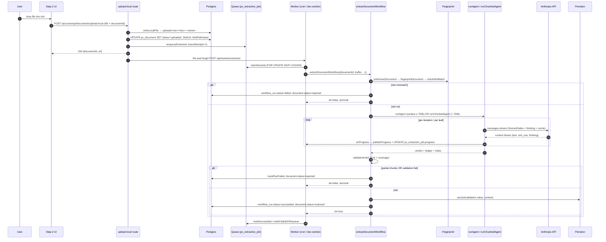
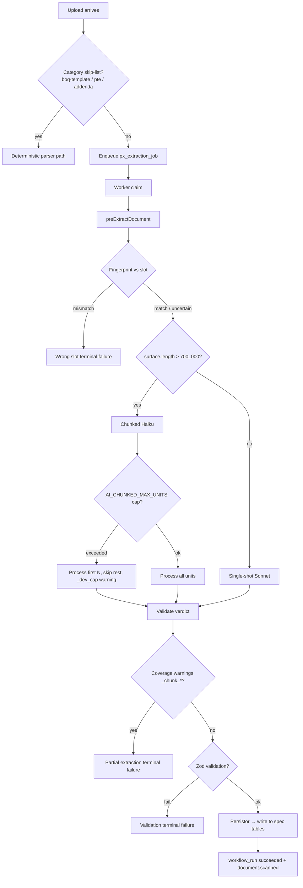

# ProcureX — Documents & AI Extraction

End-to-end reference for the file-upload, classification, and AI-extraction subsystems behind ProcureX. By the end of this you should be able to trace a file from the browser into a Drizzle row, through the Anthropic agent loop, into a validated verdict, and out to the per-spec persistor. Every behaviour is grounded in the cited code; nothing is aspirational.

## Overview

The pipeline runs in four stages: **upload → classify → extract → verdict**. A user drops a file into an accordion slot (or the freeform drop zone). The upload route writes bytes to Vercel Blob (prod) or to `web/uploads/<workspaceId>/...` (dev), flips `px_document.status` to `uploaded`, and enqueues a `px_extraction_job` row. A worker (Vercel Cron in prod, `scripts/dev-worker.ts` in dev) drains the queue, runs `extractDocumentWorkflow` which fingerprints the file against the slot, runs the agent (single-shot Sonnet or chunked Haiku), validates the verdict against the per-spec Zod schema, then invokes the per-spec persistor. Every artefact — surface, candidates, iteration logs, chunked leaves, final result — lands in `runs/<workflowRunId>/`.

Three rails keep it honest: (1) **no silent success** — chunked partials and validation failures both mark the workflow `failed` and the document `rejected`; (2) **forensics on disk** — every API turn and chunk attempt is written to `runs/<id>/`; (3) **terminal failures are sticky** — wrong-slot, partial-chunk, and validation errors skip the requeue path.

## Document storage

The polymorphic store is in [`web/modules/documents/schema.ts`](../../../web/modules/documents/schema.ts). One table, `px_document`, backs every file in every module. The pointer pair `(targetKind, targetId)` is a logical FK — deliberately not enforced at the DB level so the table stays extraction-safe when modules move.

| Field | Type | Notes |
|---|---|---|
| `id` | text PK | UUID, generated client-side via `crypto.randomUUID()` |
| `workspaceId` | text FK | Cascade-delete with the workspace |
| `projectId` | text | Logical FK — no enforcement (project may live in another module) |
| `targetKind` / `targetId` | text / text | Polymorphic pointer — `project`, `company`, `submission`, `round` |
| `scope` | text | E.g. `required`, `applicable`, `pte`, `ta`, `ptc`, `bidder_submission`, `ptc_response` |
| `category` | text | Stores the human label (`"Form of Tender"`) — the spec registry resolves both id and label |
| `blobPathname` | text | Vercel Blob pathname OR — in local-mode — the absolute disk path |
| `blobUrl` | text | The host-qualified URL the worker fetches |
| `status` | enum | `pending → uploaded → scanned` (happy path) or `rejected` |
| `version` | int | Bumped on re-upload (handled in the upload action) |

### Upload flow (local mode)

[`web/app/procurex/api/documents/upload-local/route.ts`](../../../web/app/procurex/api/documents/upload-local/route.ts) is the workhorse when `BLOB_READ_WRITE_TOKEN` isn't provisioned:

1. `requireUserId()` auth gate.
2. Parse `multipart/form-data` — expects `file` and `documentId` (the row was pre-reserved when the slot was opened).
3. Ownership check (`doc.uploadedByUserId === userId` or 403) and state check (`status === "pending"` or 409).
4. `writeLocalFile` ([`local-storage.ts`](../../../web/modules/documents/local-storage.ts)) sanitises the filename to `[A-Za-z0-9._-]` and writes to `<repoRoot>/uploads/<workspaceId>/<documentId>-<safeName>`.
5. Update the row: `blobUrl = ${proto}://${host}/procurex/api/files/<id>`, `blobPathname = absolute disk path`, `status = uploaded`.
6. **Skip** the extraction queue for `boq-template`, `pte`, and `addenda` — those go through deterministic parsers (`modules/procurex/boq/parser.ts`, `modules/procurex/addenda/*`). Enqueuing would burn tokens on no-op persistors.
7. Otherwise `enqueueExtraction(...)` and fire-and-forget `POST /api/worker/extraction` to kick the drain. Cron would catch it anyway; the nudge collapses the typical "Waiting for the agent's first iteration" stall.
8. Audit via `recordAudit({ action: "document.upload.local" })`.

### File serving

[`web/app/procurex/api/files/[documentId]/route.ts`](../../../web/app/procurex/api/files/[documentId]/route.ts) is intentionally **public** — no auth gate — because the URL embeds a UUID, the worker runs outside any user session, and prod will replace it with signed Blob URLs. Reads via `readLocalFile(doc.blobPathname)` and streams back with `cache-control: no-store`.

### Retention

No automatic retention. Files persist under `uploads/`. Cascading workspace deletes orphan bytes (DB row gone, file stays) — acceptable in current scope, flagged for a future cleanup job. Re-uploads bump `documents.version` but don't delete previous bytes.

## Classification

When a user picks a slot explicitly, classification short-circuits — the spec is the slot. The classifier only fires for the **drop-zone** flow where files arrive without a category.

The pre-flight detector is in [`web/modules/ai-extraction/pre/fingerprint.ts`](../../../web/modules/ai-extraction/pre/fingerprint.ts) — a pure deterministic regex panel, one `FingerprintRule` per category (`fot`, `itt`, `coc`, `sopr`, `specification`, `boq-template`, `boq-priceset`, `pte`, `addenda`, `drawings-register`, `cover-letter`) with four weighted bands: `required` (all must match or score capped at 0.15), `strong`, `weak`, `veto` (subtractive). A `mimeKind` mismatch costs 0.15. Scores clamp to `[0, 1]`. `checkSlotMatch` categorises:

- `score ≥ 0.5` for the expected category → **match**
- `score < 0.5` AND a rival scores `≥ 0.6` for a **different** category → **mismatch** (workflow fails as "Wrong slot")
- otherwise → **uncertain** (allow with a warning)

The optional Haiku classifier (`classifyWithAi` in [`actions.ts`](../../../web/modules/ai-extraction/actions.ts)) sends the first 10 KB of surface plus the category list to `claude-haiku-4-5` and parses a single-line JSON `{categoryId, confidence, reason}`. Two breakers guard it: the env flag below, and `aiClassifyRateLimited` (a process-level breaker that flips on the first `specified API usage limits` 400 and stays flipped until process restart).

> [!CAUTION]
> **D-014 — "Classifying" took >60 s on every upload.** The Haiku classifier round-trips through Anthropic and was adding ~60 s of wall time to every dropped file even when the deterministic fingerprint already had a confident answer. **Fix**: `AI_CLASSIFY_DISABLED=true` in VM `.env`. When set, `classifyWithAi` returns `null` immediately and the upload falls back to fingerprint-only routing.

## The extraction agent

The runtime is a hand-rolled tool-use loop on top of `@anthropic-ai/sdk` — not the AI SDK abstraction — because three Anthropic features are unreachable through any abstraction layer: **adaptive thinking** at max effort, **prompt caching** on system blocks, and the **128k output beta** (`output-128k-2025-02-19`). The singleton is in [`client.ts`](../../../web/modules/ai-extraction/client.ts); the loop is in [`agent/runner.ts`](../../../web/modules/ai-extraction/agent/runner.ts).

The `DocSpec` (defined in `specs/types.ts`, indexed by `specs/registry.ts`) is the agent's contract. Each spec exports `id`, `label`, `schema` (Zod), `agentSpecPath` (a Markdown contract under `docs/prompts/`), `persistor` (verdict → DB writes), and optionally `chunkStrategy: "sheet"` + `mergeChunks(...)` for per-sheet XLSX extraction.

> [!CAUTION]
> **D-008 — FoT extraction silently returned an empty verdict.** `loadAgentSpec` swallows file-read errors and returns the error string as the spec text. When `docs/prompts/fot.md` was missing from the deploy, the agent received `"Spec file ... not found: ENOENT"` as its instructions and freelanced a wrong-shape verdict (`ohpMarkups: {}, signatures: [], ...`) that happened to satisfy an open Zod schema. **Fix**: copy the `docs/prompts/` tree from OmniApp into the repo on every deploy and re-queue affected runs. Watch for `Spec file ... not found` in iteration logs on future regressions.

### Two execution paths

The router at `runner.ts:184` is one line: `if (pre.surface.length > 700_000) → chunked else single-shot`.

- **Single-shot** — surface ≤ 700 000 chars (~175 k tokens). FoT, ITT, BoQ Template, small SOPRs. Model = `AI_DEFAULT_MODEL` (default `claude-sonnet-4-6`). The full surface is inlined into the user prompt; the system block = base instructions + spec markdown (cached via `cache_control: ephemeral`). One tool — `submit_verdict(verdict)` — terminates the loop on first call.
- **Chunked** — surface > 700 000 chars. Technical Specifications, large SOPRs. Model = `AI_CHUNKED_MODEL` (default `claude-haiku-4-5`, cheap + fast for many small structured-JSON calls). Lives in [`agent/chunked.ts`](../../../web/modules/ai-extraction/agent/chunked.ts).

Both paths branch on Opus vs non-Opus thinking config: `claude-opus*` gets `thinking: { type: "adaptive" }` + `output_config.effort`; everything else gets `thinking: { type: "enabled", budget_tokens }` mapped from effort (`1024 / 4000 / 12000 / 24000 / 32000` for `low / medium / high / xhigh / max`).

The single-shot loop iterates up to `AI_MAX_ITERATIONS` (default 500) but should submit on iter 1. Mid-turn `max_tokens` truncation is handled by pushing the partial assistant content + a "resume exactly where you left off" nudge. Transient retries are **disabled** by default (`BACKOFF_S = []`) — restore `[5, 15, 30, 60, 120, 180]` for backoff on `overloaded` / 5xx / network blips.

Per-run forensics at `runs/<runId>/`: `prompt.json` (verbatim first-iteration prompt with cache markers), `log/iter-NNN.json` (full response content), `log/iter-NNN-results.json` (tool execs), plus the pre-extract triple `manifest.json` / `surface.md` / `candidates.json`. The `sandbox/` dir is intentionally **not** destroyed so the agent's working files remain inspectable.

## Chunked path detail

The chunked path replaces the original greedy-pack strategy that silently dropped chunks on `max_tokens` or parse failure. The new approach is "small units up front, no merging":

1. **Split** via `splitStrategyFor(specId, mimeKind)`: `specification` with ≥ 2 CSI markers → per CSI section (with a TOC-only veto that falls back to page splits if every CSI marker sits in the first 5% of the surface); `mimeKind === "xlsx"` → per `## Sheet:` heading; everything else → per `## ` markdown heading.
2. **Pre-split** any unit > `MAX_UNIT_CHARS_PRESPLIT = 8_000` at internal boundaries (PART markers / blank lines / nearest newline) using a `~`-suffixed id scheme — `p.47` → `p.47~0`, `p.47~1`. (`.` would collide with existing page ids.)
3. **Extract** each leaf with ONE call, `MAX_OUTPUT_TOKENS = 64_000`, `MAX_CONCURRENT_UNITS = 5` top-level. Streaming is mandatory (the SDK rejects non-streaming calls whose worst-case execution exceeds 10 minutes). On `max_tokens` or JSON parse failure, **subdivide** at the nearest internal boundary and recurse — until text falls below `MIN_UNIT_CHARS = 4_000`, at which point failure is recorded.
4. **Cache hygiene**: the system block is IDENTICAL across leaves — per-leaf identity (`unitId`, filename) lives in the user message — so the prompt cache actually hits.
5. **Coverage ledger** tracks `units_in` (top-level after splitting) vs `units_ok` (top-level units whose every descendant leaf succeeded). The run returns `ok: true` only when they balance. Failed top units are appended as `coverage_warnings: [{field: "_chunk_<id>", ...}]` which triggers the `extractDroppedChunkWarnings` gate in `extract-document.ts` for terminal failure.
6. **Merge** OK leaves deterministically via `mergePartialVerdicts(partials, dedupeKeys)` — array concat with key-based dedupe per spec (`responsibilityMatrixRows: "ref"`, `bills: "sheet"`, `sections: "sectionCode"`, etc.), object deep-merge, scalar-first-wins.

> [!CAUTION]
> **D-015 — SOPR extraction took 31 minutes on the chunked path (554 chunks).** A real SOPR PDF split into 554 top-level units; at five concurrent leaves the run consumed the full 13-minute Vercel function ceiling twice and only finished on a third drain. **Fix**: `AI_CHUNKED_MAX_UNITS=30` in VM `.env` for dev. Cap is enforced before extraction; skipped unit ids land in `coverage.json.units_skipped`; the verdict is marked `cache_eligible: false` so a capped dev result never poisons a future full run; a `_dev_cap` coverage warning surfaces in the UI. **Lift the cap in production** — `0 = unlimited`.

A second breaker — `chunkedUserCapHit` — short-circuits remaining leaves in the process the moment Anthropic returns a `specified API usage limits` 400. It resets at the start of every new run. A 3-minute heartbeat (`HEARTBEAT_MS`) bumps `extraction_job.updated_at` so the 20-minute `reclaimStuck` window doesn't kill a legitimate long-running job.

## Verdict shape

Every successful run writes into `px_workflow_run.output.verdict`. The field set is per-spec (Zod schema is the source of truth); the wrapper is consistent:

| Field | Type | Description |
|---|---|---|
| `verdict` | object | The post-validation Zod-parsed value (canonical) |
| `rawAgentVerdict` | object | The raw shape the agent submitted, BEFORE flatten/zod-parse — invaluable for debugging when the flatten preprocess strips data |
| `iterations` | int | Number of agent turns (1 for typical single-shot, equals top-level units for chunked) |
| `totals` | object | `{input_tokens, output_tokens, cache_read_tokens, cache_create_tokens}` — basis for the cost line in the accordion footer |
| `iterationLog` | array | One row per turn — duration, tokens, stop reason, tool inputs/execs, text/thinking previews |
| `runMeta` | object | `{model_alias, effort, thinking: "adaptive", temperature: 1, betas}` |
| `verdictHash` | string | SHA-256 of the verdict (stable cache key) |
| `attempts` | int | Validation-retry counter (currently capped at 1 by `MAX_VALIDATION_RETRIES = 0`) |
| `cache_eligible` | bool | False when chunked partials / `_dev_cap` / stub-only verdicts — gates future cache hits |

For chunked verdicts, two embeds appear inside `verdict`: `_coverage_ledger` (`units_in`, `units_ok`, `total_units_in_doc`, per-unit pass/fail with reasons, totals) and `coverage_warnings` (`{field, severity, message}` — `_chunk_<id>` rows fire the terminal-failure gate; `_dev_cap` rows mark the run cache-ineligible).

The cached-hit branch wraps the payload with `cached_from`, `cache_hit: true`, and the matching `surfaceHash`. The cache lookup is **DISABLED by default** (`AI_EXTRACT_VERDICT_CACHE=on` to flip) so re-uploads hit the agent fresh.

## Worker queue

The queue schema is in [`queue/schema.ts`](../../../web/modules/ai-extraction/queue/schema.ts) — table `px_extraction_job` with `id`, `workspaceId`, `projectId`, `documentId`, `status` (enum `queued / claimed / running / succeeded / failed`), `priority` (int, lower = higher), `attempts` / `maxAttempts` (defaults to **1** — no requeue; set to 3 to restore backoff), `payload` (JSONB — `blobUrl`, `filename`, `mimeType`, `specOverride`, `tendererId`), `claimedBy` / `claimedAt`, `workflowRunId`, `progress` (JSONB the UI polls), `nextAttemptAt`.

Claim is atomic via `FOR UPDATE SKIP LOCKED` in [`claim.ts`](../../../web/modules/ai-extraction/queue/claim.ts) — single statement, neon-http compatible. Backoff on requeue: `30s → 2m → 8m`. `reclaimStuck` re-queues any `claimed`/`running` row whose `updated_at` hasn't moved in 20 minutes; per-iteration progress writes keep `updated_at` ticking so legitimate long runs aren't murdered.

Drain entrypoint [`worker/extraction/route.ts`](../../../web/app/procurex/api/worker/extraction/route.ts): `GET` (POST aliased), `maxDuration = 800` s (~13 min — Vercel Pro upper bound), called by Vercel Cron every minute in prod and by `scripts/dev-worker.ts` every 5 s in dev. Per drain: claim up to 25 jobs serially, 720 s budget. Optional `CRON_SECRET` bearer auth.

> [!CAUTION]
> **D-007 — Step-2 spinner stuck on "Waiting for the agent's first iteration…" indefinitely.** Local dev has no cron, so queued jobs sat forever between UI polls. **Fix**: [`scripts/dev-worker.ts`](../../../web/scripts/dev-worker.ts) polls `http://localhost:3000/procurex/api/worker/extraction` every 5 s and only emits a log line when there's actual work. Run with `npm run dev:worker`; concurrent ticks are guarded by an `inflight` flag.

### Queue state machine

| From | To | Trigger |
|---|---|---|
| `queued` | `claimed` | `claimNextJob` atomic update |
| `claimed` | `running` | `markRunning` after `workflowRunId` is allocated |
| `running` | `succeeded` | `markSucceeded` on workflow ok |
| `running` | `queued` | `markFailedOrRequeue` when `attempts < maxAttempts` AND not terminal |
| `running` | `failed` | terminal failures (wrong slot, partial chunks, validation errors, coverage gaps) — `documents.status` also flips to `rejected` |
| `claimed` / `running` | `queued` | `reclaimStuck` after the stale window |

## Pipeline sequence

### Decision tree

## Environment surface

| Env var | Default | Used by | Purpose |
|---|---|---|---|
| `ANTHROPIC_API_KEY` | required (≥ 10 chars) | `client.ts` singleton | Anthropic SDK auth |
| `AI_DEFAULT_MODEL` | `claude-sonnet-4-6` | single-shot `runAgent` | Primary extraction model |
| `AI_CHUNKED_MODEL` | `claude-haiku-4-5` | `runChunkedAgent` | Per-leaf model on the chunked path; cheap + fast for many small JSON calls |
| `AI_DEFAULT_EFFORT` | `medium` | `runAgent` | Thinking bucket — `low/medium/high/xhigh/max` → budget tokens `1024/4000/12000/24000/32000` (non-Opus) or `output_config.effort` (Opus) |
| `AI_MAX_ITERATIONS` | `500` | loop guard | Hard cap; typical run completes in 1 iter |
| `AI_MAX_TOKENS` | `32000` | single-shot `max_tokens` | Per-call output ceiling |
| `AI_CHUNKED_MAX_UNITS` | `0` (unlimited) | `runChunkedAgent` cap | Dev knob; capped runs aren't cache-eligible |
| `AI_CLASSIFY_DISABLED` | `false` | `classifyWithAi` | Skip the Haiku classifier; fall back to fingerprint |
| `AI_EXTRACT_VERDICT_CACHE` | unset | `extractDocumentWorkflow` | Set `on` to re-enable surface-hash cache lookups |
| `BLOB_READ_WRITE_TOKEN` | optional | upload routes | When unset → local-disk route |
| `CRON_SECRET` | optional | drain route | Bearer auth |
| `DATABASE_URL` / `DATABASE_URL_UNPOOLED` | required | Drizzle | Neon Postgres |
| `AUTH_SECRET` | required (≥ 16) | Auth.js | Session signing |

## Known incidents

| ID | Severity | Title | Root cause | Resolution |
|---|---|---|---|---|
| **D-007** | Medium | Step-2 spinner stuck on "Waiting for the agent's first iteration…" indefinitely | Local dev has no cron; queue idle between UI polls | Added [`scripts/dev-worker.ts`](../../../web/scripts/dev-worker.ts) polling `WORKER_URL` every 5 s; documented in the bootstrap |
| **D-008** | High | FoT extraction succeeded with empty verdict (`ohpMarkups: {}, signatures: [], ...`) | `loadAgentSpec` silently returned the error string when `docs/prompts/fot.md` was missing; agent freelanced a wrong-shape verdict that satisfied an open Zod schema | Copied `docs/` tree from OmniApp into the deploy + re-queued affected runs. Watch for `Spec file ... not found` in iteration logs |
| **D-014** | Medium | "Classifying" took >60 s on upload | Anthropic Haiku call on every dropped file even when fingerprint was confident | `AI_CLASSIFY_DISABLED=true` in VM `.env` → deterministic fingerprint detector only |
| **D-015** | Medium | SOPR extraction took 31 min on chunked path (554 chunks) | Real SOPR PDF splits into 554 top-level units; full chunked run exceeds dev iteration budget | `AI_CHUNKED_MAX_UNITS=30` in VM `.env` — caps to first 30 chunks for dev; capped verdicts are not cache-eligible; `_dev_cap` warning surfaces in UI |

All four are closed since 2026-05-31. See [`docs/quality/defect-log.md`](../../quality/defect-log.md) for the source of truth.

## Common edits

- **Add a new doc category**: create `web/modules/ai-extraction/specs/<id>.ts` exporting a `DocSpec` (with `schema`, `agentSpecPath`, `persistor`), wire it into `specs/registry.ts`, drop a Markdown contract at `docs/prompts/<id>.md`, and add a fingerprint rule in `pre/fingerprint.ts`. The UI accordion picks it up automatically from `STEP2_REQUIRED_DOCS` / `STEP2_OPTIONAL_DOCS` / `BIDDER_DOCS`.
- **Tune the chunked threshold**: change the literal `700_000` at `runner.ts:184`. Below this, single-shot; above, chunked.
- **Tune chunked unit sizing**: `MAX_UNIT_CHARS_PRESPLIT` (default 8 000) — smaller units = no truncation risk, more API calls; larger = fewer calls, higher truncation/parse-failure rate.
- **Re-enable the surface-hash cache**: `AI_EXTRACT_VERDICT_CACHE=on`. Be aware re-uploads will return instantly without re-running the persistor.
- **Re-enable transient retries**: in `runner.ts`, set `BACKOFF_S = [5, 15, 30, 60, 120, 180]`. In `chunked.ts`, `TRANSIENT_MAX_ATTEMPTS` already retries leaves twice on transient errors.
- **Restore queue requeue**: `enqueueExtraction` sets `maxAttempts: 1` — change to 3 (default in the schema) to bring back the `30s → 2m → 8m` backoff schedule.
- **Restore validation retries**: `MAX_VALIDATION_RETRIES = 0` at the top of `extract-document.ts` — set to 1 to retry once with the schema-error feedback string.

## Gotchas

- **`docs/prompts/` must ship with every deploy.** A missing prompt file does not crash — it silently degrades to a freelanced verdict (D-008). Validate the tree in CI.
- **`maxAttempts: 1` means a single transient blip fails the job.** Combined with terminal-failure stickiness, the queue has no built-in resilience. Bump `maxAttempts` AND re-enable `BACKOFF_S` if flaky networks are in scope.
- **`AI_CHUNKED_MAX_UNITS` must be `0` in production.** Non-zero silently truncates. The `_dev_cap` warning is the only signal; the verdict still saves.
- **The cached-hit branch skips `onProgress`.** When `AI_EXTRACT_VERDICT_CACHE=on`, re-uploads return ~1 s with 0 tokens but the UI never sees progress events. Default is **off**.
- **The file-serving route is public.** UUID-unguessable but anyone with the id can fetch bytes. Replace with signed Blob URLs when threat model demands.
- **BigInt round-trip via JSONB.** `stringifyJsonSafe` encodes bigints as `"<digits>n"` strings; reads must round-trip through `bigintLike`. Forgetting throws `Do not know how to serialize a BigInt`.
- **`extraction_job.updated_at` is the liveness signal.** No bump for 20 min = reclaimed. The chunked 3-min heartbeat exists specifically because long extractions used to be killed mid-flight.
- **`px_extraction_job` de-dupes by `(documentId, specOverride ?? null)`.** Re-firing webhooks never double-enqueues. A bidder doc's primary spec + secondary `deviations` spec coexist because `specOverride` is part of the key.

## File map

All paths relative to repo root `/Users/taj/Downloads/BOQs-master/`.

| Path | Purpose |
|---|---|
| `web/modules/documents/schema.ts` | `px_document` table — polymorphic file pointer |
| `web/modules/documents/local-storage.ts` | Local-disk fallback writer/reader |
| `web/app/procurex/api/documents/upload-local/route.ts` | Multipart upload → write → enqueue → kick worker |
| `web/app/procurex/api/files/[documentId]/route.ts` | Public file-serve route (UUID-gated) |
| `web/app/procurex/api/worker/extraction/route.ts` | Worker drain endpoint (cron + on-demand) |
| `web/scripts/dev-worker.ts` | Local-dev poller (5 s ticks) |
| `web/modules/ai-extraction/client.ts` | Anthropic SDK singleton + env-resolved constants |
| `web/modules/ai-extraction/actions.ts` | Server actions — includes the optional `classifyWithAi` Haiku call |
| `web/modules/ai-extraction/agent/runner.ts` | Single-shot tool-loop + router to chunked |
| `web/modules/ai-extraction/agent/chunked.ts` | Chunked path — splitter, pre-split, recursive extraction, merge |
| `web/modules/ai-extraction/agent/sandbox.ts` | Per-run tmpdir under `runs/<id>/sandbox/` |
| `web/modules/ai-extraction/agent/tools.ts` | Tool definitions (`submit_verdict`, plus optional `bash` / `python` / `read_file` / `write_file`) |
| `web/modules/ai-extraction/agent/validator.ts` | Zod validation + coverage gate |
| `web/modules/ai-extraction/pre/index.ts` | Pre-extractor router → pdf/xlsx/docx |
| `web/modules/ai-extraction/pre/fingerprint.ts` | Deterministic regex panel — category fingerprint + slot-match check |
| `web/modules/ai-extraction/queue/schema.ts` | `px_extraction_job` table |
| `web/modules/ai-extraction/queue/enqueue.ts` | Insert with `(documentId, specOverride)` de-dupe |
| `web/modules/ai-extraction/queue/claim.ts` | `FOR UPDATE SKIP LOCKED` claim + backoff + reclaim |
| `web/modules/ai-extraction/queue/worker.ts` | `drainExtractionQueue` — serial run loop |
| `web/modules/ai-extraction/queue/event-bus.ts` | In-process SSE progress publisher |
| `web/modules/ai-extraction/workflows/extract-document.ts` | Orchestrator — pre-extract, fingerprint, agent, validate, persist |
| `web/modules/ai-extraction/workflows/chunk-xlsx.ts` | Per-sheet XLSX splitter (legacy chunkStrategy path) |
| `web/modules/ai-extraction/specs/registry.ts` | Single source of truth for all 12 doc categories |
| `web/modules/ai-extraction/specs/types.ts` | `DocSpec`, `ManualFieldConfig`, `bigintLike`, `PersistContext` |
| `web/modules/ai-extraction/convergence.ts` | Cross-document field reconciliation |
| `web/modules/core/env.ts` | Zod-validated env schema — all `AI_*` knobs |
| `docs/integrations/anthropic.md` | Anthropic integration evidence — real run traces, cost tracking, key rotation |
| `docs/quality/defect-log.md` | Defect ledger — D-007, D-008, D-014, D-015 |
