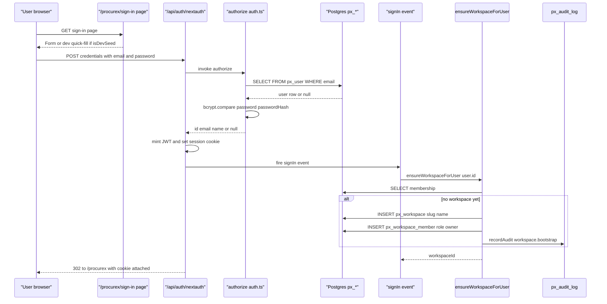
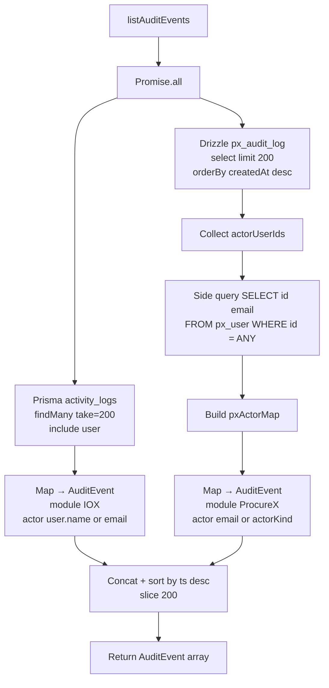

# ProcureX — Identity, RBAC & Audit

ProcureX runs as a namespaced module inside IOX. It re-uses the platform's database server, the platform's NextAuth handler, and the platform's audit-log surface — but it owns its own user, workspace, and audit-log tables, sitting alongside the older Prisma-managed schema. This document walks through that arrangement end to end: how a session is established, how roles gate actions, how every write reaches `px_audit_log`, and how the two histories surface together at `/platform/audit`.

## Overview

Three concerns are layered:

1. **Identity** — `px_user` (Drizzle) plus the standard Auth.js companion tables (`px_account`, `px_session`, `px_verification_token`). The Credentials provider hashes against `password_hash`. The `is_dev_seed` / `dev_role_label` columns power the demo sign-in quick-fill panel.
2. **RBAC** — `px_workspace` + `px_workspace_member` with a Postgres enum `workspace_role` of `owner | admin | member | viewer`. Workspaces are slug-keyed; membership is the gating primitive for every ProcureX server action.
3. **Audit** — `px_audit_log` records every state change, indexed three ways (by workspace, by project, by target). A platform-level reader unions it with the legacy Prisma `activity_logs` table so officers see a single, time-ordered history across IOX and ProcureX.

The session is platform-wide by design (see ADR-0002), enforced via a single cookie issued at the root `/api/auth/[...nextauth]` handler. ProcureX does not run its own auth silo.

## Two user tables

ProcureX writes its own user table (`px_user`) even though the older IOX modules already have a Prisma-managed `users` table. The two tables coexist deliberately.

> [!IMPORTANT]
> **There are two user tables in this database.** Prisma's `users` (older IOX modules — CostX, BOQs, benchmarks) and Drizzle's `px_user` (ProcureX). They are not joined by a foreign key. The same human being — Arjun Mehta — exists as two rows, one per table, sharing the email `arjun.mehta@iox.local`. The platform treats email as the bridge. Any new module that needs to attribute work to a user must decide which table it's keyed off, and any code that joins audit events across modules must resolve actors via email (or accept that the two id-spaces are disjoint).

Why both exist: Prisma was already in production for CostX, BOQs, masterplans, and the platform admin surface when ProcureX was ported in from OmniApp. Re-keying every CostX foreign key onto a new `px_user` row was out of scope for M1. The smaller fix — keep Prisma where it is, give ProcureX its own Auth.js-shaped tables, bridge them by email — is documented in ADR-0001 and ADR-0003.

The bridge in practice:

- The Drizzle Credentials provider authenticates against `px_user.password_hash`.
- The IOX-side `getSession()` mock (and, in Phase 9, the real `auth()` reader) sees the same NextAuth session cookie. Module permission helpers short-circuit when `users.role === "ADMIN"` (Prisma) — the super-admin rule.
- The seed scripts ensure Arjun appears in both tables with the same email. Without the `px_user` row, NextAuth's `authorize()` returns `null` and the user sees a generic `CredentialsSignin` error — this is exactly the failure mode logged as **D-006** ("Arjun missing from `px_user` table"), which was fixed by seeding Arjun with `bcrypt('dev')` and re-running the ProcureX demo seed.

## The Drizzle adapter at root

The NextAuth handler is mounted at `/api/auth/[...nextauth]` — at the repository root, not under `/procurex`. ADR-0002 records the reasoning: one identity, one cookie, every IOX module honours the same session. Putting the handler under `/procurex` would have created a per-module auth silo and broken the super-admin rule.

The wiring is split across three files so the middleware (which runs on the Edge runtime) never imports Node-only code:

| File | Role |
|---|---|
| `web/app/api/auth/[...nextauth]/route.ts` | Re-exports `GET` / `POST` from the Node-side handlers |
| `web/modules/core/auth.ts` | NextAuth init: Drizzle adapter, Credentials provider, `signIn` event |
| `web/modules/core/auth.config.ts` | Edge-safe config: `pages.signIn = "/procurex/sign-in"`, `session.strategy = "jwt"`, `authorized`/`jwt`/`session` callbacks |

The Drizzle adapter is configured against the four standard Auth.js tables in `web/modules/identity/schema.ts`:

- `px_user` — extended with `password_hash`, `is_dev_seed`, `dev_role_label`, `created_at`, `updated_at`
- `px_account` — OAuth provider linkage, primary-keyed on `(provider, providerAccountId)`
- `px_session` — required by the adapter even though we use JWT sessions
- `px_verification_token` — primary-keyed on `(identifier, token)`

The session strategy is `jwt`, so the session cookie is self-contained: `sub` carries the user id, the `jwt`/`session` callbacks copy it onto `session.user.id` for server components. The Credentials provider rejects anything missing email or password, looks up the user via `getUserByEmail`, and bcrypt-compares against `password_hash`. If the user has no `password_hash` it returns `null` immediately — that's the path that fires when Arjun exists in Prisma but not in `px_user`.

**`AUTH_TRUST_HOST` and D-002.** NextAuth in v5 refuses to issue cookies for hosts it does not trust. On the demo VM the first deploy returned a 500 with `UntrustedHost: Host must be trusted` on every sign-in attempt. The fix was to set `AUTH_TRUST_HOST=true` in `.env` and reload pm2 — logged as D-002 in the defect log. `AUTH_SECRET` and `AUTH_TRUST_HOST` are platform-level env vars (consequence noted in ADR-0002), not module-scoped.

**Cookie strategy.** Single cookie at the root domain, JWT-encoded, signed with `AUTH_SECRET`, scoped to the whole IOX surface. Every module — CostX, BOQs, ProcureX, the platform admin — reads the same session.

## Workspace + member roles

Workspaces are the primary RBAC primitive inside ProcureX. They sit in `px_workspace`, keyed by a unique slug, with a `created_by_user_id` reference back to `px_user`. Membership lives in `px_workspace_member`, primary-keyed on `(workspace_id, user_id)`, with a Postgres enum role column.

| Role | Capability inside the workspace |
|---|---|
| `owner` | Full control; the default assignment on workspace bootstrap |
| `admin` | All actions short of deleting the workspace |
| `member` | Default for invited users; can create / edit project content |
| `viewer` | Read-only access |

ProcureX permission checks fetch the caller's row via `getUserRole(userId, workspaceId)` and gate accordingly. The slug is the URL-visible identifier — e.g. `/procurex/[workspaceSlug]/projects/...` — and the route resolves it server-side to an id before any read. The `workspace_member_user_idx` covers the common "list my workspaces" query (`getMyWorkspaces`).

Workspace creation is automated. On every sign-in the `signIn` event handler calls `ensureWorkspaceForUser(user.id)`. If the user has no membership yet, the helper:

1. Looks up the user's display name (or email, or `"Workspace"`).
2. Slugifies it and walks up `name-2`, `name-3`, … until it finds a free slug (max 50 attempts, then falls back to a timestamp suffix).
3. Inserts `px_workspace` with `createdByUserId = userId`.
4. Inserts `px_workspace_member` with `role = "owner"`.
5. Records an audit row with `action = "workspace.bootstrap"`.

This is the only path that auto-grants `owner` — invited users land on `member` unless explicitly elevated.

Cross-module super-admin behaviour is layered on top: see `docs/security/access-control-matrix.md`. Every `canAccess*` helper short-circuits when `users.role === "ADMIN"` in the Prisma `users` table, so Arjun's IOX-side `ADMIN` flag grants access to ProcureX projects regardless of his `px_workspace_member` row.

## Sign-in flow

If `authorize()` returns `null`, NextAuth surfaces `CredentialsSignin` and the page re-renders with a banner — this is the path D-006 was masking when Arjun's `px_user` row was missing.

## Audit table

`px_audit_log` is the ProcureX-side ledger. Every mutation that changes user-visible state should call `recordAudit(...)` from `web/modules/audit/index.ts`. The helper swallows errors so a failed audit write never breaks the surrounding action.

| Field | Type | Notes |
|---|---|---|
| `id` | `text` PK | `crypto.randomUUID()` default |
| `workspace_id` | `text` → `px_workspace(id)` `ON DELETE CASCADE` | Nullable for system-level events |
| `project_id` | `text` | Logical FK; the project table comes in M2.1, no constraint yet |
| `actor_user_id` | `text` → `px_user(id)` `ON DELETE SET NULL` | Null for system / bidder-token events |
| `actor_kind` | `text` (default `"user"`) | Enum-ish: `user` \| `bidder_token` \| `system` |
| `action` | `text` NOT NULL | Dotted action name, e.g. `workspace.bootstrap`, `procurex_seed_v1` |
| `target_kind` | `text` NOT NULL | The kind of thing acted on, e.g. `workspace`, `project`, `tenderer` |
| `target_id` | `text` | Optional; the id within `target_kind` |
| `payload` | `jsonb` | Free-shape per `action` — convention: small, JSON-stringifiable diff |
| `created_at` | `timestamp` (default now) | Time-ordered queries rely on this |

Three indexes back the three dominant query shapes:

| Index | Columns | Used by |
|---|---|---|
| `audit_workspace_idx` | `(workspace_id, created_at)` | Workspace-scoped timeline |
| `audit_project_idx` | `(project_id, created_at)` | Project-scoped timeline |
| `audit_target_idx` | `(target_kind, target_id)` | "What happened to this thing?" lookups |

The `payload` `jsonb` is intentionally untyped at the schema level — each `action` defines its own shape. The seed writes `{ projects, tenderers, documents, companies }`; the workspace bootstrap writes `{ slug, name }`. The reader truncates payloads to 120 characters for the platform-wide list view.

## Cross-module audit UNION

The IOX platform admin surface at `/platform/audit` shows a single timeline across both modules. `web/lib/platform/audit.ts` builds it by running two parallel reads and normalising the results into a common `AuditEvent` shape.

Three things make this UNION work despite the two-user-table split:

1. **Bounded reads.** Each side caps at 200 rows, so the union is always at most 400 rows in memory and 200 rows after the final slice.
2. **Actor resolution by side query.** ProcureX rows carry only `actor_user_id` (a `px_user.id`). After fetching the rows, the reader collects the distinct ids and issues a single batched `SELECT id, email FROM px_user WHERE id = ANY(...)` to build a `pxActorMap`. Rows whose actor cannot be resolved fall back to `actorKind` or the literal `"system"`.
3. **Failure tolerance.** Both side queries are wrapped in `.catch(() => [])`. If Prisma is unreachable, the page still renders ProcureX events. If Drizzle is unreachable, it still renders IOX events. The page never errors out because one table is sad.

The normalised `AuditEvent` carries `module: "IOX" | "ProcureX"`, an ISO timestamp, a display-name actor, the action / target / target id, an optional payload summary, and (for IOX rows) the source IP. `getAuditStats` then folds the array into a small dashboard: total counts split by module, top-5 actions, top-5 actors.

## Demo seed

`web/scripts/seed-procurex.ts` is the demo seed runner. It is idempotent — it gates on the presence of an `action = 'procurex_seed_v1'` row in `px_audit_log` and no-ops if one is found. The audit row is therefore both the marker and the historical record of the seed.

The seed seeds in dependency order:

1. **Locate Arjun.** `SELECT id FROM px_user WHERE email = 'arjun.mehta@iox.local'`. If missing, it aborts with `"Arjun not seeded; run sign-in once first"` — this is the assertion that surfaced **D-006**.
2. **Locate Arjun's workspace.** Created automatically by `ensureWorkspaceForUser` on first sign-in. If missing, abort with a message pointing the operator at `/procurex/sign-in`.
3. **Seed 10 companies** from a fixed list, scoped to the workspace.
4. **Seed 6 projects** in varied statuses (`configured`, `analysing`, `review`, `draft`, `reported`).
5. **Wire Arjun as `owner`** on every project via `px_project_member` (`ON CONFLICT DO NOTHING`).
6. **Seed 3 tenderers per project**, picking random companies and assigning a `T1/T2/T3` code with a random status.
7. **Seed one ITT document per project** in `px_document`.
8. **Write the `procurex_seed_v1` audit row** with a payload counting what was created.

The demo password is `bcrypt('dev')` — set by a separate one-off seed for Arjun that runs before `seed-procurex.ts` (this is what D-006 was fixed by, on the VM). Once Arjun's `px_user` row exists with that hash, the quick-fill panel on `/procurex/sign-in` (visible because `is_dev_seed = true` and `dev_role_label = "SUPER_ADMIN"`) can sign him in with one click.

## Common edits

- **Add a workspace role.** Extend `workspaceRoleEnum` in `web/modules/workspace/schema.ts`, run a Drizzle migration (the enum is a Postgres `pgEnum` so this is an `ALTER TYPE ... ADD VALUE`), then teach `canAccessProject` to honour the new value.
- **Audit a new action.** Pick an `action` name (dot-prefixed by module / domain), call `recordAudit({ workspaceId, actorUserId, actorKind, action, targetKind, targetId, payload })` from the mutation. Keep `payload` small and JSON-stringifiable — the platform reader truncates to 120 chars.
- **Add a new credentials field.** Extend `px_user` in `web/modules/identity/schema.ts`, migrate, and update `authorize()` in `web/modules/core/auth.ts`. Touching the Auth.js companion tables (`px_account`, `px_session`, `px_verification_token`) requires re-running the Drizzle adapter wiring in `auth.ts`.
- **Change the sign-in page path.** Edit `pages.signIn` in `web/modules/core/auth.config.ts`. Do not move the handler — keep it at `/api/auth/[...nextauth]` (ADR-0002).
- **Seed a new demo user.** Insert into `px_user` with `is_dev_seed = true`, `dev_role_label = "..."`, and `password_hash = bcrypt('dev')`. The quick-fill panel will pick them up automatically.

## Gotchas

- **Two user tables, one human.** The biggest foot-gun. A new module that joins on `user_id` must know which table it's keyed off, and any cross-module reporting must bridge by email or accept that the two id-spaces are disjoint. Don't add a foreign key from a `px_*` table to Prisma's `users` (or vice versa) — the two schemas are managed by different migrators.
- **Sign in before seeding.** The ProcureX demo seed assumes Arjun has signed in at least once (so `ensureWorkspaceForUser` has created his workspace). The runner aborts with a helpful message if it hasn't, but the failure mode is easy to misread as a generic error.
- **`AUTH_TRUST_HOST` on every host.** Any new deployment target — staging VM, preview branch, second region — needs the env var set or NextAuth returns 500 on sign-in (D-002).
- **Audit writes can't throw.** The `recordAudit` helper deliberately swallows errors. If you need to know an audit write failed, log the error explicitly in the calling site — don't try to assert it.
- **The `project_id` FK isn't enforced.** `px_audit_log.project_id` is a `text` column without a Postgres foreign key — the project table arrives in M2.1. Don't assume referential integrity; check on the read side or accept orphan rows.
- **JWT sessions cache the user id.** Changing `px_user.id` for a logged-in user invalidates their session. JWTs don't re-fetch the user on every request — only the callbacks re-run, and they trust `token.sub`.
- **Slug collisions are silently disambiguated.** `uniqueSlug` walks up `name-2`, `name-3`, … without telling the user. A workspace named "Procurement" might land at `procurement-7` if six earlier workspaces took the lower numbers.
- **The mock session is still live in dev.** `lib/session.ts` returns Arjun unconditionally, so unauthenticated `/costx` requests still render (logged in the access-control matrix and ADR-0004 as a dev-only gap). Phase 9 replaces it with `auth()`.

## File map

| Path | Role |
|---|---|
| `web/modules/identity/schema.ts` | `px_user`, `px_account`, `px_session`, `px_verification_token` |
| `web/modules/identity/queries.ts` | `getUserByEmail`, `getUserById` |
| `web/modules/workspace/schema.ts` | `px_workspace`, `px_workspace_member`, `workspaceRoleEnum` |
| `web/modules/workspace/actions.ts` | `ensureWorkspaceForUser`, `getUserRole`, `getMyWorkspaces` |
| `web/modules/audit/schema.ts` | `px_audit_log` |
| `web/modules/audit/index.ts` | `recordAudit` |
| `web/modules/core/auth.ts` | NextAuth init, Drizzle adapter, Credentials provider, `signIn` event, `requireUserId` |
| `web/modules/core/auth.config.ts` | Edge-safe config — `pages.signIn`, `session.strategy`, callbacks |
| `web/app/api/auth/[...nextauth]/route.ts` | Root handler — re-exports `GET` / `POST` |
| `web/lib/platform/audit.ts` | UNION of Prisma `activity_logs` + Drizzle `px_audit_log` |
| `web/scripts/seed-procurex.ts` | Idempotent demo seed gated on `procurex_seed_v1` audit row |
| `docs/security/access-control-matrix.md` | Role × module × action matrix and enforcement helpers |
| `docs/architecture/decisions/0001-prisma-drizzle-coexistence.md` | Why the two ORMs coexist |
| `docs/architecture/decisions/0002-nextauth-at-root.md` | Why the handler lives at the root |
| `docs/architecture/decisions/0003-procurex-isolated-namespace.md` | Why ProcureX runs as a namespaced module |
| `docs/architecture/decisions/0004-mock-session-shim.md` | The dev-only mock session and its production replacement plan |
| `docs/quality/defect-log.md` | D-002 (`AUTH_TRUST_HOST`), D-006 (Arjun missing from `px_user`) |
