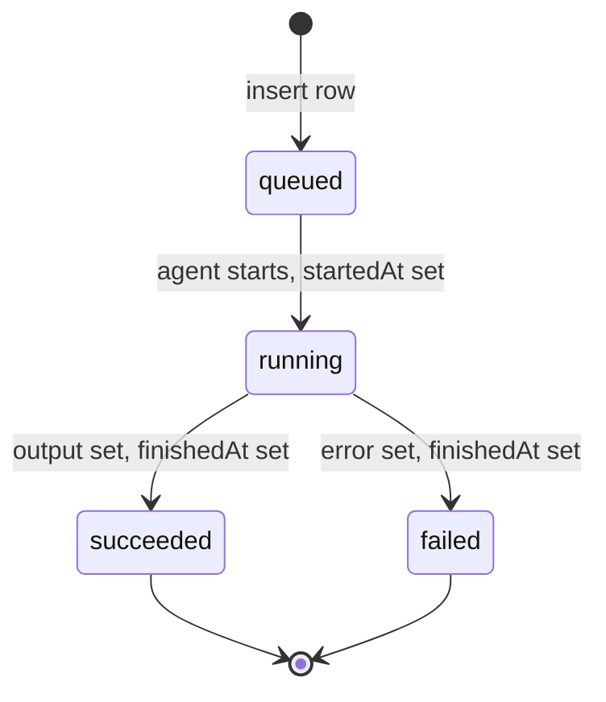
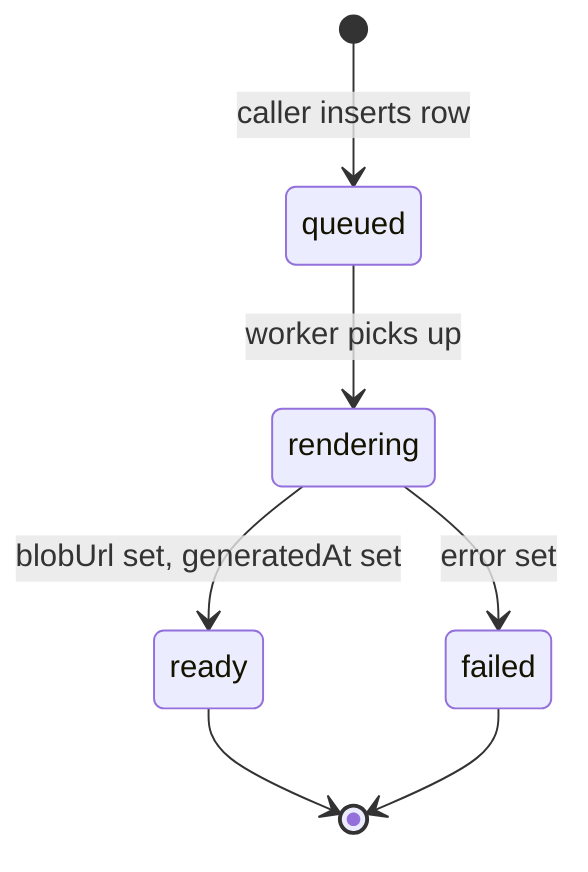

# ProcureX — Operational Modules

ProcureX's six operational modules sit at the top of `web/modules/` (not under `procurex/`) because they are OmniApp foundation tables the rest of IOX may eventually share. They turn a tender project into a long-running, audit-trailed workflow: `workflows/` records every durable agent run, `analysis/` holds the deterministic pricing engine plus AI-extracted deviations, `comments/` is a polymorphic threaded discussion surface, `notifications/` is the in-app / email outbox, `companies/` is the workspace-scoped counterparty directory, `reports/` is the immutable artefact ledger. All six live in the `px_*` namespace and re-export through `web/drizzle/schema.ts` so one `drizzle-kit` push touches them together.

> [!NOTE]
> Three of these modules — `comments/`, `notifications/`, `reports/` — currently consist of a single `schema.ts` file with no actions, queries, or API routes wired to them yet. They are **declared but unused** placeholders that reserve the table shape for Phase 2+ features. The other three (`workflows/`, `analysis/`, `companies/`) are fully live and load-bearing.

---

## Workflows (`px_workflow_run`)

The durable-run ledger. Every long-running agent invocation — AI extraction today, future BoQ ingest and report generation — opens a row, mutates through a small state machine, and writes output as JSON. The UI polls or subscribes for progress; cross-bidder cache lookups query for previously-succeeded surfaces.

### Schema

| Field | Type | Notes |
|---|---|---|
| `id` | text (PK) | UUID, `crypto.randomUUID()` default |
| `workspaceId` | text → `workspaces.id` | Nullable; cascade on workspace delete |
| `projectId` | text | Logical pointer — no FK so cross-project / project-less runs are possible |
| `kind` | text | Dotted identifier, e.g. `ai.extract:fot`, `ai.extract:coc`, `ai.extract:boq`. Future: `boq.ingest`, `analysis.run`, `reports.generate` |
| `status` | `workflow_run_status` enum | `queued` / `running` / `succeeded` / `failed` |
| `input` | jsonb | Caller payload — `{ documentId, filename, spec, surfaceHash }` for `ai.extract:*` |
| `output` | jsonb | Final verdict; for AI extraction includes `verdict`, `cache_eligible`, `cached_from` |
| `error` | text | Populated only when `status='failed'` |
| `startedAt` | timestamp | Set at `running` transition |
| `finishedAt` | timestamp | Set at `succeeded` / `failed` transition |
| `createdAt` | timestamp | Defaults `now()` |

Indexes: `workflow_run_kind_idx`, `workflow_run_project_idx (projectId, createdAt)`, `workflow_run_status_idx`.

### Lifecycle



The AI extraction worker (`modules/ai-extraction/workflows/extract-document.ts`) skips `queued` and inserts directly at `running` — row creation and agent start are in the same server action. Pure-`queued` rows only appear once a background scheduler exists.

### Who creates / reads

| Caller | Action |
|---|---|
| `modules/ai-extraction/workflows/extract-document.ts` | The **only** writer. Inserts at `running`, updates through `succeeded`/`failed`, persists `output` and `error` |
| `modules/ai-extraction/convergence-actions.ts` | Latest `succeeded` run per `(projectId, kind)` — convergence check across tendered docs |
| `modules/ai-extraction/queue/project-status.ts` | Bulk-fetches by `(workspaceId, id IN [...])` for the project-level extraction status pill |
| `modules/procurex/review/sections/project-fot-requirements.ts` | Latest `succeeded` `kind='ai.extract:fot'` for the project's own FoT |
| `modules/procurex/review/sections/project-coc-requirements.ts` | Same as FoT but `kind='ai.extract:coc'` |
| `modules/procurex/review/sections/bidder-fot-submission.ts` | Per-bidder FoT verdict |
| `modules/procurex/review/sections/bidder-coc-standing.ts` | Per-bidder COC verdict |
| `modules/procurex/tenderers/compliance-actions.ts` | Same pattern for compliance rendering |
| `modules/procurex/tenderers/actions.ts` | Reads run output to reconcile submission state |
| `app/procurex/api/projects/[projectId]/full/route.ts` | Bulk-fetches all workspace runs, filters in JS by `runIds` from `extractionJobs` |

### Common edits + gotchas

- **New agent kind** — pick `<domain>.<verb>:<scope>`, insert at `status='running'` with the full input JSON. Only `kind` is required; workspace and project are nullable for one-off batches.
- **Cache key = `input->>'surfaceHash'`** — `extract-document.ts:867`. Don't dump unstable values (`now()`, request IDs) into `input` or you'll poison the cache.
- **`projectId` has no FK** — project delete does not cascade. Failed runs survive for inspection; orphaned rows accumulate (no janitor yet).
- **`workspaceId` FK cascades** — workspace delete nukes workflow history. Back up before tenant offboarding.
- **`output` and `error` are nullable while `running`** — UI must defend against `null`. The `full` route treats `output` as `unknown` and feature-detects.
- **neon-http dislikes `DISTINCT ON`** — see `full/route.ts:103`. Fetch all rows and pick latest in JS.

---

## Analysis

The largest module: six tables implementing ProcureX's deterministic pricing engine plus the AI-extracted deviations pipeline overlaid on it. The only module with non-trivial business logic in its schema — seven Postgres enums encode the analyst's vocabulary.

### What it analyses

Two waves:

1. **Phase A — deterministic per-bidder flags.** For each priced row in each submission, compute baseline (avg-of-lowest-three / median / mean / PTE reference), emit `tender_flag` rows where variance crosses threshold or the row is unpriced / arithmetically broken. No model calls — one SQL fetch per submission, then a bulk insert.
2. **Phase C — AI-extracted deviations.** The `ai.extract:*` agents read bidder narrative documents (FoT, COC, technical responses) and emit `tender_deviation` rows tagged commercial / technical / contractual with verbatim snippet, clause, and severity.

Phase B (sectional summaries) lives in `tender_review_row` as captured QS commentary, not derived analytics.

### Schema + flow

```text
analysisConfigs ─── per-(round, context) thresholds + baseline choice
       │
       ▼
tendererSubmissions ── one row per (round, tenderer)
       │
       ├──> tenderFlags        (deterministic; recomputed on every submission apply)
       ├──> tenderDeviations   (AI-derived; appended by ai-extraction persistors)
       └──> tenderReviewRows   (per-section QS textarea + Include-in-PTC toggle)

flags (legacy, generic) — back-compat only; new code writes tenderFlags
```

| Table | Cardinality | Purpose |
|---|---|---|
| `px_analysis_config` | one per (`ownerKind`, `ownerId`, `context`) | Knobs — baseline mode, high/low thresholds, unpriced strategy, sections-enabled bitmap |
| `px_flag` | per priceset row | **Legacy** variance flag with QS Q&A state — new code prefers `tenderFlags` |
| `px_tenderer_submission` | one per (`roundId`, `tendererId`) | Submission shell — tender sum, adjusted sum, status, summary counters |
| `px_tender_flag` | per priced row | Per-bidder flag — variance / high / low / unpriced / arithmetical |
| `px_tender_deviation` | per AI finding | Commercial / technical / contractual deviation with clause + snippet |
| `px_tender_review_row` | one per (`tendererId`, `sectionKey`) | Per-bidder per-section QS state (textarea + Include-in-PTC) |

#### Enums

| Enum | Values |
|---|---|
| `baseline_kind` | `avg_lowest_three` / `median` / `average` / `reference` |
| `analysis_context` | `ptc` / `tender` / `internal` |
| `unpriced_strategy` | `list_only` / `avg_lowest_three` / `normalise_avg` / `normalise_pte` |
| `flag_kind` | `high_rate` / `low_rate` / `unpriced` / `arithmetical_error` |
| `flag_status` | `open` / `answered` / `accepted` / `rejected` |
| `tender_flag_kind` | `variance` / `high_rate` / `low_rate` / `unpriced` / `arithmetical_error` |
| `tender_deviation_kind` | `commercial` / `technical` / `contractual` |

#### Submission status (text, not enum)

`pending` / `uploaded` / `analysed` / `clarified` / `locked` — captured loosely on `tendererSubmissions.status`. Promote to an enum if you ever need DB-level validation.

#### Server actions / queries

| File | Exports |
|---|---|
| `modules/procurex/configurations/actions.ts` | `getStep4Config`, `saveStep4Config` — `analysisConfigs` for `(round, ptc)` and `(round, tender)`, mirrored into `roundConfigRefs` |
| `modules/procurex/tenderers/flag-actions.ts` | `recomputeProjectBidderFlags` — deletes prior `tenderFlags`, bulk-inserts fresh |
| `modules/procurex/tenderers/actions.ts` | Inserts `tendererSubmissions`, reads for the bidder grid |
| `modules/procurex/tenderers/submission-actions.ts` | `discardTendererUpload` and friends |
| `modules/procurex/review/review-row-actions.ts` | `upsertReviewRow` — writes `tenderReviewRows` on textarea blur |
| `modules/procurex/review/sections/boq-review.ts` | Aggregates `tendererSubmissions` + `tenderFlags` for the BoQ section |
| `modules/procurex/review/sections/bidder-deviations.ts` | Reads `tenderDeviations` |
| `modules/ai-extraction/specs/_persistors.ts` | Writes `tenderDeviations` from agent verdicts |

### Common edits + gotchas

- **New baseline mode** — add to `baseline_kind` enum (migration), wire into `getStep4Config` defaults, and update `flag-actions.ts` so `recomputeProjectBidderFlags` can compute it. Forgetting the last step silently zeroes out flags.
- **Threshold validation in `configurations/actions.ts` `validate()`** — `0 < high ≤ 100`, `-100 ≤ low < 0`, `0 < qc ≤ 100`. Server-side is source of truth.
- **PTE-reference fallback** — `baselineKind='reference'` without a PTE document → `saveStep4Config` returns `{ ok: false, field: 'ptc.baselineKind' }`. `defaultTender()` falls back to `avg_lowest_three` when no PTE.
- **`px_flag` (legacy) coexists** — new work uses `px_tender_flag`. Don't mix; QS Q&A fields (`qsQuestion`, `qsNote`, `response`, `includeInOutput`) exist only on the legacy table and aren't ported.
- **`tendererSubmissions.roundId` / `.tendererId` are bare text** — no FK. Cascade-on-delete is the caller's job.
- **`recomputeProjectBidderFlags` is destructive** — deletes every flag for the project's submissions before re-inserting. Call from one chokepoint (after `applyTendererSubmission`), not in a hot loop.
- **`tenderReviewRows.sectionKey` is free-form** — canonical keys live in `modules/procurex/review/types.ts`; a typo silently creates a parallel row the UI never reads.

---

## Comments

A single table — `px_comment` — implementing polymorphic threaded comments. `targetKind` discriminates what is being commented on; `targetId` is the logical pointer; `parentCommentId` enables threads.

### Schema

| Field | Type | Notes |
|---|---|---|
| `id` | text (PK) | UUID |
| `workspaceId` | text → `workspaces.id` | NOT NULL, cascade |
| `projectId` | text | Logical pointer, no FK |
| `targetKind` | text | Free-form discriminator. No enum — caller convention |
| `targetId` | text | Logical pointer to whatever `targetKind` names |
| `parentCommentId` | text | Self-reference (no FK) — null at thread root |
| `bodyMd` | text | Markdown source |
| `attachments` | jsonb | `[{ documentId, filename }]` |
| `createdByUserId` | text → `users.id` | NOT NULL, restrict |
| `createdAt` / `updatedAt` | timestamp | |
| `deletedAt` | timestamp | Soft-delete marker |

Indexes: `comment_workspace_idx (workspaceId, createdAt)`, `comment_target_idx (targetKind, targetId, createdAt)`, `comment_parent_idx`.

### Where comments attach (intended `targetKind` vocabulary)

| Kind | Anchors to |
|---|---|
| `project` | A tender project |
| `round` | A PTC round |
| `bidder` | A `tenderers` row (per-bidder thread on review pages) |
| `flag` | A `tender_flag` (QS Q&A on a variance) |
| `deviation` | A `tender_deviation` |
| `compliance_record` | A row on the Section A–O compliance grid |
| `document` | A `documents` row |

> [!NOTE]
> **No code currently imports from `@/modules/comments`.** The schema is in the barrel (`web/drizzle/schema.ts:12`) so the table exists, but no action, query, or component reads or writes it. `qs-comments.tsx` explicitly notes "QS comments are not yet persisted"; `compliance-card.tsx` textarea state is held in React `useState` and never flushed. Wiring actions is a Phase 2 item.

### Common edits + gotchas

- **No actions file yet** — `addComment`, `editComment`, `softDeleteComment`, `listCommentsFor(targetKind, targetId)` need writing. Follow `modules/companies/actions.ts`: `requireUserId()` → `assertWorkspaceMember()` → mutate → `recordAudit({ action: "comment.create", … })`.
- **`parentCommentId` has no FK** — cheap inserts, but orphaned children are possible. The reader assembles trees in JS.
- **`targetKind` is free-form text** — no enum guard. Keep the canonical list above in a constant in `modules/comments/index.ts` (future) and validate at the action boundary.
- **The QS textarea on the report page is intentionally non-persistent** — see `qs-comments.tsx`. Don't "fix" to local storage; persistence lands in `px_comment` when actions ship.
- **Soft-delete only** — never hard-delete; the audit trail expects every comment ID to be resolvable.

---

## Notifications

The user-facing notification outbox. One table — `px_notification` — with channel (`in_app` / `email`) and status (`pending` / `sent` / `read` / `failed`) as enums.

### Schema

| Field | Type | Notes |
|---|---|---|
| `id` | text (PK) | UUID |
| `userId` | text → `users.id` | NOT NULL, cascade |
| `workspaceId` | text → `workspaces.id` | NOT NULL, cascade |
| `projectId` | text | Logical pointer, no FK |
| `kind` | text | Free-form discriminator — `submission.applied`, `flag.opened`, etc. |
| `payload` | jsonb | Render data — title, body, deep-link href |
| `channel` | `notification_channel` enum | `in_app` (default) or `email` |
| `status` | `notification_status` enum | `pending` / `sent` / `read` / `failed` |
| `createdAt` | timestamp | |
| `sentAt` | timestamp | Set when delivery succeeds |
| `readAt` | timestamp | Set when the user opens the notification |

Indexes: `notification_user_idx (userId, createdAt)`, `notification_workspace_idx (workspaceId, createdAt)`, `notification_unread_idx (userId, status)` — the last is sized for the in-app bell badge query.

### Delivery channels

| Channel | Transport | Status transitions |
|---|---|---|
| `in_app` | Polled by the UI bell, `read` on click | `pending` → `sent` (immediate on insert) → `read` |
| `email` | Not wired — intended for a Resend / SES adapter | `pending` → `sent` on provider 2xx, → `failed` with reason in `payload` |

### Read / unread

Unread = `status IN ('pending', 'sent')` for the bell badge; `notification_unread_idx` makes that scan O(log n). Once `read`, the row stays for history.

> [!NOTE]
> **No code currently imports from `@/modules/notifications`.** Schema is registered in `web/drizzle/schema.ts:13` so the table exists, but no producer or consumer is wired. The bell icon in the ProcureX shell is decorative.

### Common edits + gotchas

- **Single producer helper** — write `recordNotification({ userId, workspaceId, kind, payload, channel })` mirroring `recordAudit`. Never insert from page components.
- **`channel` defaults to `in_app`** — don't accept caller defaults at the action layer.
- **Non-monotonic status** — `sent` → `failed` is legal on retry. Don't add a CHECK constraint.
- **`payload` is render-time data, not domain data** — keep it shallow and secret-free; an offline user must still render a months-old payload.
- **Workspace cascade is intentional** — offboarding clears the backlog so returning users don't get hit with a 2,000-row bell.

---

## Companies

The workspace-scoped counterparty directory. Tenderers, vendors, suppliers — same data, different vocabulary per consuming module. ProcureX calls them tenderers via the `tenderers` table (`companyId` FK); future modules (Vendor Performance, CostX subcontractor DB) reference the same rows.

### Schema

#### `px_company`

| Field | Type | Notes |
|---|---|---|
| `id` | text (PK) | UUID |
| `workspaceId` | text → `workspaces.id` | NOT NULL, cascade |
| `name` | text | NOT NULL |
| `tradeName` | text | Short / alternate form |
| `country` / `city` / `trade` | text | All optional |
| `isActive` | boolean | Defaults `true`; soft-disable on `softDeleteCompany` |
| `createdByUserId` | text → `users.id` | NOT NULL, restrict |
| `createdAt` / `updatedAt` / `deletedAt` | timestamp | `deletedAt` marks soft-delete |

Index: `company_workspace_idx (workspaceId, createdAt)`.

#### `px_company_contact`

| Field | Type | Notes |
|---|---|---|
| `id` | text (PK) | UUID |
| `companyId` | text → `companies.id` | NOT NULL, cascade |
| `name` | text | NOT NULL |
| `email` | text | NOT NULL, lowercased on insert |
| `phone` / `role` | text | Optional |
| `isPrimary` | boolean | Defaults `false` — the first contact is flagged `true` |
| `createdAt` | timestamp | |

Indexes: `company_contact_company_idx`, plus a `uniqueIndex` on `(companyId, email)` to prevent duplicate contact rows.

### Relations

```text
workspaces ──┬── companies ──── companyContacts (1:N, primary flag)
             │       │
             │       └── tenderers (procurex) ──> tendererSubmissions
             │       └── (future) vendors / subcontractors
             │
             └── workspaceMembers (the auth guard for every company action)
```

Workspace boundary is the tenancy boundary — same legal entity in two workspaces gets two rows. Intentional.

### Server actions (`modules/companies/actions.ts`)

| Action | Purpose |
|---|---|
| `addCompany({ workspaceId, name, …, contact })` | Insert company + primary contact, audit `company.create` |
| `bulkImportCompanies({ workspaceId, rows[] })` | Dedupe on `(lower(name), lower(email))`, bulk insert, audit `company.bulk_import` |
| `updateCompany(id, patch)` | Validated update, audit `company.update` |
| `softDeleteCompany(id)` | Sets `deletedAt` + `isActive=false`, audit `company.delete` |
| `getCompaniesForWorkspace(workspaceId)` | List non-deleted, ordered by `createdAt` |
| `getCompaniesByIds(ids[])` | Bulk fetch; empty array returns `[]` without DB hit |

Every mutating action calls `assertWorkspaceMember(userId, workspaceId)` — non-members get `FORBIDDEN`.

### Excel I/O (`modules/companies/excel.ts`)

| Export | Purpose |
|---|---|
| `parseCompaniesWorkbook(buffer)` | Parse first sheet, normalise via `HEADER_MAP` ("Company"/"Company name" both → `companyName`), Zod-validate, return `{ rows, errors[] }` |
| `buildCompaniesTemplate()` | Empty XLSX template with two example rows |

A more polished template generator lives at `web/app/procurex/api/templates/tenderer/route.ts` (Tenderers data sheet + Instructions sheet) — that is what the tenderer wizard download button calls. The `excel.ts` helper backs the bulk-import dialog.

### Common edits + gotchas

- **Direct insert in `tenderers/actions.ts:343`** — the procurex tenderer flow calls `db.insert(companies)` directly rather than `addCompany`, skipping `recordAudit("company.create", …)`. Either route through `addCompany` (preferred) or add an explicit audit there.
- **Dedup rule asymmetry** — `bulkImportCompanies` uses `${name.toLowerCase()}|${email.toLowerCase()}` for in-batch dedup; the tenderer flow uses `lower(${companies.name}) = lower(${name})`. The SQL one is canonical.
- **Soft-delete is one-way** — no `undeleteCompany`. Re-onboarding inserts a fresh row; the old `deletedAt` is audit trail.
- **Unique index is `(companyId, email)`** — two contacts with same email under one company are blocked; across two companies in one workspace they're not. Intentional (one human, two roles).
- **`isPrimary` is not unique** — nothing stops two primaries. Add a `WHERE is_primary` partial unique index if it matters.
- **`createdByUserId` is `restrict`** — you cannot hard-delete a user who created any company. Soft-delete the user instead.

---

## Reports

The immutable artefact ledger for generated PDF / Excel outputs — PTC packs, tender evaluation reports, Appendix A. Every generation creates a new row plus Blob URL; nothing is mutated in place.

### Schema

| Field | Type | Notes |
|---|---|---|
| `id` | text (PK) | UUID |
| `workspaceId` | text → `workspaces.id` | NOT NULL, cascade |
| `projectId` | text | Logical pointer |
| `kind` | text | Dotted identifier — `procurex.ptc-pack`, `procurex.tender-report`, `procurex.appendix-a` |
| `scope` | jsonb | `{ roundId, tendererId?, options? }` — caller-supplied generation context |
| `templateKey` | text | NOT NULL — names the rendering template version |
| `blobUrl` | text | Public-ish Vercel Blob URL once `ready` |
| `blobPathname` | text | Internal Blob path for deletion / re-issue |
| `mimeType` | text | `application/pdf`, `application/vnd.openxmlformats-…` |
| `status` | `report_artefact_status` enum | `queued` / `rendering` / `ready` / `failed` |
| `error` | text | Populated when `status='failed'` |
| `generatedAt` | timestamp | Set on `ready` |
| `generatedByUserId` | text → `users.id` | `set null` — user can be deleted, artefact survives |
| `createdAt` | timestamp | |

Indexes: `report_workspace_idx (workspaceId, createdAt)`, `report_project_idx (projectId, createdAt)`, `report_kind_idx`.

### What gets reported

| `kind` | Surface |
|---|---|
| `procurex.ptc-pack` | Pre-Tender Clarification pack — sectional Q&A + per-bidder commercial deviations |
| `procurex.tender-report` | Full Tender Evaluation Report — exec summary, ranking, normalisations, appendices |
| `procurex.appendix-a` | Standalone Appendix A (rate comparison matrix) |

### Generation flow



Intended flow:

1. User clicks "Generate PTC pack" → server action inserts `px_report_artefact { status: 'queued', kind, scope, templateKey, generatedByUserId }`
2. Worker (or inline render) flips to `rendering`, calls the template, uploads to Vercel Blob, writes `blobUrl` + `blobPathname` + `mimeType`, flips to `ready`
3. UI polls or subscribes; on `ready`, surfaces a download button pointing at `blobUrl`

> [!NOTE]
> **No code currently writes to `reportArtefacts`.** The Tender Evaluation Report page (`web/app/procurex/projects/[projectId]/report/page.tsx`) renders live HTML via `modules/procurex/report/report-data.ts` server-side every paint — no persistence yet. The artefact table is reserved for when PDF/Excel rendering ships. The `web/modules/procurex/report/` directory (`report-data.ts`, `boq-changes.ts`, `rate-comparisons.ts`, `sum-breakdown.ts`, `project-snapshot.ts`, `appendix-c-data.ts`) assembles section view-models, not artefacts.

### Common edits + gotchas

- **Immutability is the contract** — never `UPDATE` `blobUrl`. Re-runs insert a new row; audit trail shows regeneration by row count.
- **`scope` is the cache key** — for "regenerate if scope unchanged?", compare on canonical-stringified JSON with sorted keys.
- **`templateKey` is load-bearing** — bump it when rendering logic changes so old `ready` rows flag "stale template" in the UI.
- **`generatedByUserId` is `set null`** — artefact stays available after a QS leaves. Don't switch to `restrict`.
- **Blob lifecycle is off-schema** — on soft-delete, delete the Blob via `blobPathname` first. Orphaned blobs cost money.

---

## Cross-module patterns

The six modules share a small set of conventions so anything new fits without inventing local idiom.

### `workspaceId` scoping

The five workspace-scoped tables (`workflows`, `comments`, `notifications`, `companies`, `reports`) all use `text("workspace_id").references(() => workspaces.id, { onDelete: "cascade" })` — same pattern. `analysis` is the exception: its tables hang off business pointers (`roundId`, `tendererId`, `submissionId`, `pricesetId`) and inherit workspace via joins. New modules should follow the workspace-FK pattern unless structurally blocked.

The runtime guard is `assertWorkspaceMember(userId, workspaceId)` (`companies/actions.ts:30`):

```ts
async function assertWorkspaceMember(userId: string, workspaceId: string) {
  const rows = await db
    .select({ role: workspaceMembers.role })
    .from(workspaceMembers)
    .where(and(eq(workspaceMembers.userId, userId), eq(workspaceMembers.workspaceId, workspaceId)))
    .limit(1)
  if (rows.length === 0) throw new Error("FORBIDDEN")
}
```

Every mutating action calls this (or an equivalent project-level guard) before touching the DB. Read pattern is `requireUserId()` from `@/modules/core/auth`.

### Audit hook usage

`recordAudit(event)` from `@/modules/audit` is the single sink. It never throws — audit failures must not break the action (`modules/audit/index.ts:14`). Shape:

```ts
await recordAudit({
  workspaceId,                  // always set
  projectId: input.projectId,   // when applicable
  actorUserId: userId,
  actorKind: "user",            // or "system" for background workers
  action: "company.create",     // dotted: <noun>.<verb>[:scope]
  targetKind: "company",
  targetId: company.id,
  payload: { name: parsed.name } as Record<string, unknown>,
})
```

`companies/actions.ts` is the reference implementation — every mutation has a matching `recordAudit`. Copy the shape when wiring `comments`, `notifications`, `reports`: insert row → `recordAudit` → return. Never gate on audit success.

### Common shapes

| Shape | Used by |
|---|---|
| UUID PK with `crypto.randomUUID()` default | All six modules |
| `createdAt` defaults `now()`, `updatedAt` updated by hand | All mutable-row tables |
| `deletedAt` for soft-delete | `companies`, `comments` — where audit visibility beats row cleanup |
| `status` as a Postgres enum, not text | `workflows`, `notifications`, `reports`, parts of `analysis` |
| Free-form `targetKind` + logical `targetId` | `comments`, mirrored in `audit_log` — both polymorphic by design |
| `payload`/`scope`/`input`/`output` as `jsonb` | Anywhere structured-but-evolving data lives |
| `workspaceId` cascade, `projectId` logical-only | All workspace-scoped tables |
| `createdByUserId` restrict, `generatedByUserId` set-null | Restrict on origin-of-record; set-null on event-of-record |

### Schema discovery

All six modules re-export through `web/drizzle/schema.ts`:

```ts
export * from "@/modules/companies/schema"
export * from "@/modules/comments/schema"
export * from "@/modules/notifications/schema"
export * from "@/modules/workflows/schema"
export * from "@/modules/reports/schema"
export * from "@/modules/analysis/schema"
```

`drizzle-kit push` reads only this barrel — a new table needs both the `pgTable` call **and** the export here.

---

## File map

| Path | Lines | Purpose |
|---|---|---|
| `web/modules/workflows/schema.ts` | 54 | `px_workflow_run` table + `workflow_run_status` enum + `WorkflowRun` / `NewWorkflowRun` types |
| `web/modules/analysis/schema.ts` | 276 | `px_analysis_config`, `px_flag`, `px_tenderer_submission`, `px_tender_flag`, `px_tender_deviation`, `px_tender_review_row` + 7 enums + 11 types |
| `web/modules/comments/schema.ts` | 51 | `px_comment` polymorphic threaded comments + `Comment` / `NewComment` types |
| `web/modules/notifications/schema.ts` | 58 | `px_notification` + `notification_channel` / `notification_status` enums + `Notification` / `NewNotification` types |
| `web/modules/companies/schema.ts` | 76 | `px_company`, `px_company_contact` + 4 types |
| `web/modules/companies/actions.ts` | 268 | `addCompany`, `bulkImportCompanies`, `updateCompany`, `softDeleteCompany`, `getCompaniesForWorkspace`, `getCompaniesByIds` |
| `web/modules/companies/excel.ts` | 124 | `parseCompaniesWorkbook` (with `HEADER_MAP` normalisation), `buildCompaniesTemplate` |
| `web/modules/companies/index.ts` | 26 | Barrel — re-exports schema + actions + excel surface |
| `web/modules/reports/schema.ts` | 63 | `px_report_artefact` + `report_artefact_status` enum + `ReportArtefact` type |

Counts above are file lines, not blank-stripped.

> [!NOTE]
> No `actions.ts`, `queries.ts`, or `index.ts` exists for `workflows/`, `analysis/`, `comments/`, `notifications/`, or `reports/`. Callers import schema directly (e.g. `import { workflowRuns } from "@/modules/workflows/schema"`) and write queries inline. `companies/` is the only module with the full schema + actions + excel + index quartet.

