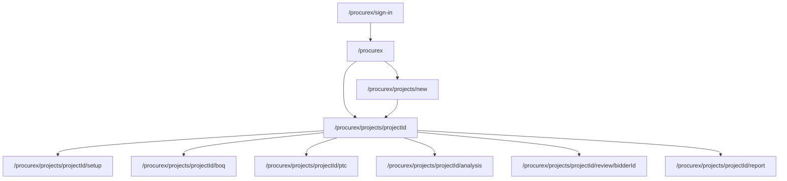
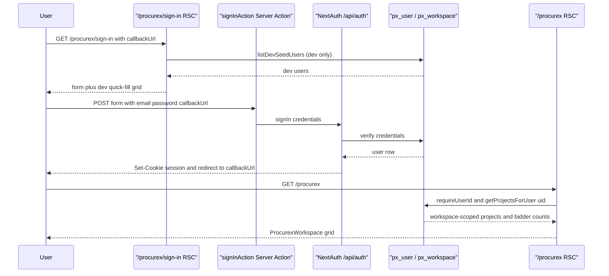

# ProcureX

ProcureX is IOX's tender intelligence module — a **faithful port of the standalone OmniApp** product, dropped into the IOX shell without simplification. Per the project's faithful-port rule, every OmniApp page, route, and persistence concern is replicated verbatim and lives under the `px_*` PostgreSQL namespace plus the `/procurex/*` URL prefix. ProcureX does not share routes, design language, or auth conventions with the rest of IOX more than it must: it keeps its HeroUI Pro chrome, its Poppins font, its NextAuth session, and its own workspace/project hierarchy. The contract between ProcureX and the IOX shell is intentionally thin — the root layout provides `<html>`/`<body>`/Inter, and ProcureX owns everything else inside the route group.

> [!NOTE]
> If you are looking for a TL;DR of where things live, jump to [File map](#file-map). If you want to know *why* the namespace is isolated, read [Why the namespace split](#why-the-namespace-split) and ADR-0003.

---

## Overview

ProcureX is the OmniApp tender workflow ported into IOX. A user signs in at `/procurex/sign-in`, lands on `/procurex` (a workspace-scoped project grid), creates or opens a tender project, walks through a six-step setup wizard, ingests tender documents (FoT, ITT, BoQ template, SoPR, COC, addenda), receives extracted structured data from the Anthropic-powered extraction worker, reviews tenderer submissions, and produces a final officer-facing report.

Everything that powers this lives under three top-level prefixes:

| Layer | Path | What it holds |
|---|---|---|
| Routes & API | `web/app/procurex/` | All `/procurex/*` pages and `/procurex/api/*` route handlers |
| UI components | `web/components/procurex/` | OmniApp-derived React components (HeroUI Pro chrome, Omni shell, tender wizard, workspace grid) |
| Domain modules | `web/modules/procurex/` | Drizzle schemas, server actions, queries for ProcureX-specific concerns |
| Foundation modules | `web/modules/` (no prefix) | Shared OmniApp foundation — `identity/`, `workspace/`, `audit/`, `companies/`, `documents/`, `comments/`, `notifications/`, `workflows/`, `ai-extraction/` |

The foundation modules sit at the top of `web/modules/` (not under `procurex/`) so existing OmniApp imports like `@/modules/identity/schema` work unchanged after the port.

> [!NOTE]
> Per the super admin rule, Arjun (and other IOX-wide super admins) have full access to ProcureX without needing a per-module credential. The NextAuth session resolved at the IOX root flows through `requireUserId()` in every ProcureX page.

---

## Why the namespace split

ProcureX lives in `/procurex/*` and in the `px_*` table namespace because OmniApp's source code uses generic paths (`/projects/`, `/api/files/`, `/api/extraction/`) that collide head-on with IOX-native routes. Three options were considered:

| # | Approach | Verdict |
|---|---|---|
| A | Replace IOX's `/projects/` with OmniApp's | Rejected — IOX `/projects/` is the cross-module project list |
| B | Merge the two `/projects/` pages | Rejected — semantically different objects |
| C | Mount OmniApp under `/procurex` with a one-shot path rewrite | **Accepted** |

The accepted option (ADR-0003) gives:

- **Zero collision** with IOX-native routes
- **Grep-ability** — anything under `procurex/` is OmniApp lineage
- **Clear auth boundary** — `/procurex/*` uses NextAuth; the rest of IOX still uses the mock session shim (ADR-0004)
- **Scoped design language** — HeroUI Pro stays inside ProcureX; the rest of IOX uses its zinc tokens

Trade-offs are real: ~16 source files needed `s|/projects/|/procurex/projects/|` rewrites, the ProcureX layout has to be a *nested* Next.js layout (no `<html>` of its own), and there is a visible chrome discontinuity at module boundaries. See **[ADR-0003 — ProcureX lives in an isolated namespace](../../architecture/decisions/0003-procurex-isolated-namespace.md)** for the full rationale.

> [!NOTE]
> The one exception to the prefix rule is `/api/auth/*` — auth lives at root per ADR-0002. There is **no** `web/app/procurex/api/auth/` folder. NextAuth callbacks resolve at `/api/auth/...` and that's load-bearing for the sign-in flow.

---

## Workspaces + members

ProcureX is workspace-scoped. A user belongs to one or more workspaces; every project belongs to exactly one workspace. The schema is in [`web/modules/workspace/schema.ts`](../../../web/modules/workspace/schema.ts) and exposes two tables.

### `px_workspace`

| Column | Type | Notes |
|---|---|---|
| `id` | `text` (UUID) | Primary key, generated client-side |
| `name` | `text` | Display name |
| `slug` | `text` | URL-safe, **unique** |
| `created_at` | `timestamp` | Defaults to `now()` |
| `created_by_user_id` | `text → px_user.id` | Restrict on delete (don't lose the workspace if the creator is removed) |

### `px_workspace_member`

| Column | Type | Notes |
|---|---|---|
| `workspace_id` | `text → px_workspace.id` | Cascade on delete |
| `user_id` | `text → px_user.id` | Cascade on delete |
| `role` | `workspace_role` enum | `owner` \| `admin` \| `member` \| `viewer` |
| `joined_at` | `timestamp` | Defaults to `now()` |

Composite primary key on `(workspace_id, user_id)`. A secondary index on `user_id` powers the "give me every workspace this user belongs to" query that every ProcureX page hits.

> [!NOTE]
> The roles enum here is **workspace-level** RBAC. Project-level RBAC uses a separate `project_role` enum (`owner` / `qs` / `viewer`) on `px_project_member`. A user can have different roles in different scopes.

The query pattern is straightforward — `getProjectsForUser(userId)` in `modules/procurex/projects/queries.ts` first selects the user's workspace IDs from `px_workspace_member`, then filters `px_project` by `workspaceId IN (...)` with a `deletedAt IS NULL` guard.

---

## Projects

The `px_project` table is the largest in ProcureX. It is the persistence target for everything the FoT / ITT / COC extractors produce, plus everything the six-step wizard captures. The full schema lives in [`web/modules/procurex/projects/schema.ts`](../../../web/modules/procurex/projects/schema.ts).

### Shape (abbreviated)

| Group | Columns |
|---|---|
| Identity | `id`, `workspace_id`, `name`, `status`, `created_by_user_id`, `created_at`, `updated_at`, `deleted_at` |
| Step 1 — Project identity | `currency`, `city`, `country`, `project_type` |
| Step 1 — Contract details | `basis_of_tender`, `conditions_of_contract`, `gfa`, `bua`, `budget_cents` |
| Step 1 — People | `project_lead_user_id`, `procurement_lead_user_id`, `tender_coordinator_user_id` |
| Step 1 — Key dates | `tender_issued_at`, `original_return_at`, `adjusted_return_at` |
| From ITT | `required_validity_days`, `itt_addenda_cutoff_days`, `itt_clarification_cutoff_days`, `vat_treatment`, `engineer_name`, `document_priority_order` (jsonb), `approved_bond_banks` (jsonb), `alternative_tender_allowed`, `rera_trust_account_required`, `language` |
| From COC | `contract_form`, `contract_form_code`, `contract_form_version`, `contract_sum_cents`, `governing_law`, `dispute_forum`, `advance_payment_percent`, `performance_bond_percent`, `retention_percent`, `ld_per_day_cents`, `ld_cap_cents`, `dlp_months`, `decennial_liability_years`, `fixed_price` |
| From SoPR + COC appendices | `insurance_minimums`, `working_hours`, `site_conditions`, `material_standards_required`, `bim_requirements`, `earned_value_config`, `hse_requirements`, `sustainability_config`, `master_community_policy`, `security_requirements`, `reporting_frequency` (all jsonb) |

The `project_status` enum drives where in the wizard / pipeline a project sits:

```
draft → configured → analysing → review → reported → archived
```

The home grid (`/procurex`) routes draft projects to `/procurex/projects/<id>/setup?step=1` and everything else to `/procurex/projects/<id>` — that branch is in `web/app/procurex/page.tsx`.

### Scoping to workspaces

Every project query goes through a workspace filter. `getProjectsForUser` is the canonical pattern — never read `px_project` directly without intersecting with `px_workspace_member`. The setup page (`web/app/procurex/projects/[projectId]/setup/page.tsx`) double-checks: `getMyWorkspaces(userId)` is called and if the project's workspace isn't in the user's set, the request is redirected to `/`.

### `px_project_member`

| Column | Type | Notes |
|---|---|---|
| `project_id` | `text → px_project.id` | Cascade |
| `user_id` | `text → px_user.id` | Cascade |
| `role` | `project_role` enum | `owner` \| `qs` \| `viewer` |
| `joined_at` | `timestamp` | Defaults to `now()` |

Composite PK `(project_id, user_id)`, secondary index on `user_id`.

---

## Routes + UI surfaces

Below is the full list of `/procurex/*` URLs (excluding `/api/*`, which is in the next section).

| URL | File | Purpose |
|---|---|---|
| `/procurex` | `web/app/procurex/page.tsx` | Workspace home — grid of projects for the current user |
| `/procurex/sign-in` | `web/app/procurex/sign-in/page.tsx` | NextAuth credentials sign-in (with dev-mode quick-fill) |
| `/procurex/projects/new` | `web/app/procurex/projects/new/page.tsx` | New-project shell; mounts the 6-step `TenderSetup` wizard |
| `/procurex/projects/[projectId]` | `web/app/procurex/projects/[projectId]/page.tsx` | Tender detail — executive summary, tender returns, bidder cards |
| `/procurex/projects/[projectId]/setup` | `.../setup/page.tsx` | Re-enter the wizard at `?step=1..6` |
| `/procurex/projects/[projectId]/boq` | `.../boq/page.tsx` | BoQ viewer for the project's bill of quantities |
| `/procurex/projects/[projectId]/ptc` | `.../ptc/page.tsx` | Particular Technical Conditions client view |
| `/procurex/projects/[projectId]/analysis` | `.../analysis/page.tsx` | Multi-tab analysis (commercial, technical, risk) |
| `/procurex/projects/[projectId]/review/[bidderId]` | `.../review/[bidderId]/page.tsx` | Per-bidder review — submissions, deviations, compliance |
| `/procurex/projects/[projectId]/report` | `.../report/page.tsx` | Final officer-facing report with appendices A/B/C |

### Wizard internals (`/procurex/projects/new`)

The new-project wizard is composed of six step components colocated under `web/app/procurex/projects/new/`:

| Step | File | What it captures |
|---|---|---|
| 1 | `step1-toc.tsx` | Table of contents / identity scaffold |
| 2 | `step-2-tender-documents.tsx` | Document upload (FoT, ITT, BoQ template, SoPR, COC) |
| 3 | `step-3-tenderer.tsx` | Tenderer invitations |
| 4 | `step-4-configure.tsx` | Configure responsibilities, compliance records, evaluation |
| 5 | `step-5-results-overview.tsx` (+ `step5/*`) | Tender returns, bidder summaries, executive summary |
| 6 | `step-6-reports.tsx` | Generate final report |

### Routing tree



---

## API surface

All ProcureX API handlers live under `web/app/procurex/api/` (the lone exception is NextAuth at `/api/auth/*` per ADR-0002 + ADR-0003).

| Method | URL | File | Purpose |
|---|---|---|---|
| `GET` | `/procurex/api/files/[documentId]` | `api/files/[documentId]/route.ts` | Stream a stored document blob |
| `POST` | `/procurex/api/documents/upload` | `api/documents/upload/route.ts` | Upload to remote blob store |
| `POST` | `/procurex/api/documents/upload-local` | `api/documents/upload-local/route.ts` | Upload to local-disk store (dev) |
| `GET`/`DELETE` | `/procurex/api/documents/[documentId]` | `api/documents/[documentId]/route.ts` | Document metadata; soft delete |
| `GET` | `/procurex/api/templates/tenderer` | `api/templates/tenderer/route.ts` | Tenderer-facing template package |
| `POST` | `/procurex/api/worker/extraction` | `api/worker/extraction/route.ts` | Worker drain — claims pending `px_extraction_job` rows |
| `GET` | `/procurex/api/projects/[projectId]/full` | `api/projects/[projectId]/full/route.ts` | Read-only diagnostic export of the entire project graph |
| `GET` | `/procurex/api/projects/[projectId]/snapshot` | `api/projects/[projectId]/snapshot/route.ts` | Lightweight snapshot for refresh / polling |
| `GET` (SSE) | `/procurex/api/extraction/stream/[documentId]` | `api/extraction/stream/[documentId]/route.ts` | Server-Sent Events for a single document's extraction |
| `GET` (SSE) | `/procurex/api/extraction/stream-project/[projectId]` | `api/extraction/stream-project/[projectId]/route.ts` | Server-Sent Events for *all* documents in a project |

> [!NOTE]
> `GET /procurex/api/projects/[projectId]/full` is **unauthenticated** today (it's a diagnostic). It returns project + members + documents + extraction state + workflow runs + SOPR child tables + tenderer invites + last 200 audit events + a summary roll-up. BigInts are serialised as `"<digits>n"` strings to keep `JSON.stringify` safe. See the file's header docblock for the exact response shape.

The `full` route is the canonical place to look when you want to understand *everything* the system persists about a single project, including extraction token totals, Sonnet 4.6 cost estimates, and ledger / verdict payloads from the extraction agent.

---

## Sign-in flow

The sign-in page (`web/app/procurex/sign-in/page.tsx`) is a server component. It accepts a `callbackUrl` query param (default `/procurex`) and an `error` param (rendered as a banner). It dispatches a server action that calls NextAuth's `signIn("credentials", ...)`.

In non-production environments it also lists dev seed users (`listDevSeedUsers()`) with one-click quick-fill buttons; password is the literal string `dev`.



Two things to note:

1. The callback URL **defaults to `/procurex`**, not to IOX home. Users who authenticate on the ProcureX sign-in page land inside the module they just authenticated to — not the cross-module shell.
2. The dev quick-fill block is rendered server-side and only when `env.NODE_ENV !== "production"`. Production builds receive an empty `devUsers` array and the block is suppressed.

---

## Demo data

`web/scripts/seed-procurex.ts` is the demo seed. It is **idempotent** — a marker row in `px_audit_log` with `action = 'procurex_seed_v1'` gates re-runs.

Prerequisites:

- Arjun (`arjun.mehta@iox.local`) must already exist in `px_user`. The script throws if not — sign in once via `/procurex/sign-in` first to provision the user.
- Arjun must already own a workspace in `px_workspace`. Same gate.

It seeds:

| Entity | Count | Detail |
|---|---|---|
| Companies | 10 | `L&T Construction`, `El Seif Engineering`, `Saudi Binladin Group`, `Salini Impregilo`, `Bouygues Bâtiment`, `Drake & Scull`, `Almabani General Contractors`, `Nesma & Partners`, `Saudi Pan Kingdom`, `China Harbour Engineering` — inserted into `px_company`, scoped to Arjun's workspace |
| Projects | 6 | Varied statuses: 2 × `configured`, 1 × `analysing`, 1 × `review`, 1 × `draft`, 1 × `reported`. Names include `Skyline Tower — Phase 2 Civils`, `Roshn Sedra District 3 — Substructure`, `Diriyah Heritage Villas — MEP Package`, `Trojena Cable Car Station — Tender Re-Bid`, `Red Sea Resort Cluster 4 — Facade`, `KAFD Tower B — Vertical Transportation` |
| Project members | 6 | Arjun added as `owner` of every project |
| Tenderers | 18 | 3 random companies per project; status randomly `pending` / `invited` / `submitted` |
| Documents | 6 | One placeholder `ITT_Package_v1.pdf` per project (`category = 'itt'`, `status = 'uploaded'`) |
| Audit log | 1 | `procurex_seed_v1` marker row sealing the gate |

To re-seed, delete the gate row:

```sql
DELETE FROM px_audit_log WHERE action = 'procurex_seed_v1';
```

…and re-run `pnpm tsx scripts/seed-procurex.ts` from `web/`.

---

## Common edits

| You want to… | Touch |
|---|---|
| Add a column to projects | `web/modules/procurex/projects/schema.ts`, regenerate Drizzle migration, update the wizard step that captures it, update `getOmniTenderDetail` if the new column appears in the detail page |
| Add a new wizard step | Create `web/app/procurex/projects/new/step-N-<name>.tsx`, wire into `tender-setup.tsx`, bump max step in `web/app/procurex/projects/[projectId]/setup/page.tsx` (currently `Math.min(6, ...)`) |
| Add a project sub-route (e.g. `/risk`) | Create `web/app/procurex/projects/[projectId]/risk/page.tsx`, add a card on the detail page, add a row to the [API surface](#api-surface) table if it needs a handler |
| Add a new API handler | Create `web/app/procurex/api/<area>/route.ts` (or with `[param]` segments), import from `@/modules/...` only — do not reach into `web/app/procurex/projects/*` from API handlers |
| Change the home grid card | `web/components/procurex/ProcurexWorkspace.tsx` plus the `ProcurexGridEntry` mapping in `web/app/procurex/page.tsx` |
| Change extraction prompts | Edit `web/modules/ai-extraction/agent/runner.ts` + the per-spec prompt under `docs/prompts/<spec>.md`. See [Anthropic integration](../../integrations/anthropic.md) |
| Add a tenderer column | `web/modules/procurex/tenderers/schema.ts` + actions in the same folder |
| Add a workspace role | `web/modules/workspace/schema.ts` enum + migration |
| Add demo projects | Extend `projectTemplates` in `web/scripts/seed-procurex.ts` and bump the audit-log gate name (e.g. `procurex_seed_v2`) so re-run picks them up |

---

## Gotchas

> [!NOTE]
> **Do not** put `<html>` or `<body>` in `web/app/procurex/layout.tsx`. It is a *nested* layout that lives inside IOX's root `<html>`/`<body>` shell. It only wraps children in a `<div>` and applies the Poppins CSS variable.

- **Scroll ownership.** IOX's root `<body>` is `h-screen overflow-hidden flex-col`. The ProcureX layout wrapper sets its own `overflow-y-auto` and ProcureX pages were designed standalone (they use `min-h-screen` internally), so leave it alone — if you take it away, pages with internal sticky elements stop scrolling.
- **`/api/auth` does not live under `/procurex/api/`.** Even though everything else does. Auth routes live at `web/app/api/auth/*` per ADR-0002. Don't move them.
- **HeroUI Pro chrome stays inside ProcureX.** Don't import HeroUI Pro into IOX-native modules; use the zinc tokens instead. Don't import zinc tokens into ProcureX components; HeroUI Pro owns the chrome here.
- **Path rewrites.** OmniApp source assumed `/projects/...` and `/api/...` paths. After the one-shot sed pass everything should be `/procurex/projects/...` and `/procurex/api/...`. If you bring in *new* OmniApp code, you must redo the rewrite locally.
- **Workspace scope is mandatory.** Every read of `px_project` (and related tables) goes through a workspace membership check. The pattern is in `getProjectsForUser` and the setup page. Bypassing it leaks projects across tenants.
- **BigInts in JSON responses.** Several columns are `bigint` (cents, token counts). The `/full` diagnostic endpoint serialises them as `"<digits>n"` strings. If you add a new API route that returns these, do the same — `JSON.stringify` on a raw BigInt throws.
- **Seed gate is by action name.** `procurex_seed_v1` is the gate. Renaming the gate lets you re-seed without dropping rows. Deleting the gate row is the manual escape hatch.
- **Status drives routing.** The home grid sends `draft` projects to `/setup?step=1`; anything else goes to the detail page. If you add a new pre-configured status (e.g. `intake`), decide explicitly whether it should bounce through setup or land on detail.
- **Dev-only sign-in helpers.** `listDevSeedUsers()` and the password literal `dev` exist *only* in non-production. Don't make production paths depend on them.
- **`/procurex/api/projects/[projectId]/full` is unauthenticated** today. It's a read-only diagnostic. If exposed to non-trusted networks, gate it behind `requireUserId()` + a workspace check.
- **Chunked vs single-shot extraction.** The router at `modules/ai-extraction/agent/runner.ts:184` routes by surface size (700 000 char threshold). Single-shot uses Sonnet 4.6; chunked uses Haiku 4.5. `AI_CHUNKED_MAX_UNITS=30` caps chunks in dev so SoPR runs finish in 1–2 min. See [Anthropic integration](../../integrations/anthropic.md).

---

## File map

```
web/
├── app/
│   ├── api/auth/                                    ← NextAuth (ADR-0002 exception)
│   └── procurex/
│       ├── layout.tsx                               ← Nested layout (Poppins + overflow wrapper)
│       ├── page.tsx                                 ← /procurex home grid
│       ├── sign-in/page.tsx                         ← Credentials sign-in
│       ├── projects/
│       │   ├── new/
│       │   │   ├── page.tsx                         ← Wizard shell
│       │   │   ├── tender-setup.tsx                 ← Step orchestrator
│       │   │   ├── step1-toc.tsx
│       │   │   ├── step-2-tender-documents.tsx
│       │   │   ├── step-3-tenderer.tsx
│       │   │   ├── step-4-configure.tsx
│       │   │   ├── step-5-results-overview.tsx
│       │   │   ├── step-6-reports.tsx
│       │   │   └── step5/*                          ← Results-overview subviews
│       │   └── [projectId]/
│       │       ├── page.tsx                         ← Tender detail
│       │       ├── tender-returns.tsx
│       │       ├── setup/page.tsx                   ← Re-enter wizard at ?step=N
│       │       ├── boq/{page,boq-viewer}.tsx
│       │       ├── ptc/{page,ptc-client}.tsx
│       │       ├── analysis/{page,analysis-tabs}.tsx
│       │       ├── review/[bidderId]/{page,review-tenderer-client}.tsx
│       │       └── report/
│       │           ├── {page,report-client}.tsx
│       │           └── components/                  ← executive summary, appendices A/B/C
│       └── api/
│           ├── files/[documentId]/route.ts
│           ├── templates/tenderer/route.ts
│           ├── documents/{upload,upload-local}/route.ts
│           ├── documents/[documentId]/route.ts
│           ├── worker/extraction/route.ts
│           ├── projects/[projectId]/{full,snapshot}/route.ts
│           └── extraction/
│               ├── stream/[documentId]/route.ts
│               └── stream-project/[projectId]/route.ts
│
├── components/procurex/                             ← OmniApp UI (HeroUI Pro chrome, Omni shell, wizard, grid)
│
├── modules/
│   ├── identity/, workspace/, audit/, companies/,
│   │   documents/, comments/, notifications/,
│   │   workflows/, ai-extraction/                   ← OmniApp foundation modules (no `procurex/` prefix)
│   └── procurex/
│       ├── projects/   ← schema.ts, queries.ts, actions.ts, index.ts (px_project, px_project_member)
│       ├── tenderers/  ← schema, actions, compliance, flags, submissions
│       ├── portal/     ← schema.ts (px_tenderer_invite + portal tables)
│       ├── sopr/       ← schema.ts (project_phases, responsibility_matrix_rows, compliance_record_templates)
│       ├── boq/        ← parser, events, actions, entity-matcher
│       ├── ptc/, specifications/, config/, configurations/
│       ├── addenda/    ← detector, diffs, zip-walker, cover-parser, attachment-a
│       ├── revisions/  ← schema + index
│       ├── review/     ← bidder-review-data, overview-data, sections, types
│       └── report/     ← report-data, appendix-c-data, sum-breakdown, rate-comparisons, project-snapshot
│
└── scripts/
    └── seed-procurex.ts                             ← Idempotent demo seed
```

---

## Sibling docs

- **[ADR-0003 — ProcureX lives in an isolated namespace](../../architecture/decisions/0003-procurex-isolated-namespace.md)** — the rationale for the `/procurex` prefix and the `px_*` table namespace.
- **[Anthropic integration](../../integrations/anthropic.md)** — single-shot vs chunked extraction, model defaults, failure / retry policy, cost telemetry.
- **Documents and AI (planned sibling, `docs/modules/procurex/documents-and-ai.md`)** — deep dive on the `documents/` and `ai-extraction/` foundation modules, the extraction worker, the SSE stream endpoints, and verdict / ledger / token persistence.
- **Identity, RBAC, and audit (planned sibling, `docs/modules/procurex/identity-rbac-audit.md`)** — NextAuth wiring, the `px_user` + `px_workspace_member` + `px_project_member` role matrix, and the `px_audit_log` event taxonomy.
- **Operational modules (planned sibling, `docs/modules/procurex/operational-modules.md`)** — addenda, revisions, SOPR, PTC, BoQ, and how the wizard's step 2 documents are turned into structured project state.
