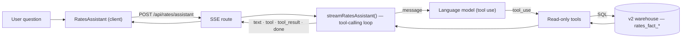

# RatesX AI Assistant

The RatesX AI Assistant is a plain-English question-answering layer over the [RatesX](./ratesx.md) warehouse. A user asks something like *"what's the benchmarked rate per m² for reinforced concrete in the UAE?"* and a tool-calling agent runs **live SQL against the warehouse**, then composes a grounded answer — the median, the inter-quartile range, the sample size, the currency, and a one-line caveat. The defining principle is that **the language model never recalls or estimates a rate from its own training**: every number on screen comes from a tool result, and when the library has no data the assistant says so rather than inventing one. It is the conversational front door to the same star schema the elemental and library surfaces read from, and it answers *any* question dynamically — there are no canned responses.

## Overview

The assistant lives at `/rates/assistant` (wired to the "AI Assistant" card on the RatesX home). The request path is a four-part loop:

1. **UI** (`components/rates-home/RatesAssistant.tsx`) posts the question + recent history to the API and opens a stream.
2. **API** (`app/api/rates/assistant/route.ts`) runs the agent and streams Server-Sent Events back.
3. **Agent** (`modules/rates/lib/ai/agent.ts`) drives a tool-calling loop with the shared model client; on each turn it streams text, decides which tool to call, executes it, and continues until it has an answer.
4. **Tools** (`modules/rates/lib/ai/tools.ts`) are read-only query functions over the v2 facts — they are the only way the agent touches data.

> [!IMPORTANT]
> Tools query, the model composes. The agent is forbidden (by system prompt and by construction) from producing a rate that didn't come from a tool. A tool that returns `rows: 0` is surfaced as an explicit "no matching data" so the model can tell the user the library has none — it must not fall back to general knowledge. This is the same deterministic-first discipline the rest of RatesX follows.

## Architecture



The agent reuses the shared model client (`modules/ai-extraction/client.ts`, also used by ProcureX extraction) — the model id comes from `AI_DEFAULT_MODEL`, and `isAiConfigured()` gates the route on the model API key being present (returns `503` otherwise).

## The tools

Five read-only tools, all parameterised SQL over the v2 star schema. Each returns compact JSON (medians, quartiles, sample size, currency) and never free text.

| Tool | What it does | Source |
|---|---|---|
| `list_dimensions` | Lists what the library actually contains — NRM L1 elements, asset classes/types, countries, currencies, year range. Called first when a filter value is uncertain, so the model never invents one. | dims |
| `benchmark_rate` | Cost per m² (BUA/GIA/GFA) for one or more NRM L1 elements and/or an asset class, country, currency. Returns overall median/q1/q3/min/max + a per-element breakdown + sample size. | `rates_fact_project_benchmark` |
| `market_rate` | Current per-unit rate for a material/work item (full-text match on the description), grouped **per unit** (rates only compare within a unit) with sample lines. | `rates_fact_rate_item` |
| `elemental_breakdown` | Per-element cost-per-m² composition for a cohort (filter by asset class / country / currency). | `rates_fact_project_benchmark` |
| `escalation` | Construction-cost inflation index factor between two years. | `modules/rates/lib/inflation.ts` |

### Honest "no data" + coverage hinting

When `benchmark_rate` finds nothing for the requested currency, it doesn't just return empty — it runs a second query **ignoring currency** and returns a `currencyAvailability` breakdown, e.g. *"Roads: 11 projects with no currency assigned, 1 in AED."* This lets the agent answer in one shot ("the Roads benchmarks exist but those projects have no currency, so I can't price them in AED") instead of blindly retrying every area basis. The accompanying `note` tells the model not to retry and not to estimate.

## The agent loop

`agent.ts` exposes two entry points over the same loop:

- `runRatesAssistant(question, history)` — non-streaming, returns `{ answer, toolCalls }`.
- `streamRatesAssistant(question, history)` — an async generator yielding `AssistantEvent`s for the SSE route.

Each turn calls the model with the tool definitions; if the stop reason is `tool_use`, every tool block is executed, the results are appended as `tool_result` messages, and the loop continues — up to `MAX_ITERATIONS` (8). The system prompt encodes the behaviour:

- **Grounded** — call a tool for every number; never recall or estimate from training.
- **Conversational** — say one short natural line about what's being looked up, *then* run the query, then give the answer (lead with the figure, then the q1–q3 range and sample size, then a caveat).
- **Honest** — on `rows: 0`, state the library has none; don't retry blindly.
- **Domain-aware** — map vague terms to elements: *MEP* → Mechanical / Electrical / Chilled Water / District Cooling; *wet utilities* → Potable Water / Sewerage / Stormwater / Irrigation; *dry utilities* → Electrical / Telecom / Substation / Gas / Streetlighting; *soft landscaping* → Public Realm / Streetscape; *façade* → Building External Envelope; *reinforced concrete* → Substructure + Superstructure.
- **Aware of gaps** — when a split isn't captured (RTA-vs-private, curtain-wall-vs-cladding, green-cert premium, precast-vs-in-situ, city-level), confirm via `list_dimensions` and say so rather than fabricate.

## Streaming + UI

The route streams SSE `data:` lines carrying one of: `text` (a token delta), `tool` (a query started), `tool_result` (its result), `done`, or `error`. The client reads the stream and renders live:

- **ChatGPT-style layout** — empty state is a centered greeting + composer + example chips; once a message is sent the conversation fills a centered column and the composer pins to the bottom.
- **Assistant messages are plain flowing markdown** (no boxes), rendered with `react-markdown` + `remark-gfm` and block-level memoization (finished blocks don't re-parse on every token), so element/material breakdowns come out as real tables.
- **Chain-of-thought** — a collapsible under each answer showing each query's tool, filters, and outcome ("median 701 AED/m² · 88 samples" or "no matching data"); it reads "Thinking…" (shimmer) while streaming, then "Thought for N seconds · M queries".
- **Message actions** — copy, 👍/👎, and regenerate.
- **Status-driven composer** — `ready → submitted → streaming`; the send button becomes a stop button mid-generation and aborts the stream.

> [!NOTE]
> The composer, chain-of-thought, markdown, message and shimmer components mirror the HeroUI Pro chat blocks (`PromptInput`, `ChainOfThought`, `Markdown`, `ChatMessage`, `TextShimmer`). Those are not in the installed `@heroui-pro/react@1.0.0-beta.4` (they're licensed copy-in blocks, not npm exports), so they're implemented here to the same shape — drop-in swappable if the Pro blocks are added.

## Data coverage

The assistant is only as good as the warehouse. Honest current coverage:

| Works well | Partial / weak | Not captured |
|---|---|---|
| Building elements per m² (reinforced concrete, MEP, façade, internal walls, FF&E, external works); material unit rates (concrete, asphalt, stone, waterproofing, granular fill, blockwork); elemental breakdowns; escalation factor | Dubai vs Abu Dhabi (very few projects); material time-series (the price table is unpopulated); villa standard-vs-luxury | RTA-vs-private roads, curtain-wall-vs-cladding, green-certification premium %, precast-vs-in-situ, acceleration cost impact % — no such dimension |

Notably, **infrastructure benchmarks return little in AED**: the infra elements live on projects with no currency assigned, so the currency axis excludes them — the assistant explains this (via `currencyAvailability`) rather than dead-ending. Building-side benchmarks and material rates return live numbers.

## Common edits

### "I want to add a new capability (skill)"

Add a tool: append a definition to `TOOL_DEFS` and a branch to `executeTool` in `tools.ts`, backed by parameterised SQL over the v2 facts. The model picks it up automatically. Likely next tools: `compare_regions`, `material_trend`, `design_ratio`, `project_lookup`.

### "I want to change how it talks"

Edit the `SYSTEM` prompt in `agent.ts` — tone, term mappings, and the honesty rules all live there.

### "I want a different model"

Set `AI_DEFAULT_MODEL`. The client is shared with the extraction engine; no code change.

## Gotchas

- **Grounded only** — if a question needs a number, it must come from a tool; the prompt forbids training-recall and estimation. Keep new tools returning structured JSON, never prose.
- **Currency defaults to AED** — most benchmark data is AED; other currencies (and no-currency projects) are surfaced honestly, not mixed.
- **No embeddings** — material matching is full-text/ILIKE over `description`/`description_tsv`, not vector similarity.
- **Out-of-band data** — the assistant reads the v2 facts; if a new upload hasn't been backfilled/classified (see [RatesX](./ratesx.md)), the assistant won't see it.
- **`maxDuration = 60s`** on the route; the loop is capped at 8 iterations to stay within it.

## File map

```text
web/
├── app/
│   └── rates/assistant/page.tsx              # the page
├── app/api/rates/assistant/route.ts          # SSE streaming endpoint
├── modules/rates/lib/ai/
│   ├── tools.ts                              # 5 read-only warehouse query tools
│   └── agent.ts                              # tool-calling loop (stream + non-stream) + system prompt
├── components/rates-home/
│   └── RatesAssistant.tsx                     # ChatGPT-style chat UI (composer, chain-of-thought, markdown, actions)
└── modules/ai-extraction/client.ts            # shared model client (AI_DEFAULT_MODEL)
```
