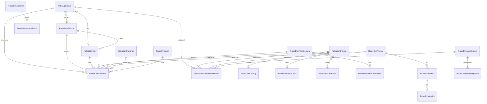
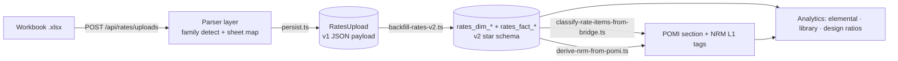
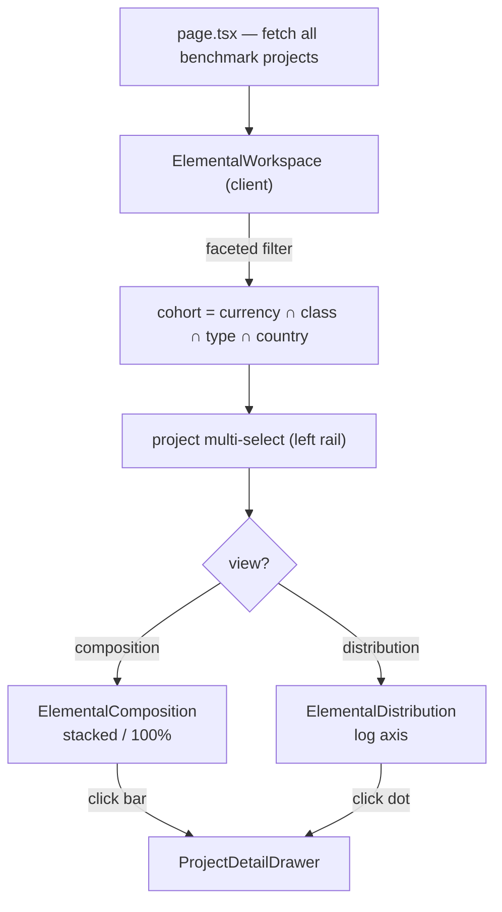

# RatesX

RatesX is IOX's construction-rates intelligence module — a quantity-surveying reference warehouse that ingests vendor and in-house rate workbooks (Buildings, Materials, Commodities, Piling, Ground Investigation, Marine, Infrastructure), normalises every priced line into a star schema, classifies it against the POMI → NRM → CESMM/CSI taxonomy, and surfaces the result as searchable rate tables, elemental cost benchmarks, design-ratio analytics, and material-price timelines. It is the pricing brain that [CostX](./costx.md) leans on when it needs a defensible per-m² rate, and the comparator a cost consultant reaches for when asked *"is this rate reasonable for this asset, this country, this year?"*. RatesX is the IOX-shell port of the standalone Omnium estimator: per the [faithful-port rule](../../web/AGENTS.md) the source spreadsheets and their per-tab column schemas are preserved verbatim, and the warehouse is built *around* them — never by discarding the original shape. What changed in the port is the chrome (zinc tokens, the IOX `Header`, the unified `/rates/*` prefix) and the addition of a normalized analytics layer on top of the raw uploads.

## Overview

RatesX carries **two storage generations** at once, and understanding the seam between them is the single most important thing about the module.

- **v1 — the upload record.** `RatesUpload` is one Postgres row per uploaded workbook, plus a JSON payload of the parsed rows shaped exactly like the source tab (Buildings::Rates has 21 columns, Materials has its own, Piling its own, etc.). The schema-per-tab contract lives in `web/modules/rates/lib/schemas.ts`. This is what the **upload UI** (`/api/rates/uploads`) writes today, and it is deliberately loose — it tracks *what was uploaded* without forcing it into a fixed model.
- **v2 — the normalized warehouse.** A 30-table star schema (24 dimensions + 1 lineage table + 5 facts, plus a junction side-table) defined in `web/prisma/schema.prisma` and materialised by the hand-authored SQL at `web/prisma/migrations/manual/rates_v2/migration.sql`. A family of `v_rates_*` views flattens the joins for read paths. This is what every **analytics surface** reads.

The end-to-end flow:

1. A user drops one or more rate workbooks on the upload surface. The request hits `app/api/rates/uploads/route.ts`.
2. The **parser layer** (`web/modules/rates/lib/parsers/*` + `upload-mapper.ts`) detects the workbook *family* from its sheet names and column headers, and maps each sheet to a typed schema from `schemas.ts`.
3. `persist.ts` writes the parsed payload to the v1 `RatesUpload` row.
4. Out of band, `scripts/backfill-rates-v2.ts` **explodes** the v1 rows into the v2 dimensions and facts — interning each distinct country, currency, asset class, project, etc. into its `rates_dim_*` row and emitting one `rates_fact_rate_item` (or `rates_fact_project_benchmark`) per priced line.
5. `scripts/classify-rate-items-from-bridge.ts` **tags** every `rates_fact_rate_item` with a POMI section and an NRM Level 1 by scoring its description against the authoritative `pomi_to_nrm_corrected.json` bridge (604 entries, RICS NRM2).
6. The analytics pages (`/rates`, `/rates/library`, `/rates/elemental-by-project`) read the v2 facts directly through the typed query API in `modules/rates/lib/db/queries.ts`.

> [!IMPORTANT]
> The upload UI writes **v1**; the analytics pages read **v2**; the two are joined by the backfill + classify scripts, which run **out-of-band, not on the upload request path**. A freshly uploaded workbook therefore does **not** appear in the elemental/library analytics until the v2 pipeline has been run against it. This is by design — ingestion is decoupled from the (slower, idempotent, re-runnable) normalisation so a bad upload never corrupts the warehouse mid-request. See [The two-generation pipeline](#the-two-generation-pipeline).

## Source workbook families

The warehouse is seeded from a library of Omnium rate and benchmark workbooks under `web/modules/rates/data/<family>/`. Each family has its own per-tab column shape, which the parser layer detects and maps; the benchmark workbooks feed `RatesFactProjectBenchmark`, the rate workbooks feed `RatesFactRateItem`, and the materials/commodities feed `RatesFactMaterialPrice`.

| Family | Workbooks | Feeds |
|---|---|---|
| Buildings | Buildings Rates Database, Building Benchmarks Database, Building MEP Benchmarks Database | Rate items + elemental + MEP benchmarks |
| Infrastructure | Infrastructure Rate & Benchmark Database, Infrastructure Benchmark | Rate items + infra benchmarks |
| Landscaping / Public Realm | Public Realm Rates, Public Realm Benchmark | Rate items + benchmarks |
| Bridges | Bridges Benchmarks, Bridges & MSE Wall Benchmarks | Benchmarks |
| Industrial | Industrial Benchmarks | Benchmarks |
| Piling | Piling Rates Database, Piling Framework Rates Database | Rate items |
| Ground Investigation | Ground Investigation Rates Database | Rate items |
| Marine | Marine Rates Database | Rate items |
| Materials | Materials Database, Commodities Database | Material prices |

Files are date-stamped (e.g. `Buildings Rates Database - 2025.05.05.xlsx`); the most recent of each family is the live source, older ones are kept for lineage. The benchmark families are the ones exercised end-to-end today (Buildings + Infrastructure dominate the seeded `RatesFactProjectBenchmark` rows); Materials parses to v1 but is not yet backfilled.

## Data model

The v2 warehouse is a textbook star schema. Five fact tables (`rates_fact_*`) carry the measures; 24 dimension tables (`rates_dim_*`) carry the descriptors; `RatesUploadV2` is the lineage spine that ties every fact row back to the file and person that produced it. The richest fact, `RatesFactRateItem`, fans out to **12 foreign keys** — which is exactly why the data lends itself to graph/relationship views as much as to tabular ones.



### The lineage spine — `RatesUploadV2`

One row per ingested workbook. Every fact row carries its `uploadId` as a cascade-delete foreign key, so deleting an upload cleanly removes everything it produced, and any single number on any screen traces back to a file, a section/tab, and an uploader. This is what makes the warehouse audit- and GDPR-ready: provenance is structural, not bolted on. Columns of note: `sectionId`/`tabId` (which source surface the rows came from), `filename`, `rowCount`, and timestamps.

### `RatesFactRateItem` — the priced line (~15,500 rows)

The heart of the warehouse: one row per priced line item across every uploaded workbook. Its 12 foreign keys are `uploadId`, `sectionId`, `tabId`, `projectId`, `pomiSectionId`, `pomiSubId`, `nrmL1Id`, `nrmL2Id`, `nrmL3Id`, `cesmmRefId`, `unitId`, `currencyId`. The measures and flags are:

| Column | Meaning |
|---|---|
| `description` | Free-text line description (also feeds the `description_tsv` full-text column) |
| `quantity`, `rate`, `amount` | The priced figures (`Decimal(18,4)` / `(20,4)`) |
| `baseDate` | The price's reference date, used for inflation indexing |
| `inflationRate` | Per-row uplift captured at ingest, if any |
| `isOutlier` | Boolean flag for downstream outlier handling |
| `confidence` | Smallint classification confidence (0–100) |
| `classificationStage` | `rule \| fuzzy \| ai \| manual` — *how* the row got its NRM/POMI tags |

Eight indexes back the common filters (`projectId`, `pomiSectionId`, `nrmL1Id`, `nrmL2Id`, `unitId`, `currencyId`, `baseDate`, `uploadId`). Rate items reference **only the clean numeric NRM L1 codes** (`1`–`9`); they never point at the benchmark-only string-coded NRM rows (a property the [data-quality fix](#data-quality-notes) relies on).

### `RatesFactProjectBenchmark` — elemental cost per project (~1,500 rows)

One row per `(project, NRM L1 element)`. Carries `cost_per_bua`, `cost_per_gia`, `cost_per_gfa` (the three area bases a QS works in), `totalCost`, the project's `bua/gia/gfa` areas and `keys` (hotel keys), an optional MEP `system`/`subsystem`, and a `currencyId`. This is the table the [Elemental-by-Project](#elemental-by-project) view is built on. A project can legitimately carry **more than one row for the same element** (different blocks/phases, or a `0` placeholder plus a real value); the analytics layer collapses those to the mean of the non-zero rows so a per-m² rate is never double-counted.

### `RatesFactDesignRatio` (+ `RatesFactDesignRatioAssetType`)

Design parameter ratios — façade-area/GFA, parking-bays/m², MEP-load densities, and similar — keyed to NRM and CSI codes with a UoM and currency. The `RatesFactDesignRatioAssetType` side-table is a many-to-many junction letting one ratio apply to several asset types. Loaded by `scripts` via `modules/rates/lib/db/load-design-ratios.ts`. ~250 rows seeded.

### `RatesFactMaterialPrice`

Commodity/material price points over time: `(material, currency, uom, country, date, price)`. Designed to power a material-price timeline (`fetchMaterialPriceTimeline`). **Currently empty** — the Materials/Commodities workbooks parse and persist to v1 but have not been backfilled into this fact yet.

### Dimension tables (24)

| Group | Tables | Notes |
|---|---|---|
| Source structure | `RatesDimSection`, `RatesDimTab` | Mirror the workbook → sheet hierarchy the uploads came from |
| Geography | `RatesDimCountry`, `RatesDimCity` | `City` nullable-FKs to `Country` (`SetNull`) |
| Commercial | `RatesDimCurrency` (`iso4217`), `RatesDimUom`, `RatesDimContractType`, `RatesDimStatus` | Currency is the hard axis on elemental analytics |
| Asset taxonomy | `RatesDimAssetClass`, `RatesDimAssetType`, `RatesDimAssetForm` | Three-level asset hierarchy |
| Parties | `RatesDimEmployer`, `RatesDimContractor` | Enable contractor/employer footprint views |
| Project | `RatesDimProject` | The hub — 10+ nullable dimension FKs, `@@unique([name, baseDate])` |
| Classification | `RatesDimPomiSection` (`Char(1)`), `RatesDimPomiSubSection`, `RatesDimNrmL1/2/3`, `RatesDimCesmmRef`, `RatesDimCsiCode` | The POMI/NRM/CESMM/CSI crosswalk backbone |
| Materials / MEP | `RatesDimMaterial`, `RatesDimMepSystem`, `RatesDimMepSubsystem` | MEP hierarchy feeds benchmark MEP breakdowns |

`RatesDimProject` is the dimensional hub: `country`, `city`, `assetClass`, `assetType`, `assetForm`, `employer`, `contractor`, `contractType`, `status`, `currency` all hang off it as nullable FKs, alongside `baseDate`, `buaM2/giaM2/gfaM2`, `keys`, and `procurement`. Two composite indexes (`[assetClassId, assetTypeId, baseDate]`, `[countryId, baseDate]`) back the comparable-project lookups.

> [!NOTE]
> `RatesUpload` (v1) and `RatesMarketTestQuery` sit outside the v2 star schema. The former is the legacy single-row upload record; the latter logs ad-hoc "market test" rate queries a user runs against the library, one row per query, for later audit.

## The two-generation pipeline



| Stage | Code | What it does |
|---|---|---|
| Upload | `app/api/rates/uploads/route.ts` | Accepts the workbook(s), invokes the parser, writes the v1 `RatesUpload` row(s) |
| Parse | `modules/rates/lib/parsers/{index,types,buildings-benchmarks}.ts`, `upload-mapper.ts` | Detects the workbook family, maps each sheet to a typed schema |
| Persist | `modules/rates/lib/persist.ts` | Writes the parsed payload to v1 |
| Backfill | `scripts/backfill-rates-v2.ts` | Idempotently explodes v1 rows into v2 dims + facts (interns dimensions, emits facts) |
| Classify | `scripts/classify-rate-items-from-bridge.ts` | Bridge-driven POMI + NRM L1 tagging (`--dry`, `--reset`, `--threshold`) |
| Derive | `scripts/derive-nrm-from-pomi.ts` | Fills NRM levels from POMI coding where the mapping is unambiguous |
| Read | `modules/rates/lib/db/queries.ts` | Typed read API over the v2 facts for every analytics surface |

The dimension loaders that the backfill uses live in `modules/rates/lib/db/`: `dimensions.ts` (the `findOrCreate*` interning helpers — `findOrCreateNrmL1`, `findOrCreateCountry`, etc.), `load-rates.ts`, `load-benchmarks.ts`, `load-design-ratios.ts`, `load-materials.ts`, and `load-dispatch.ts` (the family router that picks the right loader per workbook).

## Classification — POMI → NRM

The authoritative crosswalk is `pomi_to_nrm_corrected.json` at the **repo root** (416 KB, `schema_version` + `source` + `authority` + `entries`). It holds **604 entries**, each derived from the RICS NRM2 sheet of the source workbook:

```json
{
  "pomi_section": "A",
  "pomi_code": "A000000",
  "pomi_clause_prefix": "A",
  "description": "SECTION A - GENERAL REQUIREMENTS",
  "measurement": "Item",
  "nrm_default": { "code": "9.01", "description": "Preliminaries / General Requirements" }
}
```

`classify-rate-items-from-bridge.ts` walks every `rates_fact_rate_item`, lower-cases and tokenises its description (`/[a-z][a-z0-9]+/g`, minus a stop-word list), and scores it against every bridge clause description with a TF-IDF "cosine-ish" similarity. The best match above the `--threshold` (default `0.08`) wins; the item is tagged with that entry's POMI section and the NRM L1 implied by `nrm_default.code` (via the `NRM_L1_LABEL` map `0`=Unclassified … `9`=Facilitating works). Items that never clear the threshold keep `nrm_l1_id = NULL` — the *unbridged backlog* the analytics surface flags. Flags: `--dry` (report only), `--reset` (clear existing tags first), `--threshold <n>`.

> [!IMPORTANT]
> Classification is **full-text + TF-IDF**, not vector embeddings. The v2 schema has a Postgres `description_tsv` (`TSVECTOR GENERATED ALWAYS AS … STORED`) column for full-text search, but there is **no pgvector / embedding column**. Any "semantic similarity / nearest-rate" feature is aspirational, not built — do not document it as present.

## Inflation engine

`modules/rates/lib/inflation.ts` is a small, pure module:

```typescript
INFLATION_BY_YEAR: Record<number, number>   // year → cumulative rate
INFLATION_REFERENCE_YEARS: number[]          // sorted keys of the map
inflateFactor(baseYear, refYear): number     // multiplier between two years
```

Every per-area figure in the analytics layer can be re-based from a project's `baseYear` to a chosen `refYear` by multiplying by `inflateFactor(baseYear, refYear)`. The Elemental-by-Project view surfaces this as a **Raw ↔ Adjusted** toggle plus a reference-year chip strip (years ≥ 2018). When "Adjusted" is on, the hero/subtitle annotate the chosen reference year and the cumulative uplift, e.g. *"adjusted to 2026 (+2.0%)"*.

## Elemental-by-Project

A full-page workspace — `app/rates/elemental-by-project/page.tsx` (server) → `components/rates-home/ElementalWorkspace.tsx` (client shell) → the two chart components under `modules/rates/charts/`. It answers the QS's core question: *"where does this project's elemental cost sit versus comparable projects, and is the mix sensible?"*

### Architecture

The page fetches the **full benchmark set once** (`fetchElementalByProject()` with no filters) and the workspace filters everything **client-side**. This is deliberate: the set is small (~180 projects), so client-side faceting gives instant filter response and — crucially — lets every filter option show a **live count** with empty options hidden, instead of silently producing a blank chart.



### Composition view

`ElementalComposition.tsx` — one vertical stacked bar per project, segments = NRM L1 elements, value = cost per m² for the chosen basis (BUA / GIA / GFA), optionally inflation-adjusted. Features:

- **Absolute ↔ 100% toggle.** 100% pre-computes each element as a share of the project total (`row[`${el}__pct`]`), so bars are equal height and you compare *mix* regardless of project size — the right tool when project totals span orders of magnitude.
- **Clickable legend.** Click a chip to isolate that element across all bars; ⌥-click to hide it (`hidden` set drives recharts `Bar hide`).
- **Click a bar → `ProjectDetailDrawer`** with the project's full elemental table (value, % of total, basis, metadata).
- A bottom **brush** when there are >40 projects, and the X axis truncates long names.

### Distribution view

`ElementalDistribution.tsx` — one row per NRM element on a **shared logarithmic x-axis**. This is the only honest way to show the data: building elements run in the hundreds/m², infra elements in the tens, and the residual "Unclassified" bucket in the thousands — three orders of magnitude. Each row draws a min–max whisker, an IQR band, every project as a dot (deterministic vertical jitter to de-overlap), and a ringed median marker; the absolute median sits in a right-hand value column. Decade gridlines (`10 · 100 · 1k · 10k`) anchor the eye. Whisker/IQR/median only render when a row has real spread (`n > 1`); single-point rows show just their dot.

### Currency as a hard axis + faceting

Only **one currency is plotted at a time** (AED default). Projects in another or no currency are surfaced as an explicit *"N in other/no currency"* excluded count rather than silently mixed onto one axis. `buildOptions(dim, …)` computes, for each filter dimension, the count of projects that match the *other* active filters, hides zero-count options, and disables the active-but-now-empty one — so the user can only land on combinations that actually plot.

### Shared helpers

`elemental-data.ts` holds the transforms used by both charts: `pickValue` (basis selector), `projectFactor` (inflation), `projectElementValues` (the duplicate-row mean collapse), `quartiles`, and number formatters. `elemental-palette.ts` assigns a stable colour and display rank to each known element (buildings cohort first, infra second, Unclassified last) with a deterministic hashed fallback for anything unenumerated.

## Routes + UI surfaces

| URL | File | Renders |
|---|---|---|
| `/rates` | `app/rates/page.tsx` → `modules/rates/RatesWorkspace.tsx` | RatesX home — module cards, KPIs, and the rate-table workspace |
| `/rates/library` | `app/rates/library/page.tsx` | Searchable rate library over the v2 facts |
| `/rates/elemental-by-project` | `app/rates/elemental-by-project/page.tsx` | Composition + distribution elemental analytics |
| `POST /api/rates/uploads` | `app/api/rates/uploads/route.ts` | Workbook upload + parse (writes v1) |

## Query API reference

Every analytics surface reads through the typed functions in `modules/rates/lib/db/queries.ts`. They select straight off the `rates_fact_*` tables (or a `v_rates_*` view) and return plain serializable shapes — no ORM entities cross the server/client boundary.

| Function | Returns | Powers |
|---|---|---|
| `fetchHomeMetrics()` | `RatesHomeMetrics` (`sections, tabs, projects, rateItems, benchmarks, materialPrices, designRatios, uploads, latestUploadAt`) | The `/rates` home KPI tiles |
| `fetchPomiCountryHeatmap(opts?)` | `PomiCountryCell[]` | POMI / CESMM / NRM × country heatmap (`ClassificationMode = "pomi" \| "cesmm" \| "nrm"`) |
| `fetchNrmCostShareOverall(opts?)` | `NrmSliceRow[]` | Overall NRM cost-share donut/treemap |
| `fetchNrmStackByProject(opts?)` | `ProjectNrmBar[]` | NRM stack per project |
| `fetchMaterialPriceTimeline(opts?)` | `MaterialTimelineRow[]` | Material price-over-time line (no data until `RatesFactMaterialPrice` is backfilled) |
| `fetchElementalByProject(opts?)` | `ElementalProject[]` (each with a `stack: ElementalSlice[]`) | The Elemental-by-Project workspace |
| `fetchElementalFilters()` | `{ assetClasses, assetTypes, countries }` | Legacy filter option lists (the elemental workspace now derives facets client-side) |
| `fetchRateDistribution(opts?)` | `RateDistributionRow[]` | Rate distribution per POMI / CESMM / NRM code |
| `fetchMaterialCatalogue()` | material catalogue rows | Material library browse |

`ElementalProject` carries `projectId`, `project`, `country`, `assetClass`, `assetType`, `baseDate`, `baseYear`, `currency`, `bua/gia/gfa`, and a `stack` of `ElementalSlice` (`nrmCode`, `nrmLabel`, `costPerBua/Gia/Gfa`, `totalCost`). `fetchElementalByProject` joins `RatesFactProjectBenchmark → project → {country, assetClass, assetType, currency}` and `→ nrmL1`, then groups rows into one `ElementalProject` per project with its element stack sorted by NRM code.

## Scripts

| Script / SQL | Purpose |
|---|---|
| `scripts/backfill-rates-v2.ts` | v1 → v2 explode (idempotent; interns dims, emits facts) |
| `scripts/classify-rate-items-from-bridge.ts` | Bridge-driven POMI/NRM classification (`--dry`, `--reset`, `--threshold`) |
| `scripts/derive-nrm-from-pomi.ts` | Derive NRM levels from POMI coding |
| `prisma/migrations/manual/rates_v2/migration.sql` | Creates the v2 schema + `v_rates_*` views (manual migration, applied by the deploy pipeline) |
| `prisma/migrations/manual/rates_v2/fix_nrm_l1_labels.sql` | Non-destructive repair of shredded NRM L1 element names on benchmarks |

## Common edits

### "I want to add a new rate workbook family"

Add a parser under `modules/rates/lib/parsers/` that detects the family from its sheet names + headers and maps each sheet to a typed schema in `schemas.ts`. Register it in `parsers/index.ts` and, for the backfill, add a loader in `modules/rates/lib/db/` and wire it into `load-dispatch.ts`. The upload route picks the parser automatically; the backfill picks the loader by family.

### "I want to re-classify everything against an updated bridge"

Edit `pomi_to_nrm_corrected.json` at the repo root, then run `npx tsx scripts/classify-rate-items-from-bridge.ts --reset` (optionally `--dry` first, and tune `--threshold`). Lower the threshold to catch more items at the cost of precision.

### "I want a new element colour or display order in the charts"

Edit the `BUILDINGS` / `INFRASTRUCTURE` arrays in `modules/rates/charts/elemental-palette.ts` — array index becomes the display rank, the second tuple element is the hex. Unenumerated labels fall back to a hashed colour and sort after the known set.

### "I want to add a filter to the elemental view"

Add the dimension to `ElementalParams`, thread it through `buildHref`, add a `buildOptions(dim, …)` facet, and extend the `cohort`/`passDim` predicate in `ElementalWorkspace.tsx`. Because filtering is client-side, no query change is needed.

### "I want a new analytics surface over the warehouse"

Add a typed read function to `modules/rates/lib/db/queries.ts` (select straight off the `rates_fact_*` tables or a `v_rates_*` view), then a page under `app/rates/`. Keep the analytics read-only — writes go through the upload + backfill pipeline.

## Data-quality notes

The seeded benchmark data is heavily concentrated and carries several known gaps. The analytics surfaces handle them defensively (counts, exclusions, log axes) rather than hide them:

| Issue | Detail | Handling |
|---|---|---|
| **NRM L1 taxonomy pollution** | The benchmark loader's `splitCodeLabel` treated bare whitespace as a code delimiter, shredding `"Internal Walls and Doors"` → code `"Internal"` / label `"Walls and Doors"`; three taxonomies (NRM2, CSI MasterFormat, free-text MEP/infra) were also merged into `rates_dim_nrm_l1`. | Fixed: regex hardened to split only on explicit delimiters (`— – - :`); `fix_nrm_l1_labels.sql` reconstructs the real labels non-destructively (rate items are untouched — they use only the clean numeric codes). |
| **Null currency** | ~18 benchmark projects (including all Residential) have no currency, so they cannot sit on a currency axis. | Surfaced as an explicit *"N in other/no currency"* excluded count; their filter options are hidden. |
| **Country split** | `"UAE"` (160) and `"United Arab Emirates"` (12) exist as separate dimension rows. | Both shown with live facet counts; a merge is a pending data task. |
| **Asset type unpopulated** | 167 of ~180 benchmark projects have a null `asset_type`; the few non-null values are place names (`"Jebel Ali"`, `"Yas Island"`), not types. | The Type filter shows counts and hides empty options until real types are populated. |
| **Skewed totals** | Project totals span ~1k → ~174k per m² (a few tiny-area pavilions). | Distribution uses a log axis; composition offers a 100% (mix) view + brush zoom. |
| **Unbridged items** | A minority of rate items never clear the classifier threshold (`nrm_l1_id = NULL`). | Counted as the unbridged backlog; re-runnable via the classify script. |

## Gotchas

- **Upload writes v1, analytics read v2.** New uploads do not appear in elemental/library until `backfill-rates-v2.ts` + `classify-rate-items-from-bridge.ts` have run. There is no automatic trigger on the request path.
- **`classificationStage` is `NULL` on every rate item today** even though ~99% are NRM-classified — the column exists but the provenance stage isn't yet written by the classifier.
- **Duplicate `(project, element)` benchmark rows are real.** Composition's naive `new Map(vals)` would keep-last and Distribution would double-plot; both now route through `projectElementValues`, which collapses duplicates to the **mean of non-zero rows**. If you add a third consumer, use that helper — don't re-read the stack.
- **No embeddings.** Similarity is full-text/TF-IDF only; `description_tsv` is the search column.
- **`RatesFactMaterialPrice` is empty** — the material-price timeline renders no data until the Materials/Commodities workbooks are backfilled into it.
- **The bridge lives at the repo root**, not under `web/` — `path.resolve(__dirname, "../../pomi_to_nrm_corrected.json")` from the script.
- **Prisma 7 needs a driver adapter** — ad-hoc `new PrismaClient()` scripts fail; import the configured client from `@/lib/prisma`, or hit Postgres directly for one-off checks.

## File map

```text
web/
├── app/
│   ├── rates/
│   │   ├── page.tsx                         # RatesX home
│   │   ├── library/page.tsx                 # rate library
│   │   └── elemental-by-project/page.tsx    # elemental analytics (server)
│   └── api/rates/uploads/route.ts           # upload + parse (writes v1)
├── modules/rates/
│   ├── RatesWorkspace.tsx                   # home workspace
│   ├── charts/
│   │   ├── ElementalComposition.tsx         # stacked / 100% bars
│   │   ├── ElementalDistribution.tsx        # log-axis distribution
│   │   ├── elemental-data.ts                # shared transforms (mean-collapse, quartiles, inflation)
│   │   └── elemental-palette.ts             # element colours + display order
│   ├── components/                          # rates-table, topbar, typed-cell, dialogs, ui/*
│   ├── lib/
│   │   ├── schemas.ts  types.ts  utils.ts   # per-tab v1 schema contract
│   │   ├── parsers/{index,types,buildings-benchmarks}.ts
│   │   ├── upload-mapper.ts  persist.ts     # parse → v1 persist
│   │   ├── inflation.ts                     # INFLATION_BY_YEAR + inflateFactor
│   │   └── db/                              # v2 read API + loaders
│   │       ├── queries.ts                   # typed fetch* functions
│   │       ├── dimensions.ts                # findOrCreate* interning
│   │       └── load-{rates,benchmarks,design-ratios,materials,dispatch}.ts
│   └── server/loadInitialRates.ts
├── components/rates-home/
│   ├── ElementalWorkspace.tsx               # full-page shell + faceted filters
│   └── ProjectDetailDrawer.tsx              # right slide-over breakdown
├── scripts/
│   ├── backfill-rates-v2.ts                 # v1 → v2 explode
│   ├── classify-rate-items-from-bridge.ts   # POMI/NRM bridge classification
│   └── derive-nrm-from-pomi.ts              # NRM-from-POMI derivation
└── prisma/migrations/manual/rates_v2/
    ├── migration.sql                        # v2 schema + v_rates_* views
    └── fix_nrm_l1_labels.sql                # NRM L1 label repair
pomi_to_nrm_corrected.json                   # 604-entry POMI→NRM bridge (repo ROOT)
```
